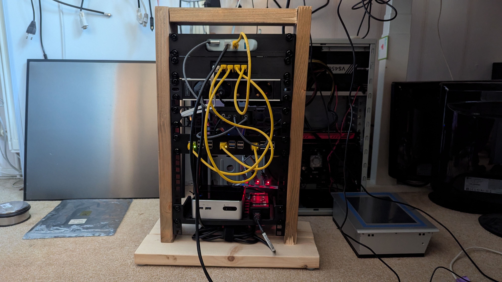
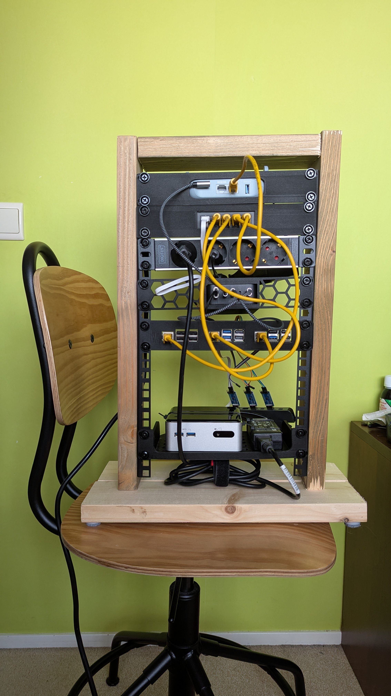
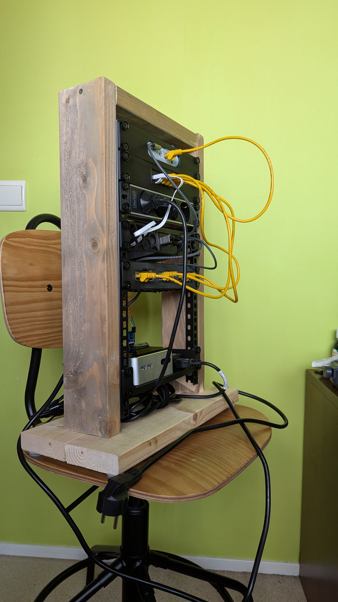
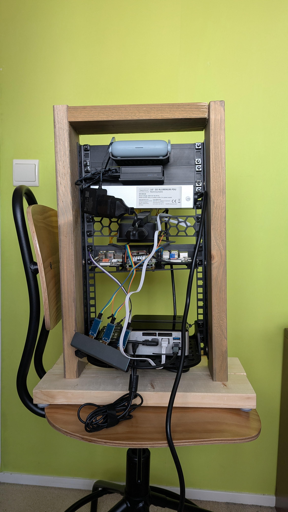

## Intro

I've wanted this for a very long time: my own 10-inch server rack. Anyway, I bought the rails and grabbed some scrap wood from modifying my daughter's loft bed, deliberately gave it a nice look by sawing it with a coarse saw. Found some 3D printed parts and some homemade prints, and voilà!

## From Top to Bottom

Rails + Nuts and screws

- [HMF 66810-02 Rack Rail for Server Cabinet, 2 Pieces, 10 Inch, 10 HE, Black](https://www.amazon.nl/dp/B09LQJLXY8)
- [deleyCON 100x M6 Cage Nuts Screw Set for Network Cabinets](https://www.amazon.nl/dp/B07Q4Q6BYR)

### GL-MT3000 Beryl AX Wifi 6 Travel Router

Product link: [GL.iNet GL-MT3000 Beryl AX Wifi 6 Travel Router](https://store-eu.gl-inet.com/products/eu-beryl-ax-gl-mt3000-pocket-sized-ax3000-wi-fi-6-travel-router-with-2-5g-wan-port)

3D files: [GL.iNet Beryl AX 6 10 inch](https://www.printables.com/model/1177033-glinet-beryl-ax-6-inch-or-10-inch-rack-mount/files)

### UGREEN LAN Switch 5-Port Network Switch

Product link: [UGREEN LAN Switch 5 Port Network Switch](https://www.amazon.nl/-/en/UGREEN-Automatic-1000Mbps-Adjustment-Ethernet/dp/B0D9H9ZRBL)

Patch cables:

Product link: [PremiumCord sputp005Y patch cable UTP RJ45-RJ45 Level 5e 0.5 m, yellow](https://www.amazon.nl/dp/B07NSRBGX2)

3D files: [5-Port Switch Mount for 10" Rack 1U](https://makerworld.com/en/models/1635857-5-port-switch-mount-for-10-rack-1u#profileId-1728120)

### DIGITUS 4-way power strip - 1U - 10 inch

Product link: [DIGITUS 4-way power strip - 1U - 10 inch](https://www.amazon.nl/-/en/dp/B09M6W23ZM)

### UGREEN Nexode USB C Charger 100W 5 Port GaN Charger

Product link: [UGREEN Nexode USB C Charger 100W 5 Port GaN Charger](https://www.amazon.nl/-/en/dp/B0CYT277T6)

For splitting power to the back, as you can see, not perfect; the length isn't quite right, a bit too short:

Product link: [AXFEE 0.3 m extension cable, 1 x power cord type C, Euro plug](https://www.amazon.nl/-/en/dp/B0DYXX2RL3)

I made this from an existing front plate; I only modified it so that the charger fits:

3D files: [UGREEN 100W 10 inch rack](https://www.tinkercad.com/things/6wyXMpDctDc-ugreen-100w-10-inch-rack)

### 2x Raspberry pi, 1x StarFive VisionFive 2 Lite

Product link:

- [Raspberry pi 3B+](https://www.sossolutions.nl/raspberry-pi-3-model-b-plus)
- [Raspberry pi 5](https://www.sossolutions.nl/raspberry-pi-5-8gb-2025-model-los)
- [StarFive VisionFive2 Lite](https://www.waveshare.net/shop/VisionFive2-Lite-4GB-WiFi.htm)

USB Cables + 90 Degree USB C, I needed the 90 degree hooks, cable didn't fit.

- [90 Degree USB C](https://www.amazon.nl/dp/B0C43KCY2V)
- [deleyCON 0.3m USB C Cable 1x 90° Oblique PD3.0 (60W Fast Charging)](https://www.amazon.nl/dp/B0DGQJ3LQF)
- [PAXO 0.3 m Nylon Micro USB Cable Black, 90 Degree Right Angle Plug](https://www.amazon.nl/dp/B0FNRZMT3F)

This one doesn't actually fit; it's too wide. I had to cut a piece off, so it lacks some sturdiness now. Also, the screws didn't fit, so I had to enlarge the holes. I will have to make a new one for this at some point:

3D files: [10" Rack 1U for 3 Raspberry Pi 5 and 6 2.5" SSDs](https://makerworld.com/en/models/827838-10-rack-1u-for-3-raspberry-pi-5-and-6-2-5-ssds#profileId-771762)

### Intel NUC (4th Gen i3-4010U Old!)

Intel NUC (4th Gen i3-4010U Old!) and an USB hub from Ali express (years ago)

I added soms USB to TTL (AURT), so I can use the NUC for debugging boot process (if needed).

Product: [DollaTek CP2104 serial converter, 3 pcs](https://www.amazon.nl/dp/B07DJ3VMKC)

3D files: [10-inch Rack Mount Shelf](https://makerworld.com/en/models/1040526-10-inch-rack-mount-shelf#profileId-1025329)

## More pictures

