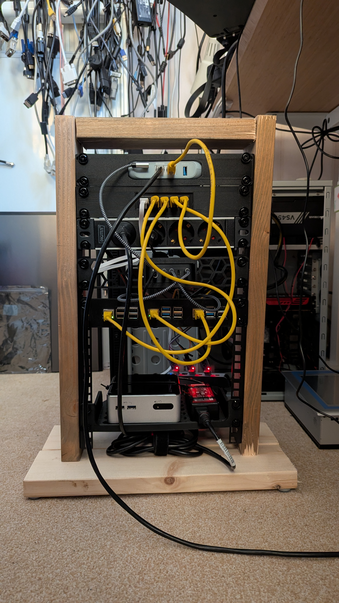

## Intro

The goal is a Kubernetes cluster with multiple architectures.

Officially, there is no support for RISC-V in mainline Kubernetes yet, but more and more is becoming possible. In theory, everything compiles, but this is not happening yet from the mainline code. As a result, many Docker images used within Kubernetes are also missing RISC-V support. However, more and more is working or can be build by yourself.

So, I thought it would be fun to get this working, hence this project.

## Router / IP addresses

I already had a router; I set up a network on it for 192.168.8.0/24. So my approach is as follows:

- 192.168.8.1 for the router
- 192.168.8.10 - 192.168.8.20 for nodes
- 192.168.8.50 - 192.168.8.70 virtual IP addresses for the cluster (metallb)
- 192.168.8.100 - 192.168.8.254 DHCP

## Domain opvolger.eu

I have a not used domain opvolger.eu, now I use it for my cluster. I added a record in my DNS that *.k8s will go to 192.168.8.50. That ip will be used by Traefik.

## Hardware Setup Cluster

Here a list of the hardware i used for my Kubernetes cluster.

- [GL.iNet GL-MT3000 Beryl AX Wifi 6 Travel Router](https://store-eu.gl-inet.com/products/eu-beryl-ax-gl-mt3000-pocket-sized-ax3000-wi-fi-6-travel-router-with-2-5g-wan-port)
- [Raspberry pi 3B+](https://www.sossolutions.nl/raspberry-pi-3-model-b-plus)
- [Raspberry pi 5](https://www.sossolutions.nl/raspberry-pi-5-8gb-2025-model-los)
- [StarFive VisionFive2 Lite](https://www.waveshare.net/shop/VisionFive2-Lite-4GB-WiFi.htm)
- Intel NUC (4th Gen i3-4010U Old!)

for more information see my build of my [10inch-rack](../2026-03-30-build-10inch-rack/).



## Setup RISC-V node(s)

I build k0s-riscv64 on a RISC-V board (Starfive VisionFive 2) with Debian and go and docker installed. Copied k0s-riscv64 to my main machine and started the setup.

How to setup Debian on this board is already on my blog. I made a user opvolger and enabled the SSH server.

## Setup ARM64 node(s)

I used Raspberry pi's for this, a 3B+ and a 5. I Flashed the SD cards with the `Raspberry Pi Images v2.0.7`, used the Raspberry Pi OS (64-bit). Setup the user (opvolger) enabled SSH-Server.

If you want to use the UART for debugging the boot process, you can enable it:

Append following line to /boot/config.txt

```ini
[all]
enable_uart=1
```

For Kubernetes you will need `cgroup_memory` enabled. I added this to my boot command.

Append following line to /boot/firmware/cmdline.txt

```ini
cgroup_memory=1 cgroup_enable=memory
```

## Setup AMD64 node(s)

Just used a Debian iso on a USB-stick to boot, added the SSH server, created a login voor the user opvolger

## HAProxy

For more information see [high-availability](https://docs.k0sproject.io/v1.35.2+k0s.0/high-availability/) on the k0sproject site.

I have a [GL.iNet GL-MT3000 Beryl AX Wifi 6 Travel Router](https://store-eu.gl-inet.com/products/eu-beryl-ax-gl-mt3000-pocket-sized-ax3000-wi-fi-6-travel-router-with-2-5g-wan-port) This has OpenWrt.

I installed HAProxy in the LuCI, logged in to the router edit `/etc/haproxy.cfg` with vi and added:

```ini
frontend kubeAPI
    bind :6443
    mode tcp
    default_backend kubeAPI_backend
frontend konnectivity
    bind :8132
    mode tcp
    default_backend konnectivity_backend
frontend controllerJoinAPI
    bind :9443
    mode tcp
    default_backend controllerJoinAPI_backend

backend kubeAPI_backend
    mode tcp
    server k0s-controller1 192.168.8.10:6443 check check-ssl verify none
    server k0s-controller2 192.168.8.11:6443 check check-ssl verify none
    server k0s-controller3 192.168.8.12:6443 check check-ssl verify none
backend konnectivity_backend
    mode tcp
    server k0s-controller1 192.168.8.10:8132 check check-ssl verify none
    server k0s-controller2 192.168.8.11:8132 check check-ssl verify none
    server k0s-controller3 192.168.8.12:8132 check check-ssl verify none
backend controllerJoinAPI_backend
    mode tcp
    server k0s-controller1 192.168.8.10:9443 check check-ssl verify none
    server k0s-controller2 192.168.8.11:9443 check check-ssl verify none
    server k0s-controller3 192.168.8.12:9443 check check-ssl verify none

listen stats
   bind *:9000
   mode http
   stats enable
   stats uri /
```

reload the haproxy, without reboot the router

```bash
service haproxy reload
```

Now i have a stats page on [http://192.168.8.1:9000](http://192.168.8.1:9000)

## MetalLB docker images

The docker images for MetalLB have no RISC-V support [yet](https://github.com/metallb/metallb/pull/2964)

So i had to build my own

```bash
git clone https://github.com/metallb/metallb.git
git checkout v0.15.3
docker buildx build --platform linux/amd64,linux/arm64,linux/riscv64 --tag opvolger/metallb-controller:v0.15.3  --push --file controller/Dockerfile .
docker buildx build --platform linux/amd64,linux/arm64,linux/riscv64 --tag opvolger/metallb-speaker:v0.15.3  --push --file speaker/Dockerfile .
```

## Download k8s bins

I downloaded the k8s bin files from [here](https://github.com/k0sproject/k0s/releases) and compiled the RISC-V version my self. My playbook expected them in my home directory

- /home/opvolger/k0s-riscv
- /home/opvolger/k0s-arm64
- /home/opvolger/k0s-amd64

## Ansible playbook

For all the other work i made an ansible playbook. See [multi-arch-cluster](https://github.com/Opvolger/multi-arch-cluster)

In short:

- Copy from my work station /home/opvolger/.ssh/id_rsa.pub to /home/opvolger/.ssh/authorized_keys on the nodes
- On the end of the file `/etc/sudoers` add `opvolger ALL=(ALL) NOPASSWD: ALL`. So user opvolger don't have the gave a password on sudo.
- Install `netplan.io` and other stuff.
- Add some firewalld rules on all the nodes for the cluster (you can also disable the firewall)
- Create a netplan yaml file for static ip and apply this setting for all the nodes.
- Set ARP kernel settings on all the nodes, so virtual IP-adres can be set. `sysctl -w net.ipv4.conf.all.arp_announce=2` and `sysctl -w net.ipv4.conf.all.arp_ignore=1`
- Download k0sctl from k0sproject, this can setup a cluster.
- Generate k0sctl.yaml for the cluster
- Run `k0sctl apply --config k0sctl.yaml`.
- Wait for a while and run `k0sctl kubeconfig admin --config k0sctl.yaml` so you have the kube config file.

Cluster is running!

I also setup a samba server in the ansible playbook. This will run on the Intel NUC, so i can use [this project](https://github.com/Opvolger/k8s-csi-driver-riscv64) for Persistent volumes.

Here my generated k0sctl.yaml from ansible:

```yaml
apiVersion: k0sctl.k0sproject.io/v1beta1
kind: Cluster
metadata:
  name: k0s-cluster
  user: admin
spec:
  hosts:
  - ssh:
      address: 192.168.8.13
      user: opvolger
    role: worker
    k0sBinaryPath: /home/opvolger/k0s-amd64
  - ssh:
      address: 192.168.8.10
      user: opvolger
    role: controller+worker
    k0sBinaryPath: /home/opvolger/k0s-arm64
    noTaints: True
  - ssh:
      address: 192.168.8.11
      user: opvolger
    role: controller+worker
    k0sBinaryPath: /home/opvolger/k0s-arm64
    noTaints: True
  - ssh:
      address: 192.168.8.12
      user: opvolger
    role: controller+worker
    k0sBinaryPath: /home/opvolger/k0s-riscv64
    noTaints: True
    environment:
      ETCD_UNSUPPORTED_ARCH: riscv64
  k0s:
    config:
      apiVersion: k0s.k0sproject.io/v1beta1
      kind: Cluster
      metadata:
        name: k0s
      spec:
        # images:
        #   calico:
        #     cni:
        #       image: quay.io/k0sproject/calico-cni
        #       version: v3.29.7-1
        #     node:
        #       image: quay.io/k0sproject/calico-node
        #       version: v3.29.7-1
        #     kubecontrollers:
        #       image: quay.io/k0sproject/calico-kube-controllers
        #       version: v3.29.7-1
        api:
          externalAddress: 192.168.8.1
          k0sApiPort: 9443
          port: 6443
        installConfig:
          users:
            etcdUser: etcd
            kineUser: kube-apiserver
            konnectivityUser: konnectivity-server
            kubeAPIserverUser: kube-apiserver
            kubeSchedulerUser: kube-scheduler
        extensions:
          helm:
            repositories:
            - name: prometheus-community
              url: https://prometheus-community.github.io/helm-charts
            - name: traefik
              url: https://traefik.github.io/charts
            - name: metallb
              url: https://metallb.github.io/metallb
            - name: csi-driver-smb
              url: https://raw.githubusercontent.com/kubernetes-csi/csi-driver-smb/master/charts
            charts:
            # docker buildx build --platform linux/amd64,linux/arm64,linux/riscv64 --tag opvolger/metallb-controller:v0.15.3  --push --file controller/Dockerfile .
            # docker buildx build --platform linux/amd64,linux/arm64,linux/riscv64 --tag opvolger/metallb-speaker:v0.15.3  --push --file speaker/Dockerfile .
            # helm install metallb metallb/metallb --values templates/metallb.yaml -n metallb-system
            # helm uninstall metallb -n metallb-system
            # kubectl apply -f templates/ip-pool.yaml -n metallb-system
            # https://oneuptime.com/blog/post/2026-02-09-kube-proxy-strict-arp-metallb/view
            - name: metallb
              chartname: metallb/metallb
              version: 0.15.3
              namespace: metallb-system
              values: |
                controller:
                  image:
                    # pullPolicy: Always
                    repository: opvolger/metallb-controller
                    tag: v0.15.3
                speaker:
                  frr:
                    enabled: false # no riscv64 (build)
                  image:
                    # pullPolicy: Always
                    repository: opvolger/metallb-speaker
                    tag: v0.15.3
            # helm install traefik traefik/traefik --values templates/traefik.yaml -n traefik-system --version 39.0.7
            # helm uninstall traefik -n traefik-system
            # https://oneuptime.com/blog/post/2026-01-07-metallb-traefik-ingress/view
            - name: traefik
              chartname: traefik/traefik
              version: 39.0.7
              namespace: traefik-system
              values: |
                service:
                  enabled: true
                  annotations:
                    # Request a specific IP from MetalLB's pool
                    metallb.universe.tf/loadBalancerIPs: "192.168.8.50"
            - name: csi-driver-smb
              version: 1.20.0
              namespace: kube-system
              chartname: csi-driver-smb/csi-driver-smb
              values: |
                image:
                  baseRepo: opvolger
                  smb:
                    repository: /smbplugin # done
                    tag: v1.20.0
                    pullPolicy: IfNotPresent
                  csiProvisioner:
                    repository: /csi-provisioner # done
                    tag: 6.1-canary
                    pullPolicy: IfNotPresent
                  csiResizer:
                    repository: /csi-resizer # done
                    tag: 2.0-canary
                    pullPolicy: IfNotPresent
                  livenessProbe:
                    repository: /livenessprobe # done
                    tag: 2.17-canary
                    pullPolicy: IfNotPresent
                  nodeDriverRegistrar:
                    repository: /csi-node-driver-registrar  # done
                    tag: 2.15-canary
                    pullPolicy: IfNotPresent
                  csiproxy:
                    repository: ghcr.io/kubernetes-sigs/sig-windows/csi-proxy  # not needed only windows
                    tag: v1.1.2
                    pullPolicy: IfNotPresent
                # for k0s change the kubelet path
                linux:
                    kubelet: /var/lib/k0s/kubelet
                windows:
                    kubelet: 'C:\\var\\lib\\k0s\\kubelet'
            concurrencyLevel: 5
        konnectivity:
          adminPort: 8133
          agentPort: 8132
        network:
          calico:
            mode: vxlan
          kubeProxy:
            disabled: false
            mode: iptables
          ipvs:
            strictARP: true
          kuberouter:
            autoMTU: true
            mtu: 0
            peerRouterASNs: ""
            peerRouterIPs: ""
          podCIDR: 10.244.0.0/16
          provider: kuberouter
          serviceCIDR: 10.96.0.0/12
        podSecurityPolicy:
          defaultPolicy: 00-k0s-privileged
        storage:
          type: etcd
        telemetry:
          enabled: false
  options:
    wait:
      enabled: false # raspberry pi 3 is slow! timeout
    drain:
      enabled: true
      gracePeriod: 2m0s
      timeout: 5m0s
      force: true
      ignoreDaemonSets: true
      deleteEmptyDirData: true
      podSelector: ""
      skipWaitForDeleteTimeout: 0s
    concurrency:
      limit: 30
      workerDisruptionPercent: 10
      uploads: 5
    evictTaint:
      enabled: false
      taint: k0sctl.k0sproject.io/evict=true
      effect: NoExecute
      controllerWorkers: false
```

## Kubectl get nodes

```bash
$ kubectl get nodes -o wide
NAME          STATUS   ROLES           AGE     VERSION       INTERNAL-IP    EXTERNAL-IP   OS-IMAGE                       KERNEL-VERSION          CONTAINER-RUNTIME
nuc           Ready    <none>          3h57m   v1.35.2+k0s   192.168.8.13   <none>        Debian GNU/Linux 13 (trixie)   6.12.74+deb13+1-amd64   containerd://1.7.30
rp3b          Ready    control-plane   3d4h    v1.35.2+k0s   192.168.8.11   <none>        Debian GNU/Linux 13 (trixie)   6.12.75+rpt-rpi-v8      containerd://1.7.30
rp5           Ready    control-plane   3d4h    v1.35.2+k0s   192.168.8.10   <none>        Debian GNU/Linux 13 (trixie)   6.12.75+rpt-rpi-2712    containerd://1.7.30
visionfive2   Ready    control-plane   3d4h    v1.35.2+k0s   192.168.8.12   <none>        Debian GNU/Linux 13 (trixie)   6.19.0                  containerd://1.7.30

$ kubectl get nodes --show-labels
NAME          STATUS   ROLES           AGE    VERSION       LABELS
nuc           Ready    <none>          4h9m   v1.35.2+k0s   beta.kubernetes.io/arch=amd64,beta.kubernetes.io/os=linux,kubernetes.io/arch=amd64,kubernetes.io/hostname=nuc,kubernetes.io/os=linux
rp3b          Ready    control-plane   3d4h   v1.35.2+k0s   beta.kubernetes.io/arch=arm64,beta.kubernetes.io/os=linux,kubernetes.io/arch=arm64,kubernetes.io/hostname=rp3b,kubernetes.io/os=linux,node-role.kubernetes.io/control-plane=true,node.k0sproject.io/role=control-plane
rp5           Ready    control-plane   3d4h   v1.35.2+k0s   beta.kubernetes.io/arch=arm64,beta.kubernetes.io/os=linux,kubernetes.io/arch=arm64,kubernetes.io/hostname=rp5,kubernetes.io/os=linux,node-role.kubernetes.io/control-plane=true,node.k0sproject.io/role=control-plane
visionfive2   Ready    control-plane   3d4h   v1.35.2+k0s   beta.kubernetes.io/arch=riscv64,beta.kubernetes.io/os=linux,kubernetes.io/arch=riscv64,kubernetes.io/hostname=visionfive2,kubernetes.io/os=linux,node-role.kubernetes.io/control-plane=true,node.k0sproject.io/role=control-plane

$ kubectl get pv
NAME                                       CAPACITY   ACCESS MODES   RECLAIM POLICY   STATUS   CLAIM                          STORAGECLASS   VOLUMEATTRIBUTESCLASS   REASON   AGE
pvc-83fa9191-819f-463d-a657-f4ab96cffe14   1Gi        RWX            Delete           Bound    default/basm-demo-helm-chart   smb            <unset>                          142m
```

## Youtube video

[](https://www.youtube.com/watch?v=r95H2GqL2As)


