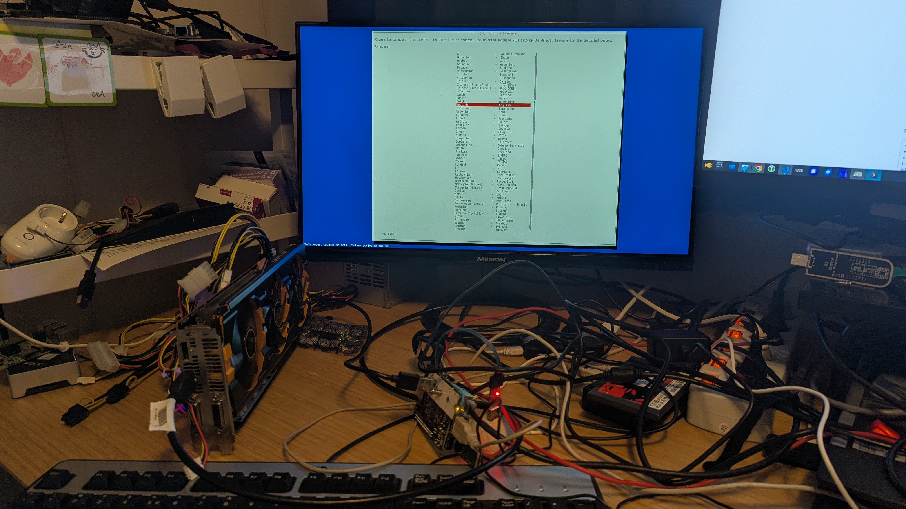

Debian Trixie Installer on Starfive VisionFive 2 Lite. (Onboard GPU is still not working!)

All the stuff that need to be done is described here.

My desktop is an AMD (intel based) machine with Fedora (KDE) Linux, all the commands are done from one directory.

## Install some stuff (desktop)

Packages needed for setup

- `fedpkg` will install everything needed to build a kernel on Fedora
- `gcc-riscv64-linux-gnu` is needed for cross compiling
- `screen` is needed to connect with UART
- `git` is needed to clone some project (OpenSBI and U-Boot)

```bash
sudo dnf install gcc-riscv64-linux-gnu fedpkg screen git
```

## Building OpenSBI (desktop)

First we need to build OpenSBI on the desktop (cross compile)

```bash
git clone --branch v1.8.1 --depth=1 https://github.com/riscv-software-src/opensbi.git
cd opensbi
make CROSS_COMPILE=riscv64-linux-gnu- PLATFORM=generic FW_OPTIONS=0 FW_TEXT_START=0x40000000
cd ..
```

## Building U-Boot (desktop)

We need to build U-Boot after OpenSBI, we need the file fw_payload.bin

```bash
git clone --branch v2026.04 --depth=1 https://github.com/u-boot/u-boot.git
cd u-boot
make CROSS_COMPILE=riscv64-linux-gnu- starfive_visionfive2_defconfig
make CROSS_COMPILE=riscv64-linux-gnu- OPENSBI=../opensbi/build/platform/generic/firmware/fw_payload.bin
cd ..
```

## Download stuff (desktop)

We will download a kernel that I have build, for more information see [project multi-arch-cluster](https://github.com/Opvolger/multi-arch-cluster/blob/master/kernel/readme.md)

This kernel can work for k0s/k3s (Kubernetes) and/or with an AMDGPU (with an adapter NVME->PCI-e)



```bash
# (rootfs) for setup Debian Trixie
wget https://deb.debian.org/debian/dists/trixie/main/installer-riscv64/current/images/netboot/debian-installer/riscv64/initrd.gz
# packages for kernel 6.19 with patch PCI-e
wget https://github.com/Opvolger/multi-arch-cluster/releases/download/0.1/linux-image-6.19.13-opvolger_6.19.13-1_riscv64.deb
wget https://github.com/Opvolger/multi-arch-cluster/releases/download/0.1/linux-libc-dev_6.19.13-1_riscv64.deb
```

## Create SD card (desktop)

Put the SD card in you desktop, the inserted SD card was device /dev/sda on my machine!

```bash
sudo sgdisk --clear \
    --set-alignment=2 \
    --new=1:4096:8191 --change-name=1:spl --typecode=1:b000 \
    --new=2:8192:16383 --change-name=2:uboot --typecode=2:b000 \
    --new=3:16384:1540094 --change-name=3:bootfs --typecode=3:8300 \
    --new=4:1540096:52330395 --change-name=4:rootfs --typecode=4:8300 \
    --new=5:52330396:59102432 --change-name=5:swap --typecode=5:8200 \
    /dev/sda

# format bootfs and rootfs
sudo mkfs.ext4 /dev/sda3
sudo mkfs.ext4 /dev/sda4

# flash OpenSBI and U-Boot to SD card partition 1 and 2
sudo dd if=u-boot/spl/u-boot-spl.bin.normal.out of=/dev/sda1
sudo dd if=u-boot/u-boot.itb of=/dev/sda2

# extract deb packages
find *.deb -print | xargs -I{} dpkg -x {} .

mkdir /tmp/mnt
sudo mount /dev/sda3 /tmp/mnt
sudo cp usr/lib/linux-image-6.19.13-opvolger/starfive/jh7110-starfive-visionfive-2-lite.dtb /tmp/mnt/jh7110-starfive-visionfive-2-lite.dtb
sudo cp boot/vmlinuz-6.19.13-opvolger /tmp/mnt/linux
sudo cp initrd.gz /tmp/mnt/initrd.gz
sudo umount /dev/sda3
```

## Open UART connection (desktop)

The pin layout is the same as the VisionFive 2, see for more information page 14 and 25 on this [document](https://doc-en.rvspace.org/VisionFive2/PDF/VisionFive2_QSG.pdf)

I am using screen and not minicom.

So put the SD card in the VisionFive 2 Lite and connect to the board with the command

```bash
sudo screen -L /dev/ttyUSB0 115200
```

## 1st Boot (Debian Install) (UART/desktop)

If the VisionFive 2 Lite is turned on, you will see text on the screen application, if not, check your connections (RX <-> TX and TX <-> RX and Ground to Ground).

Type this command in U-Boot, it will start the installer.

```bash
load mmc 0:3 ${kernel_addr_r} /linux
load mmc 0:3 ${fdt_addr_r} /jh7110-starfive-visionfive-2-lite.dtb
load mmc 0:3 ${ramdisk_addr_r} /initrd.gz
setenv bootargs ''
booti $kernel_addr_r $ramdisk_addr_r:$filesize $fdt_addr_r
```

The setup will be started in the screen application.

- use the end0 network interface
- Choice `Yes` and the warning that there are no kernel modules loaded.
- do not setup a root password, make a user with password
- Ignore the RAID error!
- Partition disks -> Choice: Manual
- bootfs, Use as: Ext4 journaling f...., Mount point: /boot -> Done setting up the partition
- roofs, Use as: Ext4 journaling f...., Mount point: / -> Done setting up the partition
- swap, Use as: swap area, -> Done setting up the partition
- Go down with the arrow key and `Finish partitioning and write changes to disk`
- Write the changes to disk -> Yes
- You can install a desktop or leave it blank. Keep the SSH Server selected
- Continue without boot loader -> Continue
- Finish the installation -> Continue

## Boot after installer (UART/desktop)

```bash
load mmc 0:3 ${kernel_addr_r} /linux
load mmc 0:3 ${fdt_addr_r} /jh7110-starfive-visionfive-2-lite.dtb
load mmc 0:3 ${ramdisk_addr_r} /initrd.img
setenv bootargs 'root=/dev/mmcblk0p4'
booti $kernel_addr_r $ramdisk_addr_r:$filesize $fdt_addr_r
```

Login to your board with username and password given in the setup, and get the ip-address of the board with `ip a` or something else.

## After boot (desktop)

We need to copy the downloaded kernels to the board, we can do that with scp (if the SSH server was enabled with the installer)

```bash
scp linux-* [username]@[ip]:/home/[username]
# example (my setup)
scp linux-* opvolger@192.168.2.30:/home/opvolger
```

## Setup auto boot (UART/desktop)

Add the `non-free-firmware` on your board

```bash
sudo nano /etc/apt/sources.list
```

add on the bottom this line:

```ini
deb http://deb.debian.org/debian trixie main non-free-firmware
```

Update the download sources and install the firmwares and u-boot-tools (we need this later), after that install the kernel we have copied.

```bash
sudo apt update
sudo apt install firmware-realtek firmware-linux-nonfree u-boot-tools
# installing the kernel can give some warnings of missing firmware files
sudo dpkg -i linux-*.deb
```

We need a `boot.scr` file, so we can boot from one file in U-Boot

```bash
cd /
sudo nano boot.cmd
```

Put this in boot.cmd

```ini
load mmc 0:3 ${kernel_addr_r} /vmlinuz-6.19.13-opvolger
load mmc 0:4 ${fdt_addr_r} /usr/lib/linux-image-6.19.13-opvolger/starfive/jh7110-starfive-visionfive-2-lite.dtb
load mmc 0:3 ${ramdisk_addr_r} /initrd.img-6.19.13-opvolger
setenv bootargs 'root=/dev/mmcblk0p4'
booti $kernel_addr_r $ramdisk_addr_r:$filesize $fdt_addr_r
```

Save and exit.

Now run the next command, this will create a `boot.scr` from `boot.cmd`. After this reboot the system and go to U-Boot again

```bash
sudo mkimage -C none -A riscv -T script -d boot.cmd boot.scr
```

Disable Sleep, it can crash the system, and reboot

```bash
sudo systemctl mask sleep.target suspend.target hibernate.target hybrid-sleep.target
sudo reboot
```

## U-Boot auto boot with boot.src

In U-Boot enter the next commands, this will boot the device in the future without typing stuff in U-Boot.

```bash
setenv bootdelay 5
setenv bootcmd 'load mmc 0:4 ${scriptaddr} boot.scr; source ${scriptaddr}'
saveenv
# we are done, reset and it will boot to Debian Trixie
reset
```
