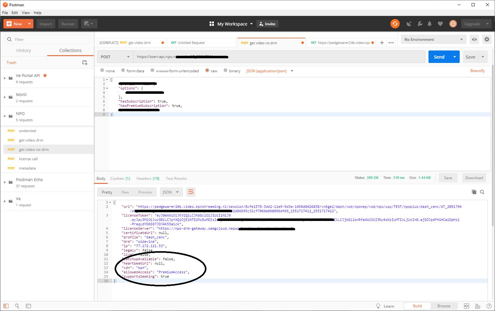

# Kodi addon - NPO Uitzending gemist

Een stukje uitleg over het hoe en waarom van de addon [plugin.video.uzg](https://github.com/Opvolger/plugin.video.uzg) voor Kodi. Deze blijf ik aanvullen als er (grote) dingen veranderen.

## Waarom

Omdat ik had besloten de “kabel” eruit “te gooien”, omdat ik geen zin meer had in betaald reclame te kijken en alles was van het zelfde op t.v. Netflix kwam toen net in Nederland en ik dacht: “Ik doe het gewoon, ik gooi de kabel er uit”. Ik had een “Smart” TV welke RTL-XL en NPO uitzendingen terug kon kijken (zonder reclame) en film van Netflix. Prima. Google Chromecast + Kodi op een Raspberry Pi. Alles opgelost dacht ik.

Helaas 2 maanden nadat ik mijn kabel opzeg, veranderd de “API” van RTL-XL en weer 4 maanden later die van NPO. Kortom, ik kon dit niet meer kijken op mijn “Smart” TV.

## Oplossing

Kodi gebruikte ik al jaren voor mijn series en films te kijken (legaal! ik heb de DVD’s/Blu-Ray’s in de kast staan). Na het opzeggen van de kabel had ik ook tvheadend met een dvb-t USB ontvanger geconfigureerd met Kodi. Zodat ik in het hele huis Nederland 1/2/3 en TV Gelderland kon kijken. Ik kan vanuit mijn werk uit aardig programmeren, dus het lag nu voor de hand om een add-on te maken in Kodi voor NPO en RTL-XL. Beide add-ons aangemeld bij Kodi en ze zijn jaren lang een “Officiële” addon geweest, deze was dus te downloaden uit de repository van Kodi zelf.

## Uitwerking

Hoe start je nu zo iets? Het was vroeger wat meer zoek werk, maar je kan het allemaal vinden op de wiki pagina van Kodi, nu hebben ze erg goede uitlegt hoe je moet beginnen. Nu dus de taal python nog even leren (lees google elke actie welke je wil doen) en achterhalen hoe je video’s ophaalt bij NPO. Dat laatste ging vroeger erg makkelijk, dat deed je als volgend:

Zet een “Zed Attack Proxy” op je pc
Stel het juiste IP-Adres in (van je locale netwerk) “ZAP > Tools > Options > Local Proxies”
Op een Android telefoon (emulator of echte), zet je de NPO App er op.
Zorg ervoor dat je telefoon via de proxy loop (Ga naar “advanced options” van je Wifi connection) of je emulator opstart met “-http-proxy http://xx.xxx.xx.xx:8080”
Klaar! Als je verkeer loopt nu via je pc, je ziet alle aanvragen van de app. Alles ging over http, hier kon je zien hoe de “API” werkte en deze “op de zelfde manier” toepassen in python. Je moest alleen even aansluiten om de “API” van Kodi en klaar. Dit klinkt natuurlijk makkelijker dan het is, maar daar komt het in het kort wel op neer. Dit alles is gemaakt november 2013 t/m januari 2014. De code aangeboden aan Kodi met een pull request en na wat kleine aanpassingen geaccepteerd!

## Tegenslag / Stoppen publieke addon

Maar helaas kwam daar na 5 jaar in eind november 2018 een einde aan. De NPO had namelijk de voorwaarden aangepast. Zover ik het nu kan lezen mag er geen publieke plugins/addons meer gemaakt worden. Gelukkig mag dit nog wel steeds voor eigen gebruik, er staat nergens dat dit niet mag! De app was ook “verbeterd”, je kan niet meer al het verkeer aftappen. Nu liep al het verkeer netjes via https, maar op Android Telefoons van versie 5 en lager, kan zelf “root” certificaten toevoegen. Dus we gingen naar “ZAP > Tools > Options > Dynamic SSL Certificates” en exporteerde het certificaat. We zette deze op de Android telefoon en al het verkeer was weer leesbaar.

Wat je hier doet, is al je verkeer via je proxy laten lopen, op je pc ook “decoderen” en opnieuw “coderen” mijn jouw certificaat. Je kan namelijk niet het certificaat van NPO gebruiken, je hebt immers de “private-key/geheime sleutel” niet. Je doet letterlijk een man-in-the-middle attack.

De Api was totaal veranderd, tevens de voorwaarden. Volgens de nieuwe voorwaarden mocht wat ik deed helaas niet meer. Netjes een verzoek gedaan bij Kodi om mijn addon “broken” te melden.

Natuurlijk kon ik privé gewoon doorgaan met mijn addon.

## DRM

Alsof de tegenslag van november 2018 nog niet genoeg was, maart 2019 ging NPO over op DRM. Alles werkte nog, behalve de video-stream uitvragen. Dit moest ik dus weer uitzoeken. De app was nog beter beveiligt, ze doen nu aan “Certificate Pinning”, kortom je kan er niet tussen in gaan zitten met je eigen zap-ssl-certificaat. Dit was niet zo fijn. Uiteindelijk de Andoid App van de NPO moeten decompilen. Gelukkig kan dit online (hoef je de tools niet te instaleren). Helaas hadden ze gebruik gemaakt van “code obfuscation (niet leesbaar maken van code)”, maar dat weerhield mij niet. Het koste mij alleen wat meer tijd. Ik kwam er achter hoe de video’s nu werden opgevraagd, met deze informatie kon ik mijn addon weer aanpassen.

Code uit de Android App

```java
    public NedforceCatalog(OkHttpClient okHttpClient, NpoPlayerConfig npoPlayerConfig) {
        this._httpClient = okHttpClient;
        this._config = npoPlayerConfig;
        switch (this._config.getEnvironment()) {
            case 1:
                okHttpClient = "https://api.npobeta.nl";
                break;
            case 2:
                okHttpClient = "https://start-api.npo.nl";
                break;
            default:
                okHttpClient = "https://npo-api.staging.egeniq.com";
                break;
        }
        this._baseUrl = HttpUrl.parse(okHttpClient);
    }
en

    public void getStreamForAsset(final String str, String str2, String str3, boolean z, boolean z2, int i, final CatalogCallback<NpoStream> catalogCallback) {
        HttpUrl build = this._baseUrl.newBuilder().addPathSegment("media").addPathSegment(str).addPathSegment("stream").build();
        JSONObject jSONObject = new JSONObject();
        JSONObject jSONObject2 = new JSONObject();
        try {
            jSONObject.put(Scopes.PROFILE, str2);
            str2 = true;
            if (z) {
                jSONObject2.put("startOver", true);
            }
            jSONObject.put("options", jSONObject2);
            if (!TextUtils.isEmpty(str3)) {
                jSONObject.put("ageRestriction", str3);
            }
            if (z2) {
                if (this._config == null || this._config.getPlayerOptions() == null || TextUtils.isEmpty(this._config.getPlayerOptions().getEncryptionType()) != null) {
                    GlobalLogger.m6738a().m6749b(TAG, "skipCatalog = true requires to provide a DRM type!");
                } else {
                    jSONObject.put("skipCatalog", true);
                    jSONObject.put("useEncryption", this._config.getPlayerOptions().getEncryptionType());
                }
            }
            jSONObject.put("hasSubscription", i != 0);
            str3 = "hasPremiumSubscription";
            if (2 != i) {
                str2 = null;
            }
            jSONObject.put(str3, str2);
            jSONObject.put("platform", 2 == i ? Plan.PREMIUM : "npo");
            this._httpClient.newCall(new Builder().url(build).post(RequestBody.create(HttpClient.f5884b, jSONObject.toString())).build()).enqueue(new Callback() {
                public void onFailure(Call call, IOException iOException) {
```

Gelukkig was Kodi 18 net uit en daar kon je streams met DRM bekijken! Dus een paar avonden uitzoeken hoe je dat moest aanroepen en we konden weer video’s opstarten.

## Security BUG (2019-2023)

Toen ik bezig was met uitzoeken hoe de “API’s” nu werkte. Ja API’s want de lijst met programma’s en afleveringen staat helemaal los van de uitvraag van de video-streams. Hierin zit dus ook een beveiligingsprobleem. de uitvraag voor de video-stream heeft geen kennis van de “API” van de NPO. Ook niet of je nu wel of geen “Premium” account hebt. (Lees NPO-plus). Kortom, je kan dus ZONDER dat je NPO-Plus account hebt WEL een NPO-Plus video opvragen. Vrij makkelijk zelfs, je past even een switch aan van “false” naar “true” in je bericht en klaar. Natuurlijk heb ik dit eerst netjes gemeld bij de NPO helemaal niks meer gehoord. Een direct gericht via Twitter, geen response en publiek bericht via twitter, geen reactie. Een bericht via Facebook, een hele korte reactie van “We zullen het doorgeven…” Toen kwam ik deze pagina tegen bij de NPO [link](https://over.npo.nl/organisatie/privacy-en-security/responsible-disclosure). Hier wilde ik wel in komen te staan!, een mail naar de NPO dan maar in maart, april en in mei…, allemaal niks meer van gehoord.

Dus hier het beveiliging lek, ik vraag hier een video-stream op van “De Luizenmoeder”. Welke ik netjes terug krijg. Ook al mijn andere uitvragen komen nu met een 720p-stream terug i.p.v. een SD-stream.


Voor de netheid de “bug” niet doorgevoerd in mijn addon, maar dat is met 2 regels aanpassen wel te doen :)

Update: uiteindelijk november 2019 is de bug herkend en zijn er excuses gemaakt dat er zo traag gereageert was! alleen is de bug nooit opgelost. 1 december 2023 heeft de NPO een totaal andere API genomen, hierdoor werkt de "hack" niet meer.

## Update december 2023

Ze hebben in december 2023 de hele api vervangen, ik heb de hele addon opnieuw mogen schrijven. Helaas geen "gratis" NPO-plus meer, maar nog steeds uitzending gemist op Kodi.
