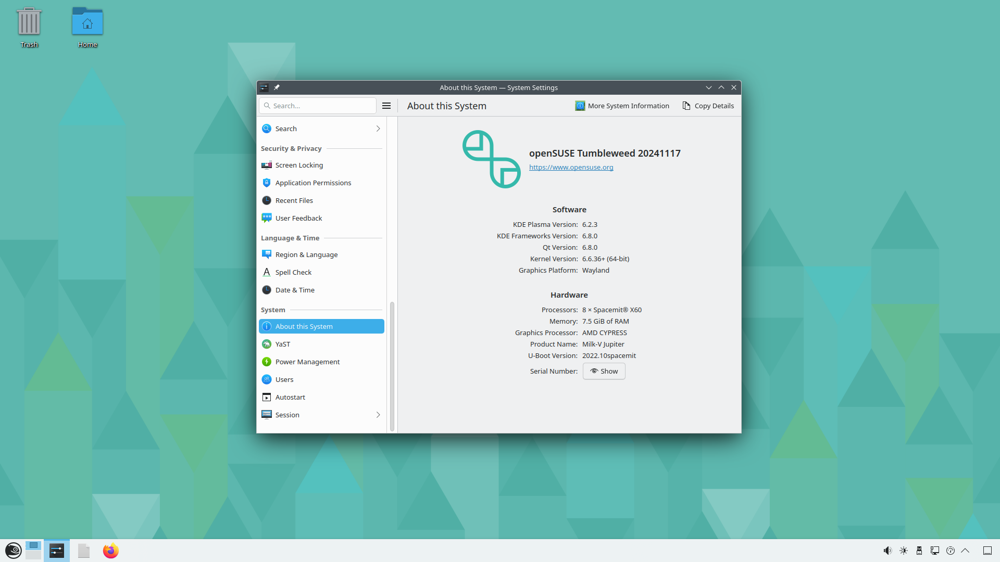

# Milk-V Jupiter - OpenSUSE Tumbleweed with dedicated GPU ATI Radeon HD 5850

## Software

I used the VisionFive2 image of OpenSUSE Tumbleweed.

## Hardware

- Milk-V Jupiter
- AMD/ATI Radeon HD 5850, Bought on a Dutch second-hand website, for 15 EURO.
- For debugging a USB to TTL (was still lying around in the house), is about 5 EURO.

## Setup (hardware)

I have had multiple video cards directly in the jupiter.

- AMD RX 6600 It was detected, but with all firmwares i got a kernel panic.
- NVIDIA GeForce GTX 770, was detected also got to see kernel drivers with 'lspci -k' but didn't work. (gave no image).
- ATI Radeon HD 5450 works! got in KDE desktop (but was slow)
- ATI Radeon HD 5850 works! got in KDE desktop
- ATI Radeon R9 290 only works on a Riser board with another power supply.

This setup is with only the ATI Radeon HD 5850, inserted in the mainboard. but most likely work with other ATI/AMD GPU's.

## Compiling the kernel

I forked the [Bianbu Linux - SpacemiT kernel](https://gitee.com/bianbu-linux/linux-6.6).

After the 6.1 kernel a lot is fixxed, so I now only need a config file.

I have put all this in my [github](https://github.com/Opvolger/spacemit-k1-linux-6.6).

```bash
# we need some firmwares in the kernel
git clone --depth 1 git://git.kernel.org/pub/scm/linux/kernel/git/firmware/linux-firmware.git linux-firmware
# we need the kernel
git clone https://github.com/Opvolger/spacemit-k1-linux-6.6.git
cd spacemit-k1-linux-6.6
```

[Download](https://bianbu-linux.spacemit.com/en/faqs/)/[Download](https://gitee.com/bianbu-linux/buildroot-ext/tree/bl-v2.0.y/board/spacemit/k1/target_overlay/lib/firmware) esos.elf and put it in linux-firmware directory (cloned from git.kernel.org)

```bash
# create a .config for compiling the kernel without the onboard GPU and with the AMDGPU enabled.
make ARCH=riscv CROSS_COMPILE=riscv64-linux-gnu- k1_extern_gpu_defconfig
# i have added my GPU firmwares in the config file, maybe you need to edit the `.config` file.
# find the line with CONFIG_EXTRA_FIRMWARE= and add you firmwares. i have a radeon/CYPRESS so search the kernel source code with the text `radeon/CYPRESS` and you will see all the *.bin files that are needed. or look in dir `linux-firmware/amdgpu/`. See list of codename/chipset (what is in the firmware) over here: https://help.ubuntu.com/community/RadeonDriver

# build the kernel, i have 16 cores, so change it if you have more (or less).
make ARCH=riscv CROSS_COMPILE=riscv64-linux-gnu- -j 16
```

The kernel will be here: `arch/riscv/boot/Image.gz` and dtb file here `arch/riscv/boot/dts/spacemit/k1-x_milkv-jupiter.dtb`.

## Create SD-Card / eMMC / M2 with Opensuse Tumbleweed

### Download Fedora Jupiter build

[Download](https://milkv.io/docs/jupiter/getting-started/resources) the Fedora 41 build.
[Direct Link to k1-fedora-minimal.img.gz](https://openkoji.iscas.ac.cn/pub/dist-repos/dl/Milk-V/Jupiter/images/latest/k1-fedora-minimal.img.gz)

I use this as a base, we replace the Fedora partition (root) for the OpenSuse Tumbleweed (root).

### Download OpenSuse Tumbleweed build

[Download](https://en.opensuse.org/openSUSE:RISC-V#On_real_hardware) the OpenSuse Tumbleweed image
[Direct Link to openSUSE-Tumbleweed-RISC-V-KDE.riscv64-rootfs.riscv64.tar.xz](https://download.opensuse.org/ports/riscv/tumbleweed/images/openSUSE-Tumbleweed-RISC-V-KDE.riscv64-rootfs.riscv64.tar.xz)

### Making it

Use a tool to flash the k1-fedora-minimal.img.gz to a CD-Card. U used balenaEtcher

Here you can see that my CD-Card is /dev/sdb (fedora img has 6 parttions)

```bash
$ lsblk 
NAME        MAJ:MIN RM   SIZE RO TYPE MOUNTPOINTS
sda           8:0    0 223,6G  0 disk 
├─sda1        8:1    0   100M  0 part 
├─sda2        8:2    0    16M  0 part 
├─sda3        8:3    0   223G  0 part 
└─sda4        8:4    0   505M  0 part 
sdb           8:16   1  29,7G  0 disk 
├─sdb1        8:17   1   256K  0 part 
├─sdb2        8:18   1    64K  0 part 
├─sdb3        8:19   1     1M  0 part 
├─sdb4        8:20   1     2M  0 part 
├─sdb5        8:21   1   256M  0 part 
└─sdb6        8:22   1     2G  0 part 
zram0       252:0    0     8G  0 disk [SWAP]
nvme0n1     259:0    0 465,8G  0 disk 
└─nvme0n1p1 259:1    0 465,8G  0 part 
nvme1n1     259:2    0 931,5G  0 disk 
├─nvme1n1p1 259:3    0   300M  0 part /boot/efi
├─nvme1n1p2 259:4    0   280G  0 part /
├─nvme1n1p3 259:5    0   8,8G  0 part [SWAP]
└─nvme1n1p4 259:6    0 642,4G  0 part /home
```

- 1 = first stage bootloader (fsbl)
- 2 = saved environment variables for u-boot (env)
- 3 = RISC-V Open Source Supervisor Binary Interface (opensbi)
- 4 = U-Boot boot loader (uboot)
- 5 = kernel and devices-tree (bootfs)
- 6 = file-system (rootfs)

We will replace the rootfs for the OpenSuse Tumbleweed rootfs.

First we will delete the rootfs partition of Fedora and create a new root partition for OpenSuse Tumbleweed.

```bash
$ sudo fdisk /dev/sdb
[sudo] password for opvolger: 

Welcome to fdisk (util-linux 2.40.2).
Changes will remain in memory only, until you decide to write them.
Be careful before using the write command.

GPT PMBR size mismatch (4726823 != 62333951) will be corrected by write.
The backup GPT table is not on the end of the device. This problem will be corrected by write.

Command (m for help): d
Partition number (1-6, default 6): 6

Partition 6 has been deleted.

Command (m for help): n
Partition number (6-128, default 6): 6
First sector (896-62333918, default 532480): 
Last sector, +/-sectors or +/-size{K,M,G,T,P} (532480-62333918, default 62332927): 

Created a new partition 6 of type 'Linux filesystem' and of size 29,5 GiB.
Partition #6 contains a ext4 signature.

Do you want to remove the signature? [Y]es/[N]o: N

Command (m for help): w

The partition table has been altered.
Calling ioctl() to re-read partition table.
Syncing disks.
```

Remove and insert the SD-Card again.

Now we will format the new partition

```bash
$ sudo mkfs -t ext4 /dev/sdb6
mke2fs 1.47.1 (20-May-2024)
/dev/sdb6 contains a ext4 file system labelled 'rootfs'
        last mounted on /home/hezhengyu/program/images/fedora on Mon Jul 15 05:12:15 2024
Proceed anyway? (y,N) y
Creating filesystem with 7725056 4k blocks and 1933312 inodes
Filesystem UUID: ffafcae9-30cd-4b81-b4d2-23ad3ff5b340
Superblock backups stored on blocks: 
        32768, 98304, 163840, 229376, 294912, 819200, 884736, 1605632, 2654208, 
        4096000

Allocating group tables: done                            
Writing inode tables: done                            
Creating journal (32768 blocks): 
done
Writing superblocks and filesystem accounting information: done   
```

You see that my partition is getting the UUID `ffafcae9-30cd-4b81-b4d2-23ad3ff5b340`, we will need this later in the `env_k1-x.txt`.

We will now extract the rootfs of OpenSuse Tumbleweed to the new partition.

Mount the rootfs partition.
Now we will unpack the root fs

```bash
# go to home dir
$ cd
# create dir mnt (if not existing)
$ mkdir -p mnt
# mount new partition to mnt dir in home dir.
$ sudo mount /dev/sdb6 /home/$USER/mnt
[sudo] password for opvolger:
$ sudo tar -xJvf /home/$USER/Downloads/openSUSE-Tumbleweed-RISC-V-KDE.riscv64-rootfs.riscv64.tar.xz --directory /home/$USER/mnt
```

Done. We will umount /dev/sdb6 and mount /dev/sdb5. So we can edit the boot txt file.

```bash
$ sudo umount /dev/sdb6
$ sudo mount /dev/sdb5 /home/$USER/mnt
$ ls /home/$USER/mnt
bianbu.bmp  env_k1-x.txt  extlinux  initramfs-6.1.15+.img  spacemit  vmlinuz-6.1.15+
$ sudo nano /home/$USER/mnt/env_k1-x.txt
```

In my version of this image there is a `initramfs-6.1.15+.img` in `/home/$USER/mnt`. This can change. If that happend, you have to use a different version of that file in the env_k1-x.txt!
Keep in mind i use my UUID of my formated rootfs, yours is different! I use `ffafcae9-30cd-4b81-b4d2-23ad3ff5b340`.
If you are using an eMMC use `mmc 1:5` and not `mmc 0:5`. If you are using nvme use `nvme 0:5` and not `mmc 0:5`

Now change

```ini
ramdisk_addr_r=0x21000000
fdt_addr_r=0x31000000
detect_dtb=setenv fdtfile ${product_name}.dtb
bootcmd=run detect_dtb; sysboot mmc ${boot_devnum}:${bootfs_part} any ${kernel_addr_r} /extlinux/extlinux.conf
```

to

```ini
ramdisk_addr_r=0x21000000
fdt_addr_r=0x31000000
load_files=load mmc 0:5 ${kernel_addr_r} /Image.gz; load mmc 0:5 ${fdt_addr_r} /k1-x_milkv-jupiter.dtb; load mmc 0:5 ${ramdisk_addr_r} /initramfs-6.1.15+.img
set_bootargs=setenv bootargs 'console=ttyS0,115200 root=UUID=ffafcae9-30cd-4b81-b4d2-23ad3ff5b340 rootfstype=ext4 rootwait rw earlycon clk_ignore_unused loglevel=7 radeon.pcie_gen2=0 swiotlb=131072 stmmaceth=chain_mode:1 selinux=0'
bootcmd=run set_bootargs; run load_files; booti $kernel_addr_r $ramdisk_addr_r:$filesize $fdt_addr_r
```

Exit the editor with Ctrl + X, and save your changes.

Copy the kernel files and umount the bootfs partition

```bash
$ cd spacemit-k1-linux-6.6
$ sudo cp arch/riscv/boot/Image.gz /home/$USER/mnt
$ sudo cp arch/riscv/boot/dts/spacemit/k1-x_milkv-jupiter.dtb /home/$USER/mnt
$ sudo umount /dev/sdb5
```

Done, put your SD-Card in your Jupiter and boot.

You will see a KDE login, but there is no user yet!.

Hit `Ctrl + Alt + F3` and login as `root` with password `linux`.

```bash
Welcome to openSUSE Tumbleweed 20241117 - Kernel 6.6.36+ (ttyS0).

end0: 192.168.2.28 2a02:a447:277b:1:e172:a638:be8a:114c
end1:  


fedora login: root
Password: 
Have a lot of fun...
2a02-a447-277b-1-e172-a638-be8a-114c:~ #
```

now create a user! I create a user opvolger.

```bash
$ useradd opvolger
# set password
$ passwd opvolger
New password: 
BAD PASSWORD: The password is shorter than 8 characters
Retype new password: 
passwd: password updated successfully
# install wheel group
$ zypper install system-group-wheel
Retrieving repository 'Open H.264 Codec (openSUSE Tumbleweed)' metadata ..[done]
Building repository 'Open H.264 Codec (openSUSE Tumbleweed)' cache .......[done]
Retrieving repository 'openSUSE-Tumbleweed-Oss' metadata .................[done]
Building repository 'openSUSE-Tumbleweed-Oss' cache ......................[done]
Retrieving repository 'openSUSE-Tumbleweed-Update' metadata ..............[done]
Building repository 'openSUSE-Tumbleweed-Update' cache ...................[done]
Loading repository data...
Reading installed packages...
Resolving package dependencies...

The following NEW package is going to be installed:
  system-group-wheel

1 new package to install.

Package download size:     8.6 KiB

Package install size change:
            |        38 B  required by packages that will be installed
      38 B  |  -      0 B  released by packages that will be removed

Backend:  classic_rpmtrans
Continue? [y/n/v/...? shows all options] (y): 
Retrieving: system-group-wheel-20170617-26.1.noarch (openSUSE-Tumbleweed-Oss)
                                                            (1/1),   8.6 KiB
Retrieving: system-group-wheel-20170617-26.1.noarch.rpm ..................[done]

Checking for file conflicts: .............................................[done]
/usr/bin/systemd-sysusers --replace=/usr/lib/sysusers.d/system-group-wheel.conf -
Creating group 'wheel' with GID 469.
(1/1) Installing: system-group-wheel-20170617-26.1.noarch ................[done]
Running post-transaction scripts .........................................[done]
# add user as sudo-er
$ usermod -a -G wheel opvolger
```

Now hit `Ctrl + Alt + F2`. Login with user opvolger and your password.

We will see the Desktop!


