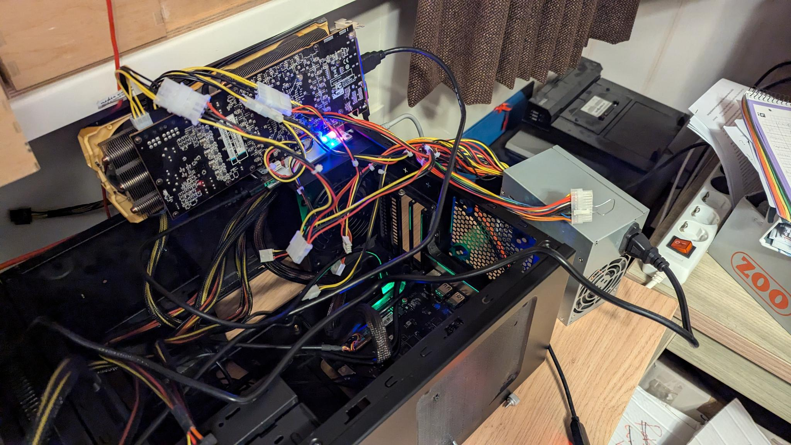

# Milk-V Jupiter - OpenSUSE Tumbleweed with external GPU ATI Radeon R9 290

## Software

I used the VisionFive2 image of OpenSUSE Tumbleweed.

## Hardware

- Milk-V Jupiter
- BEYIMEI PCIE Riser-Ver010X GPU Riser, 1X tot 16X (4PIN/6PIN/MOLEX) PCIE-verlengkabel, M.2 naar PCI-E Riser Card Bitcoin Litecoin Ethereum.
This is about 11 EURO on amazon, so no big deal... [amazon-link](https://www.amazon.nl/dp/B0BF4PH83Y?ref_=pe_28126711_487767311_302_E_DDE_dt_1)
- AMD/ATI Hawaii PRO [Radeon R9 290/390], Bought on a Dutch second-hand website, for 45 EURO. or ATI Radeon 5450, Bought on a Dutch second-hand website, for 10 EURO.
- 2x ATX power supply (was still lying around in the house + a new Cooler Master)
- For debugging a USB to TTL (was still lying around in the house), is about 5 EURO.

## Setup (hardware)

i have had multiple video cards directly in the jupiter.

- AMD RX 6600 It was detected, but with all firmwares i got a kernel panic.
- NVIDIA GeForce GTX 770, was detected also got to see kernel drivers with 'lspci -k' but didn't work. (gave no image).
- ATI Radeon 5450 works! got in KDE desktop (but was slow)
- ATI Radeon R9 290 only works on a Riser board with another power supply.

I have tried everything

- other power supply.
- 4x to 16x PCIe converter.
- Riser board, but then everything on 1 power supply.

I really have no idea why this has to be so complicated, I bought another 1x to 16x PCIe converter, it will arrive this week. It is possible that it does not want to work on 2x (mainboard) or with a 4x to 16x PCIe converter. Other video cards did work with the 4x to 16x PCIe converter in between. We will see. I hope that the 1x to 16x will work because the Riser board also indirectly goes from 1x to 16x.

hence the somewhat strange setup: 

## Compiling the kernel

I forked the milk-v [kernel](https://github.com/milkv-jupiter/linux-6.1), updated it with the [Bianbu Linux - SpacemiT kernel](https://gitee.com/bianbu-linux/linux-6.1). I was patching myself, but eventually came across this [pull-request](https://gitee.com/bianbu-linux/linux-6.1/pulls/3/commits).

I have put all this in my [github](https://github.com/Opvolger/spacemit-k1-linux-6.1/tree/bl-v1.0.y-amdgpu).

```bash
# we need some firmwares in the kernel
git clone --depth 1 git://git.kernel.org/pub/scm/linux/kernel/git/firmware/linux-firmware.git linux-firmware
# we need the kernel
git clone --branch bl-v1.0.y-amdgpu https://github.com/Opvolger/spacemit-k1-linux-6.1.git
cd spacemit-k1-linux-6.1

# create a .config for compiling the kernel without the onboard GPU and with the AMDGPU enabled.
make ARCH=riscv CROSS_COMPILE=riscv64-linux-gnu- k1_extern_gpu_defconfig
# i have added my GPU firmwares in the config file, maybe you need to edit the `.config` file.
# find the line with CONFIG_EXTRA_FIRMWARE= and add you firmwares. i have a amdgpu/hawaii so search the kernel source code with the text `amdgpu/hawaii` and you will see all the *.bin files that are needed. or look in dir `linux-firmware/amdgpu/`.

# build the kernel, i have 16 cores, so change it if you have more (or less).
make ARCH=riscv CROSS_COMPILE=riscv64-linux-gnu- -j 16

```

I have coped the root and boot partition of OpenSUSE to my m2 drive. boot is on my m2 partition 5 and root is partition 7.

The kernel will be here: `arch/riscv/boot/Image.gz` and dtb file here `arch/riscv/boot/dts/spacemit/m1-x_milkv-jupiter.dtb`.

Copy them to the OpenSUSE boot partition. Check the name of the initramfs, in my case it is `initramfs-6.6.36+.img`. It's not a problem that it's a different version, we included the firmware in our kernel anyway.

boot the milk-v with a serial connection. it will stop booting (u-boot is missing the standard files it expects. We have the OpenSUSE partitions which are organized differently than it expects).

51af1d3a-4696-4dfc-b8ca-93c85b140f1e == UUID of the root partition of OpenSUSE on my m2 drive.

boot the kernel from u-boot:

```bash
ramdisk_addr_r=0x21000000
fdt_addr_r=0x31000000
load nvme 0:5 ${kernel_addr_r} /Image.gz
load nvme 0:5 ${fdt_addr_r} /m1-x_milkv-jupiter.dtb
load nvme 0:5 ${ramdisk_addr_r} /initramfs-6.6.36+.img
setenv bootargs 'console=ttyS0,115200 root=UUID=51af1d3a-4696-4dfc-b8ca-93c85b140f1e rootfstype=ext4 rootwait rw earlycon clk_ignore_unused loglevel=7 radeon.pcie_gen2=0 swiotlb=131072 stmmaceth=chain_mode:1 selinux=0'
booti $kernel_addr_r $ramdisk_addr_r:$filesize $fdt_addr_r
```

You can make it shorter, create on your one pc the file:

```boot.cmd
ramdisk_addr_r=0x21000000
fdt_addr_r=0x31000000
load nvme 0:5 ${kernel_addr_r} /Image.gz
load nvme 0:5 ${fdt_addr_r} /m1-x_milkv-jupiter.dtb
load nvme 0:5 ${ramdisk_addr_r} /initramfs-6.6.36+.img
setenv bootargs 'console=ttyS0,115200 root=UUID=51af1d3a-4696-4dfc-b8ca-93c85b140f1e rootfstype=ext4 rootwait rw earlycon clk_ignore_unused loglevel=7 radeon.pcie_gen2=0 swiotlb=131072 stmmaceth=chain_mode:1 selinux=0'
booti $kernel_addr_r $ramdisk_addr_r:$filesize $fdt_addr_r
```

create a boot.source:

```bash
$ sudo mkimage -C none -A riscv -T script -d boot.cmd boot.scr
```

copy the file boot.scr to the OpenSUSE boot partition.

The next time you can boot in u-boot with

```bash
load nvme 0:5 ${scriptaddr} boot.scr; source ${scriptaddr}
```
