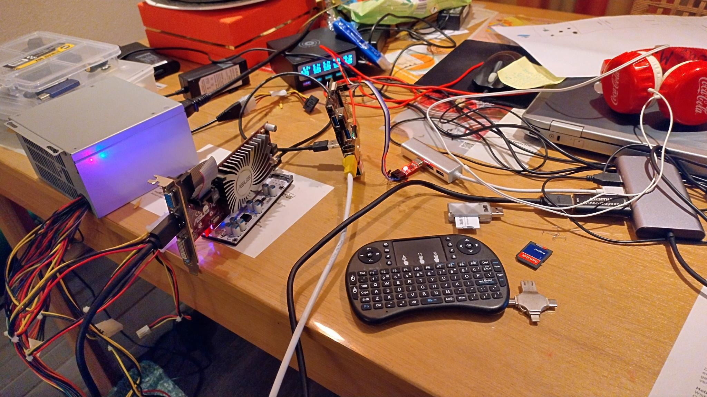
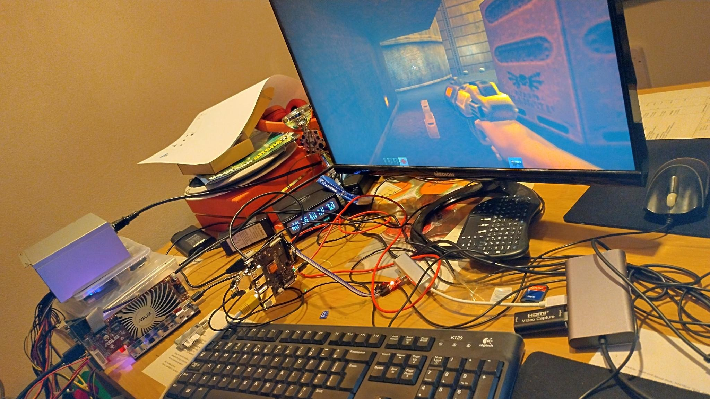

# Fedora with ATI Radeon 5450, running Quake2

I wanted to compile and test a few programs on a RISC-V. I only ran into the problem of minimal support of the onboard GPU and custom build Debian from the StarFive Team.

So below you can see my "solution".

## Hardware

- StarFive VisionFive 2
- BEYIMEI PCIE Riser-Ver010X GPU Riser, 1X tot 16X (4PIN/6PIN/MOLEX) PCIE-verlengkabel, M.2 naar PCI-E Riser Card Bitcoin Litecoin Ethereum.
This is about 11 EURO on amazon, so no big deal... [amazon-link](https://www.amazon.nl/dp/B0BF4PH83Y?ref_=pe_28126711_487767311_302_E_DDE_dt_1)
- ATI Radeon 5450, Bought on a Dutch second-hand website, for 10 EURO.
- An ATX power supply (was still lying around in the house)
- For debugging a USB to TTL (was still lying around in the house), is about 5 EURO.



My first setup was with a too light power supply for the video card, you can still see it in the background (no longer connected). I always used this to connect a hard disk externally.
If this also happens to you, you will see that the video card is recognized by the kernel, but that you see a lot of errors. `[  817.910347] pcie_plda 2c000000.pcie: AXI fetch error`

## Debugging

The longest I spent trying to get a working kernel that had the ATI video card and audio over HDMI working.

I have spent a lot of hours to get `Kernel driver in use: radeon` and `Kernel driver in use: snd_hda_intel` in my screen :)

```bash
$ lspci -k
0000:00:00.0 PCI bridge: PLDA XpressRich-AXI Ref Design (rev 02)
lspci: Unable to load libkmod resources: error -2
0000:01:00.0 USB controller: VIA Technologies, Inc. VL805/806 xHCI USB 3.0 Controller (rev 01)
        Subsystem: VIA Technologies, Inc. VL805/806 xHCI USB 3.0 Controller
        Kernel driver in use: xhci_hcd
0001:00:00.0 PCI bridge: PLDA XpressRich-AXI Ref Design (rev 02)
0001:01:00.0 VGA compatible controller: Advanced Micro Devices, Inc. [AMD/ATI] Cedar [Radeon HD 5000/6000/7350/8350 Series]
        Subsystem: ASUSTeK Computer Inc. Device 0366
        Kernel driver in use: radeon
0001:01:00.1 Audio device: Advanced Micro Devices, Inc. [AMD/ATI] Cedar HDMI Audio [Radeon HD 5400/6300/7300 Series]
        Subsystem: ASUSTeK Computer Inc. Device aa68
        Kernel driver in use: snd_hda_intel
# or for Audio
$ inxi -aA
Audio:
  Device-1: AMD Cedar HDMI Audio [Radeon HD 5400/6300/7300 Series] vendor: ASUSTeK
    driver: snd_hda_intel v: kernel bus-ID: 0001:01:00.1 chip-ID: 1002:aa68 class-ID: 0403
  Device-2: jh7110-pwmdac driver: starfive_pwmdac bus-ID: N/A chip-ID: starfive:100b0000
    class-ID: pwmdac
  Device-3: jh7110-hdmi driver: innohdmi_starfive bus-ID: N/A chip-ID: starfive:29590000
    class-ID: hdmi
  Device-4: simple-audio-card driver: N/A bus-ID: N/A chip-ID: simple-audio-card:soc
    class-ID: snd-card0
  Device-5: simple-audio-card driver: asoc_simple_card bus-ID: N/A
    chip-ID: simple-audio-card:soc class-ID: snd-card1
  Device-6: simple-audio-card driver: N/A bus-ID: N/A chip-ID: simple-audio-card:soc
    class-ID: snd-card2
  Device-7: simple-audio-card driver: asoc_simple_card bus-ID: N/A
    chip-ID: simple-audio-card:soc class-ID: snd-card3
  Device-8: simple-audio-card driver: N/A bus-ID: N/A chip-ID: simple-audio-card:soc
    class-ID: snd-card4
  Device-9: simple-audio-card driver: N/A bus-ID: N/A chip-ID: simple-audio-card:soc
    class-ID: snd-card5
  Device-10: simple-audio-card driver: N/A bus-ID: N/A chip-ID: simple-audio-card:soc
    class-ID: snd-card6
  Sound API: ALSA v: k5.15.0-dirty running: yes
  Sound Server-1: PulseAudio v: 16.1 running: no
  Sound Server-2: PipeWire v: 0.3.59 running: yes
```

The longest it take to findout I had to add firmwares to the kernel. I got the error's with:

```bash
$ journalctl | grep radeon
```

After this it was only getting the Fedora root partition on my SD-card. The "Frankenstein" Debian-build-69 is fun if you want to see the board working with the onboard GPU, but those drivers are really unfinished and X11 was as fast as I could see completely custom build for this GPU. (No OpenGL, OpenGL ES 3 only).

## DIY Step by step

### Create SD-card

My machine has a SD-card reader on `/dev/mmcblk0` this can of course be difference on your machine.

Download the Debian-Image-69 from StarFive VisionFive 2 Support page (I used the torrent in the google drive).
Download the Fedora RISC-V image `Fedora-Developer-37-20221130.n.0-sda.raw.xz` [link](https://fedoraproject.org/wiki/Architectures/RISC-V/Installing#Download_manually) and extract it to Fedora-Developer-37-20221130.n.0-sda.raw

```bash
# create a loop device of image
$ sudo losetup -f -P ~/Downloads/Image-69/starfive-jh7110-VF2_515_v2.5.0-69.img
$ sudo losetup -f -P ~/Downloads/Fedora-Developer-37-20221130.n.0-nvme.raw.img
# find your loop device
$ losetup -l
NAME        SIZELIMIT OFFSET AUTOCLEAR RO BACK-FILE                                                               DIO LOG-SEC
/dev/loop1          0      0         1  1 /var/lib/snapd/snaps/gnome-3-28-1804_161.snap                             0     512
/dev/loop8          0      0         1  1 /var/lib/snapd/snaps/gtk-common-themes_1534.snap                          0     512
/dev/loop15         0      0         0  0 /home/opvolger/Downloads/Fedora-Developer-37-20221130.n.0-nvme.raw.img    0     512
/dev/loop6          0      0         1  1 /var/lib/snapd/snaps/core18_2679.snap                                     0     512
/dev/loop13         0      0         1  1 /var/lib/snapd/snaps/wine-platform-runtime_335.snap                       0     512
/dev/loop4          0      0         1  1 /var/lib/snapd/snaps/bare_5.snap                                          0     512
/dev/loop11         0      0         1  1 /var/lib/snapd/snaps/wine-platform-5-stable_18.snap                       0     512
/dev/loop2          0      0         1  1 /var/lib/snapd/snaps/core18_2697.snap                                     0     512
/dev/loop0          0      0         1  1 /var/lib/snapd/snaps/gtk-common-themes_1535.snap                          0     512
/dev/loop9          0      0         1  1 /var/lib/snapd/snaps/snapd_18357.snap                                     0     512
/dev/loop7          0      0         1  1 /var/lib/snapd/snaps/snapd_17950.snap                                     0     512
/dev/loop14         0      0         0  0 /home/opvolger/Downloads/Image-69/starfive-jh7110-VF2_515_v2.5.0-69.img   0     512
/dev/loop5          0      0         1  1 /var/lib/snapd/snaps/cncra_63.snap                                        0     512
/dev/loop12         0      0         1  1 /var/lib/snapd/snaps/wine-platform-runtime_334.snap                       0     512
/dev/loop3          0      0         1  1 /var/lib/snapd/snaps/cncra_76.snap                                        0     512
/dev/loop10         0      0         1  1 /var/lib/snapd/snaps/wine-platform-5-stable_16.snap                       0     512
# in my case it is loop14 and loop15

# insert your SD-card and delete all partitions (I had 3)
$ sudo fdisk /dev/mmcblk0
[sudo] password for opvolger: 

Welcome to fdisk (util-linux 2.38.1).
Changes will remain in memory only, until you decide to write them.
Be careful before using the write command.


Command (m for help): d
Partition number (1-3, default 3): 1

Partition 1 has been deleted.

Command (m for help): d
Partition number (2,3, default 3): 2

Partition 2 has been deleted.

Command (m for help): d
Selected partition 3
Partition 3 has been deleted.

Command (m for help): w
The partition table has been altered.
Calling ioctl() to re-read partition table.
Syncing disks.

# add all 3 partitions (not all data) of the Debain-Image-69 to the SD-card
$ sudo dd if=/dev/loop14 of=/dev/mmcblk0 status=progress
[sudo] password for opvolger: 
1121309184 bytes (1.1 GB, 1.0 GiB) copied, 93 s, 12.1 MB/s^C
2190529+0 records in
2190529+0 records out
1121550848 bytes (1.1 GB, 1.0 GiB) copied, 95.7358 s, 11.7 MB/s
# You can hit Ctrl+C after about 1GB (I did!)
# the Fedora img has only 2 partitions, 2nd is the root partition. We need to (re)place the root partition of the Debain-Image-69 (3th partition now on the SD-card)
$ sudo dd if=/dev/loop15p2 of=/dev/mmcblk0p3 status=progress
9975758848 bytes (10 GB, 9.3 GiB) copied, 319 s, 31.3 MB/s 
19537853+0 records in
19537853+0 records out
10003380736 bytes (10 GB, 9.3 GiB) copied, 384.316 s, 26.0 MB/s
```

Remove the SD-card and put it back in again.

### Building the Linux Kernel

I built this on my own machine, otherwise it will take a very long time. so cross compile!
Everything is neatly explained if you click through to the "linux" repo of all (yet) custom code for the SBC. [link](https://github.com/starfive-tech/VisionFive2)

```bash
$ mkdir ~/visionfive2
$ cd visionfive2
$ git clone https://github.com/starfive-tech/linux.git
Cloning into 'linux'...
remote: Enumerating objects: 9350943, done.
remote: Counting objects: 100% (1061/1061), done.
remote: Compressing objects: 100% (425/425), done.
Receiving objects:   1% (160706/9350943), 77.16 MiB | 14.26 MiB/s
Done
$ cd linux
$ git checkout JH7110_VisionFive2_devel
Updating files: 100% (20490/20490), done.
Switched to branch 'JH7110_VisionFive2_devel'
Your branch is up to date with 'origin/JH7110_VisionFive2_devel'.
```

Now we have the modified kernel 5.15 that workes with VisionFive 2.
We can use the instructions of the other branch [link](https://github.com/starfive-tech/linux/tree/JH7110_VisionFive2_upstream). Here and there I deviated a little from it

I am running Manjaro on got an error. I fixxed it in `arch/riscv/Makefile` on line +/- 56 (find this online).

```Makefile
...
...
...
# ISA string setting
riscv-march-$(CONFIG_ARCH_RV32I)	:= rv32ima
riscv-march-$(CONFIG_ARCH_RV64I)	:= rv64ima
riscv-march-$(CONFIG_FPU)		:= $(riscv-march-y)fd
riscv-march-$(CONFIG_RISCV_ISA_C)	:= $(riscv-march-y)c

# Newer binutils versions default to ISA spec version 20191213 which moves some
# instructions from the I extension to the Zicsr and Zifencei extensions.
toolchain-need-zicsr-zifencei := $(call cc-option-yn, -march=$(riscv-march-y)_zicsr_zifencei)
riscv-march-$(toolchain-need-zicsr-zifencei) := $(riscv-march-y)_zicsr_zifencei

KBUILD_CFLAGS += -march=$(subst fd,,$(riscv-march-y))
KBUILD_AFLAGS += -march=$(riscv-march-y)
...
...
...
```

```bash
# create the .config with all you need for only the StarFive VisionFive 2
make ARCH=riscv CROSS_COMPILE=riscv64-linux-gnu- starfive_visionfive2_defconfig

# open the menu
make CROSS_COMPILE=riscv64-linux-gnu- ARCH=riscv menuconfig
```

Now we have to add the ATI video-card and HDMI-audio.

Device Drivers ---> [HIT ENTER]
  Generic Driver Options ---> [HIT ENTER]
    Firmware loader ---> [HIT ENTER]
      () Build named firmware blobs into the kernel binary [HIT ENTER]
enter this in the line:

```ini
radeon/CYPRESS_uvd.bin radeon/CEDAR_smc.bin radeon/CEDAR_me.bin radeon/CEDAR_pfp.bin radeon/CEDAR_rlc.bin
```

Select Exit,Exit,Exit

Device Drivers --->
  Graphics support ---> [HIT ENTER]
    <*> ATI Radeon [hit space twice]
Select Exit

Device Drivers --->
  Sound card support ---> [HIT ENTER]
    Advanced Linux Sound Architecture ---> [HIT ENTER]
      HD-Audio --->
        Build HDMI/DisplayPort HD-audio codec support [hit space twice]
Select Exit,Exit,Exit,Exit

Now save your changes! as .config and Exit

We can compile the kernel, I have 8 cores in my machine... so I added -j 8

```bash
$ make ARCH=riscv CROSS_COMPILE=riscv64-linux-gnu- -j 8
  SYNC    include/config/auto.conf
  CALL    scripts/atomic/check-atomics.sh
  CALL    scripts/checksyscalls.sh
  CHK     include/generated/compile.h
  CC      sound/core/sound.o
  CC      sound/core/init.o
  CC      sound/core/control.o
  UPD     kernel/config_data
  AR      sound/pci/ac97/built-in.a
  CC      sound/pci/hda/hda_bind.o
  CC      sound/pci/hda/hda_codec.o
  GZIP    kernel/config_data.gz
  CC      kernel/configs.o
  CC      drivers/tty/vt/keyboard.o
  AR      kernel/built-in.a
  CC      sound/core/vmaster.o
  CC      sound/usb/card.o
  CC      sound/pci/hda/hda_jack.o
  CC      sound/core/ctljack.o
...
...
...
  LD      vmlinux
  SORTTAB vmlinux
  SYSMAP  System.map
  MODPOST modules-only.symvers
  OBJCOPY arch/riscv/boot/Image
  GZIP    arch/riscv/boot/Image.gz
  GEN     Module.symvers
  LD [M]  drivers/net/wireless/eswin/wlan_ecr6600u_usb.ko
  Kernel: arch/riscv/boot/Image.gz is ready
$ mkdir -p ~/visionfive2/kernel
$ make CROSS_COMPILE=riscv64-linux-gnu- ARCH=riscv INSTALL_PATH=~/visionfive2/kernel zinstall -j 8
sh ./arch/riscv/boot/install.sh 5.15.0-dirty \
arch/riscv/boot/Image.gz System.map "/home/opvolger/visionfive2/kernel"
Installing compressed kernel
```

The kernel is Done! Now copy it to the boot partition!

#### BOOT/ROOT Copy kernel

We have the SD-card inserted (again).

```bash
$ mkdir -p ~/visionfive2/boot
$ mkdir -p ~/visionfive2/root
# mount boot and root partition
$ sudo mount /dev/mmcblk0p2 ~/visionfive2/boot
$ sudo mount /dev/mmcblk0p3 ~/visionfive2/root
# copy the kernel
$ sudo cp ~/visionfive2/kernel/*dirty ~/visionfive2/boot/boot
```

#### BOOT/ROOT Add the boot option

```bash
$ sudo nano ~/visionfive2/boot/boot/extlinux/extlinux.conf
```

We have to change the kernel from /boot/vmlinuz-5.15.0-starfive to /boot/vmlinuz-5.15.0-dirty

```ini
## /boot/extlinux/extlinux.conf
##
## IMPORTANT WARNING
##
## The configuration of this file is generated automatically.
## Do not edit this file manually, use: u-boot-update

default l0
menu title U-Boot menu
prompt 0
timeout 50


label l0
        menu label Debian GNU/Linux bookworm/sid 5.15.0-starfive
        linux /boot/vmlinuz-5.15.0-starfive
        initrd /boot/initrd.img-5.15.0-starfive
        fdtdir /boot/dtbs/
        append  root=/dev/mmcblk1p3 rw console=tty0 console=ttyS0,115200 earlycon rootwait stmmaceth=chain_mode:1 selinux=0

label l0r
        menu label Debian GNU/Linux bookworm/sid 5.15.0-starfive (rescue target)
        linux /boot/vmlinuz-5.15.0-starfive
        initrd /boot/initrd.img-5.15.0-starfive
        fdtdir /boot/dtbs/
        append  root=/dev/mmcblk1p3 rw console=tty0 console=ttyS0,115200 earlycon rootwait stmmaceth=chain_mode:1 selinux=0 single
```

to

```ini
## /boot/extlinux/extlinux.conf
##
## IMPORTANT WARNING
##
## The configuration of this file is generated automatically.
## Do not edit this file manually, use: u-boot-update

default l0
menu title U-Boot menu
prompt 0
timeout 50


label l0
        menu label Fedora GNU/Linux bookworm/sid 5.15.0-dirty
        linux /boot/vmlinuz-5.15.0-dirty
        initrd /boot/initrd.img-5.15.0-starfive
        fdtdir /boot/dtbs/
        append  root=/dev/mmcblk1p3 rw console=tty0 console=ttyS0,115200 earlycon rootwait stmmaceth=chain_mode:1 selinux=0

label l0r
        menu label Debian GNU/Linux bookworm/sid 5.15.0-starfive (rescue target)
        linux /boot/vmlinuz-5.15.0-starfive
        initrd /boot/initrd.img-5.15.0-starfive
        fdtdir /boot/dtbs/
        append  root=/dev/mmcblk1p3 rw console=tty0 console=ttyS0,115200 earlycon rootwait stmmaceth=chain_mode:1 selinux=0 single
```

#### BOOT/ROOT Fix the fstab of the root partition

We have to change the /boot mount point. The UUID and type are different. We have to findout the new UUID and change the type from ext4 to vfat. (Debian image works with vfat!)

```bash
$ blkid /dev/mmcblk0p2
/dev/mmcblk0p2: SEC_TYPE="msdos" UUID="9936-8B5F" BLOCK_SIZE="512" TYPE="vfat" PARTUUID="9ba5bebd-7dd9-4a43-b352-3b197302ead9"

$ sudo nano ~/visionfive2/root/etc/fstab
```

change

```ini
UUID=d9334329-e2ad-4b72-8f5f-b61406e9d461  / ext4    defaults,noatime,x-systemd.device-timeout=300s,x-systemd.mount-timeout=300s 0 0
UUID=53e7246e-90c3-42c4-b447-3ebc9fe1fdfc  /boot ext4    defaults,noatime,x-systemd.device-timeout=300s,x-systemd.mount-timeout=300s 0 0
```

to

```ini
UUID=d9334329-e2ad-4b72-8f5f-b61406e9d461  / ext4    defaults,noatime,x-systemd.device-timeout=300s,x-systemd.mount-timeout=300s 0 0
UUID=9936-8B5F  /boot vfat    defaults,noatime,x-systemd.device-timeout=30s,x-systemd.mount-timeout=30s 0 0
```

#### BOOT/ROOT Yum repo's

There is no real release yet of RISC-V of Fedora (mainline). So we need to disable alot of repo's

```bash
$ sudo nano ~/visionfive2/root/etc/yum.repos.d/fedora-cisco-openh264.repo 
$ sudo nano ~/visionfive2/root/etc/yum.repos.d/fedora-modular.repo 
$ sudo nano ~/visionfive2/root/etc/yum.repos.d/fedora-riscv.repo 
$ sudo nano ~/visionfive2/root/etc/yum.repos.d/fedora-updates-modular.repo 
$ sudo nano ~/visionfive2/root/etc/yum.repos.d/fedora-updates.repo 
$ sudo nano ~/visionfive2/root/etc/yum.repos.d/fedora-updates-testing-modular.repo 
$ sudo nano ~/visionfive2/root/etc/yum.repos.d/fedora-updates-testing.repo
```

and change

```ini
enabled=1
```

to

```ini
enabled=0
```

We only have to update one file

```bash
$ sudo nano ~/visionfive2/root/etc/yum.repos.d/fedora.repo
```

```ini
[fedora]
name=Fedora $releasever - $basearch
#baseurl=http://download.example/pub/fedora/linux/releases/$releasever/Everything/$basearch/os/
metalink=https://mirrors.fedoraproject.org/metalink?repo=fedora-$releasever&arch=$basearch
enabled=1
countme=1
metadata_expire=6h
...
...
...
...
```

to

```ini
[fedora]
name=Fedora $releasever - $basearch
baseurl=https://dl.fedoraproject.org/pub/alt/risc-v/repo/fedora/37/latest/riscv64/
#metalink=https://mirrors.fedoraproject.org/metalink?repo=fedora-$releasever&arch=$basearch
enabled=1
countme=1
metadata_expire=6h
...
...
...
...
...
```

## BOOT it up!

```bash
# umount the SD-card
$ sudo umount ~/visionfive2/root/
$ sudo umount ~/visionfive2/boot/
```

Put the SD-card into the VisionFive 2 and turn it on!
We have to wait for dev-zram0.device ...

Now we connect to the VisionFive 2 (ip will be different)

```bash
$ ssh riscv@192.168.2.20
The authenticity of host '192.168.2.20 (192.168.2.20)' can't be established.
ED25519 key fingerprint is SHA256:cqqk6Zm4/oC0tSwrC4JtT29MPpOC7Ye9yAuxQMklugM.
This key is not known by any other names.
Are you sure you want to continue connecting (yes/no/[fingerprint])? yes
Warning: Permanently added '192.168.2.20' (ED25519) to the list of known hosts.
riscv@192.168.2.20's password: 
```

Now first remove zram!

```bash
[riscv@fedora-riscv ~]$ sudo yum remove zram-generator-defaults

We trust you have received the usual lecture from the local System
Administrator. It usually boils down to these three things:

    #1) Respect the privacy of others.
    #2) Think before you type.
    #3) With great power comes great responsibility.

[sudo] password for riscv:
Dependencies resolved.
===============================================================================================================
 Package                           Architecture      Version                  Repository                  Size
===============================================================================================================
Removing:
 zram-generator-defaults           noarch            1.1.2-2.fc37             @koji-override-0           320  
Removing unused dependencies:
 zram-generator                    riscv64           1.1.2-2.fc37             @koji-override-0           728 k

Transaction Summary
===============================================================================================================
Remove  2 Packages

Freed space: 728 k
Is this ok [y/N]: y
Running transaction check
Transaction check succeeded.
Running transaction test
Transaction test succeeded.
Running transaction
  Preparing        :                                                                                       1/1 
  Erasing          : zram-generator-defaults-1.1.2-2.fc37.noarch                                           1/2 
  Erasing          : zram-generator-1.1.2-2.fc37.riscv64                                                   2/2 
  Running scriptlet: zram-generator-1.1.2-2.fc37.riscv64                                                   2/2 
  Verifying        : zram-generator-1.1.2-2.fc37.riscv64                                                   1/2 
  Verifying        : zram-generator-defaults-1.1.2-2.fc37.noarch                                           2/2 

Removed:
  zram-generator-1.1.2-2.fc37.riscv64                zram-generator-defaults-1.1.2-2.fc37.noarch               

Complete!
```

## Compile Quake2

```bash
# clean yum clean all
[riscv@fedora-riscv ~]$ sudo yum clean all
0 files removed
# install packages needed for compiling (Y)Quake2
# GPG is not working, so no check on it (this will take a while)
[riscv@fedora-riscv ~]$ sudo yum install SDL2-devel openal-soft-devel libcurl-devel --nogpgcheck 
Fedora 37 - riscv64                                     71% [======================================-               ] 1.3 MB/s |  40 MB     00:12 ETA
...
...
...
  Verifying        : openal-soft-devel-1.22.2-2.fc37.riscv64                                                                                   10/10 

Installed:
  SDL2-2.24.0-1.fc37.riscv64                       SDL2-devel-2.24.0-1.fc37.riscv64                    libcurl-devel-7.85.0-2.fc37.riscv64           
  libdecor-0.1.0-3.fc37.riscv64                    libglvnd-core-devel-1:1.5.0-1.fc37.riscv64          libglvnd-devel-1:1.5.0-1.fc37.riscv64         
  libmysofa-1.2.1-3.fc37.riscv64                   mesa-libEGL-devel-22.2.2-1.fc37.riscv64             openal-soft-1.22.2-2.fc37.riscv64             
  openal-soft-devel-1.22.2-2.fc37.riscv64         

Complete!
```

Now clone Quake2 and build it!

```bash
[riscv@fedora-riscv ~]$ git clone https://github.com/yquake2/yquake2.git
Cloning into 'yquake2'...
remote: Enumerating objects: 27461, done.
remote: Counting objects: 100% (452/452), done.
remote: Compressing objects: 100% (203/203), done.
remote: Total 27461 (delta 278), reused 386 (delta 248), pack-reused 27009
Receiving objects: 100% (27461/27461), 24.93 MiB | 8.24 MiB/s, done.
Resolving deltas: 100% (19048/19048), done.
[riscv@fedora-riscv ~]$ cd yquake2
[riscv@fedora-riscv yquake2]$ make
Build configuration
============================
YQ2_ARCH = riscv64 COMPILER = gcc
WITH_CURL = yes
WITH_OPENAL = yes
WITH_RPATH = yes
WITH_SYSTEMWIDE = no
WITH_SYSTEMDIR = 
============================

===> Building quake2
make release/quake2
make[1]: Entering directory '/home/riscv/yquake2'
===> CC src/backends/generic/misc.c
===> CC src/client/cl_cin.c
===> CC src/client/cl_console.c
...
...
...
...
...
===> CC src/client/refresh/files/pvs.c
===> CC src/common/shared/shared.c
===> CC src/common/md4.c
===> CC src/backends/unix/shared/hunk.c
===> LD release/ref_soft.so
make[1]: Leaving directory '/home/riscv/yquake2'
[riscv@fedora-riscv ~]$ cd
[riscv@fedora-riscv ~]$ mkdir -p ~/.yq2/baseq2
# if you own Quake2 copy the content of your baseq2 folder to ~/.yq2/baseq2
# if not.. get the demo version of pak0.pak and other files from here:
[riscv@fedora-riscv ~]$ git clone https://github.com/drags/docker-quake2.git
Cloning into 'docker-quake2'...
remote: Enumerating objects: 1190, done.
remote: Total 1190 (delta 0), reused 0 (delta 0), pack-reused 1190
Receiving objects: 100% (1190/1190), 70.91 MiB | 8.56 MiB/s, done.
Resolving deltas: 100% (87/87), done.
Updating files: 100% (1191/1191), done.
[riscv@fedora-riscv ~]$ cp -R docker-quake2/baseq2/* ~/.yq2/baseq2/
# we have do not need x86 :)
[riscv@fedora-riscv ~]$ rm ~/.yq2/baseq2/gamex86_64.so
# create maps.lst
[riscv@fedora-riscv ~]$ cat <<EOT >> ~/.yq2/baseq2/maps.lst
q2dm1 "The Edge" \
q2dm2 "Tokay's Towers" \
q2dm3 "The Frag Pipe" \
q2dm4 "Lost Hallways" \
q2dm5 "The Pits" \
q2dm6 "Lava Tomb" \
q2dm7 "The Slimy Place" \
q2dm8 "WareHouse"
EOT
```

Done!

## Play Quake2

Login X11 and start ~/yquake2/release/quake2


