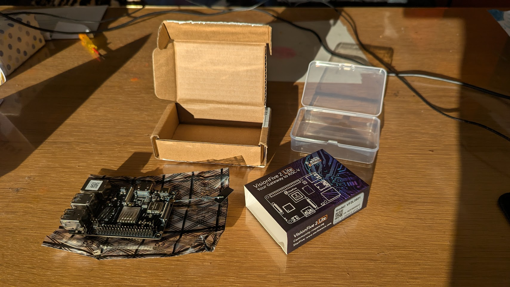

# StarFive VisionFive 2 Lite - U-boot and Kernel with external GPU ATI Radeon R9 290

Where is a new Lite edition of the StarFive VisionFive 2. It is the StarFive VisionFive 2 Lite. The form factor is a little bit smaller clock speeds is a bit lower, but almost the same. It is now only or SD-card or eMMC (soldered) but we have now Bluetooth and WiFi.



The u-boot and kernel patch is already on the way. Just like the StarFive VisionFive 2 (not Lite) is the GPU still not in de mainline kernel, but the rest is working.

So if you don't want to run a vender Linux kernel/distro, you can run a mainline kernel with a patch and a normal rootfs from a distribution that already support RISC-V.

I am on Fedora 43, and needed to install some missing packages (new laptop)

```bash
sudo dnf install openssl-devel-engine swig gcc-c++-riscv64-linux-gnu gcc-c++ libmpc-devel gcc-plugin-devel git openal-soft-devel ncurses-devel flex bison gnutls-devel
```

## Building OpenSBI

v1.7 of OpenSBI has a bug for the StarFive VisionFive 2. It is al fixed on master, but I use v1.6 for now.

```bash
git clone --branch v1.6 --depth=1 https://github.com/riscv-software-src/opensbi.git
cd opensbi
make CROSS_COMPILE=riscv64-linux-gnu- PLATFORM=generic FW_OPTIONS=0 FW_TEXT_START=0x40000000
```

## Building U-Boot

We first get the u-boot code. We do not need al the history, so we add depth 1.

```bash
git clone --branch v2026.01-rc3 --depth=1 https://github.com/u-boot/u-boot.git
```

and apply this [patch](https://patchwork.ozlabs.org/project/uboot/list/?series=479346)

The website is very slow (timeouts) so i already downloaded the patch [Re-PATCH-v1-2-9-riscv-dts-starfive-Add-VisionFive-2-Lite-board-device-tree.mbox](https://raw.githubusercontent.com/Opvolger/ansible-riscv-sd-card-creater/refs/heads/master/files/jh7110-lite/Re-PATCH-v1-2-9-riscv-dts-starfive-Add-VisionFive-2-Lite-board-device-tree.mbox)

The patch is not working 100%, so we need to fix some stuff. That is why i use the reject option with git.

```bash
cd u-boot
wget https://raw.githubusercontent.com/Opvolger/ansible-riscv-sd-card-creater/refs/heads/master/files/jh7110-lite/Re-PATCH-v1-2-9-riscv-dts-starfive-Add-VisionFive-2-Lite-board-device-tree.mbox
git apply --reject --whitespace=fix Re-PATCH-v1-2-9-riscv-dts-starfive-Add-VisionFive-2-Lite-board-device-tree.mbox
```

You will see that some patches are rejected:
```bash
Checking patch dts/upstream/src/riscv/starfive/jh7110-common.dtsi...
error: while searching for:
        assigned-clock-rates = <50000000>;
        bus-width = <8>;
        bootph-pre-ram;
        cap-mmc-highspeed;
        mmc-ddr-1_8v;
        mmc-hs200-1_8v;
        cap-mmc-hw-reset;
        post-power-on-delay-ms = <200>;
        pinctrl-names = "default";
        pinctrl-0 = <&mmc0_pins>;
        vmmc-supply = <&vcc_3v3>;
        vqmmc-supply = <&emmc_vdd>;
        status = "okay";
};


error: patch failed: dts/upstream/src/riscv/starfive/jh7110-common.dtsi:281
error: while searching for:
        assigned-clock-rates = <50000000>;
        bus-width = <4>;
        bootph-pre-ram;
        no-sdio;
        no-mmc;
        cd-gpios = <&sysgpio 41 GPIO_ACTIVE_LOW>;
        disable-wp;
        cap-sd-highspeed;
        post-power-on-delay-ms = <200>;
        pinctrl-names = "default";
        pinctrl-0 = <&mmc1_pins>;
        status = "okay";

error: patch failed: dts/upstream/src/riscv/starfive/jh7110-common.dtsi:299
Hunk #3 succeeded at 444 (offset 7 lines).
Checking patch dts/upstream/src/riscv/starfive/jh7110-deepcomputing-fml13v01.dts...
Checking patch dts/upstream/src/riscv/starfive/jh7110-milkv-mars.dts...
Checking patch dts/upstream/src/riscv/starfive/jh7110-pine64-star64.dts...
Checking patch dts/upstream/src/riscv/starfive/jh7110-starfive-visionfive-2.dtsi...
Checking patch dts/upstream/src/riscv/starfive/jh7110.dtsi...
Hunk #1 succeeded at 205 (offset 5 lines).
Checking patch arch/riscv/include/asm/arch-jh7110/eeprom.h...
error: while searching for:

#include <linux/types.h>

u8 get_pcb_revision_from_eeprom(void);

/**

error: patch failed: arch/riscv/include/asm/arch-jh7110/eeprom.h:9
Checking patch board/starfive/visionfive2/visionfive2-i2c-eeprom.c...
error: while searching for:
        return 0;
}

/**
 * get_pcb_revision_from_eeprom - get the PCB revision
 *
 * 1.2A return 'A'/'a', 1.3B return 'B'/'b',other values are illegal
 */
u8 get_pcb_revision_from_eeprom(void)
{
        u8 pv = 0xFF;

        if (read_eeprom())
                return pv;

        return pbuf.eeprom.atom1.data.pstr[6];
}

u8 get_ddr_size_from_eeprom(void)

error: patch failed: board/starfive/visionfive2/visionfive2-i2c-eeprom.c:535
Checking patch configs/starfive_visionfive2_defconfig...
error: while searching for:
CONFIG_CMD_BOOTSTAGE=y
CONFIG_OF_BOARD=y
CONFIG_DEVICE_TREE_INCLUDES="starfive-visionfive2-u-boot.dtsi"
CONFIG_OF_LIST="starfive/jh7110-deepcomputing-fml13v01 starfive/jh7110-milkv-mars starfive/jh7110-pine64-star64 starfive/jh7110-starfive-visionfive-2-v1.2a starfive/jh7110-starfive-visionfive-2-v1.3b"
CONFIG_MULTI_DTB_FIT=y
CONFIG_ENV_OVERWRITE=y
CONFIG_ENV_IS_IN_SPI_FLASH=y

error: patch failed: configs/starfive_visionfive2_defconfig:79
Checking patch dts/upstream/src/riscv/starfive/jh7110s-starfive-visionfive-2-lite.dts...
Checking patch board/starfive/visionfive2/visionfive2-i2c-eeprom.c...
Hunk #7 succeeded at 633 (offset 18 lines).
Checking patch drivers/pci/pcie_starfive_jh7110.c...
Checking patch board/starfive/visionfive2/spl.c...
Hunk #1 succeeded at 140 (offset 8 lines).
Checking patch board/starfive/visionfive2/starfive_visionfive2.c...
Hunk #1 succeeded at 69 (offset 6 lines).
Checking patch arch/riscv/cpu/jh7110/spl.c...
Checking patch arch/riscv/include/asm/arch-jh7110/eeprom.h...
Checking patch board/starfive/visionfive2/visionfive2-i2c-eeprom.c...
Hunk #1 succeeded at 580 (offset 30 lines).
Applying patch dts/upstream/src/riscv/starfive/jh7110-common.dtsi with 2 rejects...
Rejected hunk #1.
Rejected hunk #2.
Hunk #3 applied cleanly.
Applied patch dts/upstream/src/riscv/starfive/jh7110-deepcomputing-fml13v01.dts cleanly.
Applied patch dts/upstream/src/riscv/starfive/jh7110-milkv-mars.dts cleanly.
Applied patch dts/upstream/src/riscv/starfive/jh7110-pine64-star64.dts cleanly.
Applied patch dts/upstream/src/riscv/starfive/jh7110-starfive-visionfive-2.dtsi cleanly.
Applied patch dts/upstream/src/riscv/starfive/jh7110.dtsi cleanly.
Applying patch arch/riscv/include/asm/arch-jh7110/eeprom.h with 1 reject...
Rejected hunk #1.
Applying patch board/starfive/visionfive2/visionfive2-i2c-eeprom.c with 1 reject...
Rejected hunk #1.
Applying patch configs/starfive_visionfive2_defconfig with 1 reject...
Rejected hunk #1.
Applied patch dts/upstream/src/riscv/starfive/jh7110s-starfive-visionfive-2-lite.dts cleanly.
Applied patch board/starfive/visionfive2/visionfive2-i2c-eeprom.c cleanly.
Applied patch drivers/pci/pcie_starfive_jh7110.c cleanly.
Applied patch board/starfive/visionfive2/spl.c cleanly.
Applied patch board/starfive/visionfive2/starfive_visionfive2.c cleanly.
Applied patch arch/riscv/cpu/jh7110/spl.c cleanly.
Applied patch arch/riscv/include/asm/arch-jh7110/eeprom.h cleanly.
Applied patch board/starfive/visionfive2/visionfive2-i2c-eeprom.c cleanly.
```

All the patches that didn't work are saved in *.rej files. We need to see what we need to fix. Lines that where added have a '+' sign what is deleted have `-` sign.

You can see that this is removed in the reject file `dts/upstream/src/riscv/starfive/jh7110-common.dtsi.rej`, but some thinks are already changed.

We will fix that. Open `dts/upstream/src/riscv/starfive/jh7110-common.dtsi` and change (from line 278)

```ini
&mmc0 {
	max-frequency = <100000000>;
	assigned-clocks = <&syscrg JH7110_SYSCLK_SDIO0_SDCARD>;
	assigned-clock-rates = <50000000>;
	bus-width = <8>;
	bootph-pre-ram;
	cap-mmc-highspeed;
	mmc-ddr-1_8v;
	mmc-hs200-1_8v;
	cap-mmc-hw-reset;
	pinctrl-names = "default";
	pinctrl-0 = <&mmc0_pins>;
	vmmc-supply = <&vcc_3v3>;
	vqmmc-supply = <&emmc_vdd>;
	status = "okay";
};

&mmc1 {
	max-frequency = <100000000>;
	assigned-clocks = <&syscrg JH7110_SYSCLK_SDIO1_SDCARD>;
	assigned-clock-rates = <50000000>;
	bus-width = <4>;
	bootph-pre-ram;
	cd-gpios = <&sysgpio 41 GPIO_ACTIVE_LOW>;
	disable-wp;
	cap-sd-highspeed;
	pinctrl-names = "default";
	pinctrl-0 = <&mmc1_pins>;
	status = "okay";
};
```

to

```ini
&mmc0 {
	max-frequency = <100000000>;
	assigned-clocks = <&syscrg JH7110_SYSCLK_SDIO0_SDCARD>;
	assigned-clock-rates = <50000000>;
	bus-width = <8>;
	bootph-pre-ram;
	pinctrl-names = "default";
	pinctrl-0 = <&mmc0_pins>;
	status = "okay";
};

&mmc1 {
	max-frequency = <100000000>;
	assigned-clocks = <&syscrg JH7110_SYSCLK_SDIO1_SDCARD>;
	assigned-clock-rates = <50000000>;
	bus-width = <4>;
	bootph-pre-ram;
	cap-sd-highspeed;
	pinctrl-names = "default";
	pinctrl-0 = <&mmc1_pins>;
	status = "okay";
};
```

In `configs/starfive_visionfive2_defconfig.rej` you can see that adding the new board to the CONFIG_OF_LIST didn't work. Other board are already added or changed from name!

So edit `configs/starfive_visionfive2_defconfig` and change the line

```ini
CONFIG_OF_LIST="starfive/jh7110-deepcomputing-fml13v01 starfive/jh7110-milkv-mars starfive/jh7110-milkv-marscm-emmc starfive/jh7110-milkv-marscm-lite starfive/jh7110-pine64-star64 starfive/jh7110-starfive-visionfive-2-v1.2a starfive/jh7110-starfive-visionfive-2-v1.3b"
```

to

```ini
CONFIG_OF_LIST="starfive/jh7110-deepcomputing-fml13v01 starfive/jh7110-milkv-mars starfive/jh7110-milkv-marscm-emmc starfive/jh7110-milkv-marscm-lite starfive/jh7110-pine64-star64 starfive/jh7110-starfive-visionfive-2-v1.2a starfive/jh7110-starfive-visionfive-2-v1.3b starfive/jh7110s-starfive-visionfive-2-lite"
```

If we open `arch/riscv/include/asm/arch-jh7110/eeprom.h.rej` we see that only comment was added. so we ignore this rejected patch.

Now the last *.rej file `board/starfive/visionfive2/visionfive2-i2c-eeprom.c.rej`

We have to edit `board/starfive/visionfive2/visionfive2-i2c-eeprom.c` from line 543

change

```ini
u8 get_pcb_revision_from_eeprom(void)
{
	u8 pv = 0xFF;

	if (read_eeprom())
		return pv;

	return pbuf.eeprom.atom1.data.pstr[6];
}
```

to

```ini
u8 get_pcb_revision_from_eeprom(void)
{
	if (read_eeprom())
		return 0;

	return pbuf.eeprom.atom4.data.pcb_revision;
}
```

Now we can build it! We have patch the patch!

```bash
make CROSS_COMPILE=riscv64-linux-gnu- starfive_visionfive2_defconfig
# if you want to use the PCIe interface for something different then NVMe drive. Disable the PCI in U-Boot.
sed -i -e 's/CONFIG_PCI_INIT_R=y/CONFIG_CMD_PCI=n/g' .config
sed -i -e 's/CONFIG_PCI_INIT_R=y/CONFIG_PCI_INIT_R=n/g' .config
sed -i -e 's/PCI_INIT_R=y/PCI_INIT_R=n/g' .config
make CROSS_COMPILE=riscv64-linux-gnu- OPENSBI=../opensbi/build/platform/generic/firmware/fw_payload.bin CONFIG_DEFAULT_FDT_FILE=starfive/jh7110s-starfive-visionfive-2-lite.dtb
```

On the question `Enumerate PCI buses during init (PCI_INIT_R) [N/y/?] (NEW)` hit Enter.

Done, it is build!

## Kernel 6.18 with a patch

and apply this [patch](https://lore.kernel.org/all/20251120082946.109378-1-hal.feng@starfivetech.com/)

I uses the github mirror

```bash
# we need some firmwares in the kernel
git clone --depth 1 git://git.kernel.org/pub/scm/linux/kernel/git/firmware/linux-firmware.git linux-firmware
# clone the kernel
git clone --branch v6.18 --depth=1 https://github.com/torvalds/linux.git
cd linux
wget https://lore.kernel.org/all/20251120082946.109378-1-hal.feng@starfivetech.com/t.mbox.gz
gzip -d t.mbox.gz
git apply --reject --whitespace=fix t.mbox
```

Just like U-boot, some files are rejected. But the changes are in the code. (I think double patches are in the t.mbox file). So nothing to do! Config en build the kernel!

Generate a .config file from the the default defconfig for RISC-V.

Change the config file so we don't need modules.

I add the firmware needed for the Radeon R9 290 and add enable some kernel features.

```bash
make ARCH=riscv CROSS_COMPILE=riscv64-linux-gnu- defconfig -j 16
# don't make modules, add everything in the kernel
sed -i -e 's/=m/=y/g' .config
# add some stuff to build
cat >> .config << EOL
# firmware in kernel
CONFIG_EXTRA_FIRMWARE="amdgpu/hawaii_k_smc.bin amdgpu/hawaii_smc.bin amdgpu/hawaii_uvd.bin amdgpu/hawaii_vce.bin amdgpu/hawaii_sdma.bin amdgpu/hawaii_sdma1.bin amdgpu/hawaii_pfp.bin amdgpu/hawaii_me.bin amdgpu/hawaii_ce.bin amdgpu/hawaii_rlc.bin amdgpu/hawaii_mec.bin amdgpu/hawaii_mc.bin radeon/hawaii_pfp.bin radeon/hawaii_me.bin radeon/hawaii_ce.bin radeon/hawaii_mec.bin radeon/hawaii_mc.bin radeon/hawaii_rlc.bin radeon/hawaii_sdma.bin radeon/hawaii_smc.bin radeon/hawaii_k_smc.bin radeon/HAWAII_pfp.bin radeon/HAWAII_me.bin radeon/HAWAII_ce.bin radeon/HAWAII_mec.bin radeon/HAWAII_mc.bin radeon/HAWAII_mc2.bin radeon/HAWAII_rlc.bin radeon/HAWAII_sdma.bin radeon/HAWAII_smc.bin"
CONFIG_EXTRA_FIRMWARE_DIR="../linux-firmware"

# AMDGPU + HDMI sound
CONFIG_DRM_AMDGPU=y
CONFIG_DRM_AMD_DC=y
CONFIG_DRM_AMD_DC_FP=y
CONFIG_SND_DYNAMIC_MINORS=y
CONFIG_SND_MAX_CARDS=32
CONFIG_SND_VMASTER=y
CONFIG_SND_HDA=y
CONFIG_SND_HDA_INTEL=y
CONFIG_SND_HDA_CODEC_HDMI=y
CONFIG_SND_HDA_POWER_SAVE_DEFAULT=0
CONFIG_SND_HDA_CORE=y
CONFIG_SND_HDA_COMPONENT=y
CONFIG_SND_INTEL_NHLT=y
CONFIG_SND_INTEL_DSP_CONFIG=y
CONFIG_SND_INTEL_SOUNDWIRE_ACPI=y

# needed for ubuntu (snap):
CONFIG_SQUASHFS=y
CONFIG_SQUASHFS_FILE_CACHE=y
CONFIG_SQUASHFS_DECOMP_SINGLE=y
CONFIG_SQUASHFS_COMPILE_DECOMP_SINGLE=y
CONFIG_SQUASHFS_ZLIB=y
CONFIG_SQUASHFS_LZ4=y
CONFIG_SQUASHFS_LZO=y
CONFIG_SQUASHFS_XZ=y
CONFIG_SQUASHFS_ZSTD=y
CONFIG_SQUASHFS_FRAGMENT_CACHE_SIZE=3

# needed for Fedora (zram)
CONFIG_BLK_DEV_RAM=y
CONFIG_BLK_DEV_RAM_COUNT=16
CONFIG_BLK_DEV_RAM_SIZE=4096
CONFIG_ZRAM=y
CONFIG_ZRAM_DEF_COMP_LZ4=y
CONFIG_ZRAM_DEF_COMP="lz4"
CONFIG_ZRAM_BACKEND_LZ4=y
CONFIG_ZRAM_BACKEND_LZ4HC=y
CONFIG_ZRAM_BACKEND_ZSTD=y
CONFIG_ZRAM_BACKEND_DEFLATE=y
CONFIG_ZRAM_BACKEND_842=y
CONFIG_ZRAM_BACKEND_LZO=y
CONFIG_ZRAM_MULTI_COMP=y
CONFIG_ZRAM_WRITEBACK=y
CONFIG_ZSMALLOC_STAT=y
CONFIG_ZSMALLOC_CHAIN_SIZE=8
CONFIG_ZRAM_MEMORY_TRACKING=y
EOL
# open menu config and save the config again (default will be set)
make ARCH=riscv CROSS_COMPILE=riscv64-linux-gnu- menuconfig -j 16
# now build
make ARCH=riscv CROSS_COMPILE=riscv64-linux-gnu- -j 16
```

## Put them on a SD-Card

## Add rootfs and boot from it
