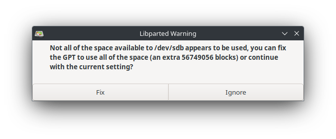
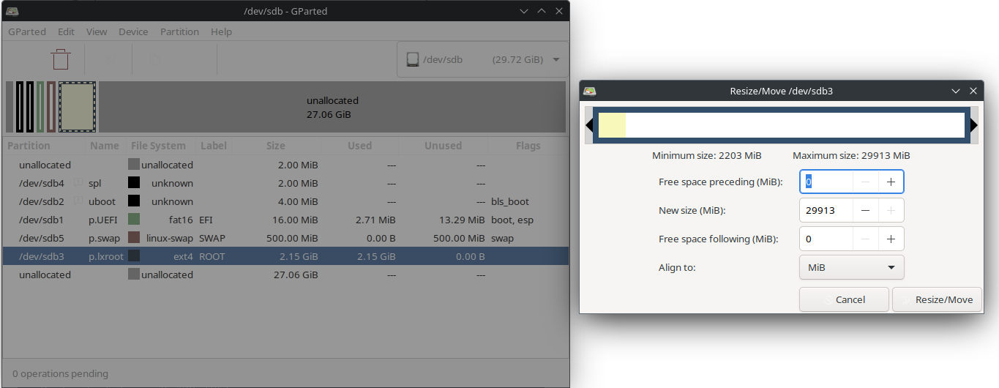

# StarFive VisionFive 2 - OpenSuse Tumbleweed with external GPU ATI Radeon R9 290

In addition to Ubuntu and Fedora, I had also run OpenSuse Tumbleweed on the StarFive VisionFive 2. I had never written a manual for this before. Hence this manual.
The entire manual works from 1 directory. In my case ~/OpenSuseTumbleweed

```bash
$ mkdir OpenSuseTumbleweed
$ cd OpenSuseTumbleweed/
```

## Downloads

We'll start with some downloads, we'll need:

- images from OpenSuse Tumbleweed [site](https://en.opensuse.org/HCL:VisionFive2)
- EFI-boot from Ubuntu [site](https://packages.ubuntu.com/mantic/cd-boot-images-riscv64)
- kernel/firmware from StarFive VisionFive 2 repo [site](https://github.com/starfive-tech/VisionFive2)

### Update firmware of the StarFive VisionFive 2

I have already described this in the Ubuntu 23.10 manual [here](UbuntuATIRadeonR9_290_2023_11_20.md).

But there is a newer version so here a short version:

```bash
# download firmware
$ wget https://github.com/starfive-tech/VisionFive2/releases/download/JH7110_VF2_515_v5.10.3/u-boot-spl.bin.normal.out
--2024-02-10 14:02:38--  https://github.com/starfive-tech/VisionFive2/releases/download/JH7110_VF2_515_v5.10.3/u-boot-spl.bin.normal.out
Resolving github.com (github.com)... 140.82.121.3
Connecting to github.com (github.com)|140.82.121.3|:443... connected.
...
...
...
Length: 148440 (145K) [application/octet-stream]
Saving to: ‘u-boot-spl.bin.normal.out’

u-boot-spl.bin.normal.out                                                    100%[===========================================================================================================================================================================================>] 144,96K  --.-KB/s    in 0,02s   

2024-02-10 14:02:39 (7,36 MB/s) - ‘u-boot-spl.bin.normal.out’ saved [148440/148440]

# download firmware
$ wget https://github.com/starfive-tech/VisionFive2/releases/download/JH7110_VF2_515_v5.10.3/visionfive2_fw_payload.img
--2024-02-10 14:03:29--  https://github.com/starfive-tech/VisionFive2/releases/download/JH7110_VF2_515_v5.10.3/visionfive2_fw_payload.img
Resolving github.com (github.com)... 140.82.121.4
Connecting to github.com (github.com)|140.82.121.4|:443... connected.
...
...
...
2024-02-10 14:03:30 (14,1 MB/s) - ‘visionfive2_fw_payload.img’ saved [3015045/3015045]

# take down your firewall (so port 69 can be used)
$ sudo systemctl stop firewalld.service 
[sudo] password for opvolger: 

# startup docker container with tftp of this directory
$ docker run -p 0.0.0.0:69:69/udp -v $(pwd):/var/tftpboot -i -t pghalliday/tftp
```

Do NOT hit Ctrl+C! We need this server until we are done flashing! Keep it running

Setup your VisionFive 2 without a SD-card and the USB to TTL connected (see [link](https://doc-en.rvspace.org/VisionFive2/PDF/VisionFive2_QSG.pdf) for more information)

My machine (with docker) has ip-address 192.168.2.29 and I give my VisionFive 2 the ip 192.168.2.222

Open a new terminal (keep docker running)

```bash
# This will open a serial screen to your VisionFive 2
screen -L /dev/ttyUSB0 115200
```

Boot up your VisionFive 2

```bash
...
...
...
Loading: *
ARP Retry count exceeded; starting again
StarFive #
```

This will be the commands (for the StarFive firmware):

```bash
# set the ip of the VisionFive 2, and of the server (where docker is running)
$ setenv ipaddr 192.168.2.222; setenv serverip 192.168.2.29
# test network
$ ping 192.168.2.29
# Initialize SPI Flash
$ sf probe
# Download and Update SPL binary
$ tftpboot 0xa0000000 ${serverip}:u-boot-spl.bin.normal.out
$ sf update 0xa0000000 0x0 $filesize
# Download and Update U-Boot binary
$ tftpboot 0xa0000000 ${serverip}:visionfive2_fw_payload.img
$ sf update 0xa0000000 0x100000 $filesize
# We will not need to reset to default now!
# Save your changes
$ env save
```

The output will be something like this:

```bash
StarFive # setenv ipaddr 192.168.2.222; setenv serverip 192.168.2.29
StarFive # ping 192.168.2.29
Using ethernet@16040000 device
host 192.168.2.29 is alive
StarFive # sf probe
SF: Detected gd25lq128 with page size 256 Bytes, erase size 4 KiB, total 16 MiB
StarFive # tftpboot 0xa0000000 ${serverip}:u-boot-spl.bin.normal.out
Using ethernet@16040000 device
TFTP from server 192.168.2.29; our IP address is 192.168.2.222
Filename 'u-boot-spl.bin.normal.out'.
Load address: 0xa0000000
Loading: ###########
         960 KiB/s
done
Bytes transferred = 148440 (243d8 hex)
StarFive # sf update 0xa0000000 0x0 $filesize
device 0 offset 0x0, size 0x243d8
148440 bytes written, 0 bytes skipped in 1.202s, speed 126143 B/s
StarFive # sf update 0xa0000000 0x0 $filesize
device 0 offset 0x0, size 0x243d8
148440 bytes written, 0 bytes skipped in 1.202s, speed 126143 B/s
StarFive # sf update 0xa0000000 0x0 $filesize
device 0 offset 0x0, size 0x243d8
0 bytes written, 148440 bytes skipped in 0.26s, speed 5241467 B/s
StarFive # tftpboot 0xa0000000 ${serverip}:visionfive2_fw_payload.img
Using ethernet@16040000 device
TFTP from server 192.168.2.29; our IP address is 192.168.2.222
Filename 'visionfive2_fw_payload.img'.
Load address: 0xa0000000
Loading: #################################################################
         #################################################################
         #################################################################
         ###########
         1 MiB/s
done
Bytes transferred = 3015045 (2e0185 hex)
StarFive # sf update 0xa0000000 0x100000 $filesize
device 0 offset 0x100000, size 0x2e0185
1970176 bytes written, 1044869 bytes skipped in 16.433s, speed 187844 B/s
StarFive # env save
Saving Environment to SPIFlash... Erasing SPI flash...Writing to SPI flash...done
OK
```

Done!

You can now hit Ctrl+C on your docker terminal and start your firewall again

```bash
$ sudo systemctl start firewalld.service
[sudo] password for opvolger:
```

You can turn off the VisionFive 2 again

### Images from OpenSuse Tumbleweed

Download the images from the OpenSuse Tumbleweed [site](https://en.opensuse.org/HCL:VisionFive2).

```bash
$ wget https://download.opensuse.org/repositories/devel:/RISCV:/Factory:/Contrib:/StarFive:/VisionFive2/images/openSUSE-Tumbleweed-RISC-V-JeOS-starfivevisionfive2.riscv64-2024.01.16-Build23.43.raw.xz
--2024-02-10 13:47:06--  https://download.opensuse.org/repositories/devel:/RISCV:/Factory:/Contrib:/StarFive:/VisionFive2/images/openSUSE-Tumbleweed-RISC-V-JeOS-starfivevisionfive2.riscv64-2024.01.16-Build23.43.raw.xz
...
...
...
2024-02-10 13:48:08 (14,3 MB/s) - ‘openSUSE-Tumbleweed-RISC-V-JeOS-starfivevisionfive2.riscv64-2024.01.16-Build23.43.raw.xz’ saved [928465828/928465828]
```

Now flash it to a SD-card. I use balenaEtcher for it. (on my machine it was /dev/sdb)

### Compile the 6.1.31+ kernel

I have installed Fedora linux and had to install some stuff to be able to cross compile

```bash
$ sudo dnf group install "Development Tools"
$ sudo dnf install git gcc-plugin-devel libmpc-devel gcc-c++ gcc-c++-riscv64-linux-gnu ncurses-devel libmpc-devel nano
```

We need to checkout the kernel of StarFive and make some changes

```bash
# we need the firmware for AMD / ATI cards, we do not need history so depth 1
$ git clone --depth 1 git://git.kernel.org/pub/scm/linux/kernel/git/firmware/linux-firmware.git linux-firmware
Cloning into 'linux-firmware'...
remote: Enumerating objects: 3389, done.
remote: Counting objects: 100% (3389/3389), done.
remote: Compressing objects: 100% (2461/2461), done.
remote: Total 3389 (delta 1233), reused 2471 (delta 832), pack-reused 0
Receiving objects: 100% (3389/3389), 435.72 MiB | 13.27 MiB/s, done.
Resolving deltas: 100% (1233/1233), done.
Updating files: 100% (3554/3554), done.

# We need the kernel of StarFive, we do not need history so depth 1
$ git clone --depth 1 git://git.kernel.org/pub/scm/linux/kernel/git/firmware/linux-firmware.git linux-firmware
Cloning into 'linux-firmware'...
remote: Enumerating objects: 3389, done.
remote: Counting objects: 100% (3389/3389), done.
remote: Compressing objects: 100% (2461/2461), done.
remote: Total 3389 (delta 1233), reused 2471 (delta 832), pack-reused 0
Receiving objects: 100% (3389/3389), 435.72 MiB | 13.27 MiB/s, done.
Resolving deltas: 100% (1233/1233), done.
Updating files: 100% (3554/3554), done.
opvolger@desktop:~/OpenSuseTumbleweed$ ^C
opvolger@desktop:~/OpenSuseTumbleweed$ git clone --branch VF2_6.1_v3.8.2 --depth 1 https://github.com/starfive-tech/linux.git
Cloning into 'linux'...
remote: Enumerating objects: 84693, done.
remote: Counting objects: 100% (84693/84693), done.
remote: Compressing objects: 100% (78851/78851), done.
remote: Total 84693 (delta 8228), reused 22621 (delta 4958), pack-reused 0
Receiving objects: 100% (84693/84693), 233.16 MiB | 7.86 MiB/s, done.
Resolving deltas: 100% (8228/8228), done.
Note: switching to '22e0315434b13cdde93ded101b567d5d1c4d5a2e'.

You are in 'detached HEAD' state. You can look around, make experimental
changes and commit them, and you can discard any commits you make in this
state without impacting any branches by switching back to a branch.

If you want to create a new branch to retain commits you create, you may
do so (now or later) by using -c with the switch command. Example:

  git switch -c <new-branch-name>

Or undo this operation with:

  git switch -

Turn off this advice by setting config variable advice.detachedHead to false

Updating files: 100% (79971/79971), done.

#Go to the kernel dir
$ cd linux

# create a "default" .config for the kernel compilation
$ make ARCH=riscv CROSS_COMPILE=riscv64-linux-gnu- starfive_jh7110_defconfig
  HOSTCC  scripts/basic/fixdep
  HOSTCC  scripts/kconfig/conf.o
  HOSTCC  scripts/kconfig/confdata.o
  HOSTCC  scripts/kconfig/expr.o
  LEX     scripts/kconfig/lexer.lex.c
  YACC    scripts/kconfig/parser.tab.[ch]
  HOSTCC  scripts/kconfig/lexer.lex.o
  HOSTCC  scripts/kconfig/menu.o
  HOSTCC  scripts/kconfig/parser.tab.o
  HOSTCC  scripts/kconfig/preprocess.o
  HOSTCC  scripts/kconfig/symbol.o
  HOSTCC  scripts/kconfig/util.o
  HOSTLD  scripts/kconfig/conf
#
# configuration written to .config
#

# open the menu
$ make CROSS_COMPILE=riscv64-linux-gnu- ARCH=riscv menuconfig
```

Now we have to add the ATI video-card and HDMI-audio.

```
Device Drivers ---> [HIT ENTER]
  Generic Driver Options ---> [HIT ENTER]
    Firmware loader ---> [HIT ENTER]
      () Build named firmware blobs into the kernel binary [HIT ENTER]
      (/lib/firmware) Firmware blobs root directory [change it to ../linux-firmware]
```

enter this in the line:

(radeon bins for ATI Radeon 5450, amdgpu/radeon bin files of AMD/ATI Hawaii PRO [Radeon R9 290/390] (has 2 drivers amd and ATI) and rt2870.bin for my wifi dongel)

```ini
radeon/CYPRESS_uvd.bin radeon/CEDAR_smc.bin radeon/CEDAR_me.bin radeon/CEDAR_pfp.bin radeon/CEDAR_rlc.bin amdgpu/hawaii_k_smc.bin amdgpu/hawaii_smc.bin amdgpu/hawaii_uvd.bin amdgpu/hawaii_vce.bin amdgpu/hawaii_sdma.bin amdgpu/hawaii_sdma1.bin amdgpu/hawaii_pfp.bin amdgpu/hawaii_me.bin amdgpu/hawaii_ce.bin amdgpu/hawaii_rlc.bin amdgpu/hawaii_mec.bin amdgpu/hawaii_mc.bin radeon/hawaii_pfp.bin radeon/hawaii_me.bin radeon/hawaii_ce.bin radeon/hawaii_mec.bin radeon/hawaii_mc.bin radeon/hawaii_rlc.bin radeon/hawaii_sdma.bin radeon/hawaii_smc.bin radeon/hawaii_k_smc.bin radeon/HAWAII_pfp.bin radeon/HAWAII_me.bin radeon/HAWAII_ce.bin radeon/HAWAII_mec.bin radeon/HAWAII_mc.bin radeon/HAWAII_mc2.bin radeon/HAWAII_rlc.bin radeon/HAWAII_sdma.bin radeon/HAWAII_smc.bin rt2870.bin
```

Select Exit,Exit

We need some stuff for snapd:

```
Device Drivers -> 
    Block devices -> [HIT ENTER]
      <*> RAM block device support [HIT SPACE 2x]
```

Select Exit

I have a RaLink Wifi dongle

```
Device Drivers -> 
    Network device support ---> [HIT ENTER]
      Wireless LAN ---> [HIT ENTER]
        <*> Ralink driver support ---- [HIT SPACE 2x][HIT ENTER]
          <*> Ralink rt27xx/rt28xx/rt30xx (USB) [HIT SPACE 2x]
          [*] rt2800usb - Incl..... 6x [HIT SPACE 1x on 4 rows]
```

Select Exit,Exit,Exit

```
Device Drivers --->
  Graphics support ---> [HIT ENTER]
    <*> ATI GPU [HIT SPACE]
    <*> AMD GPU [HIT SPACE 2x]
    [*] Enable amdgpu support for SI parts [HIT SPACE]
    [*] Enable amdgpu support for CIK parts [HIT SPACE]
    ACP (Audio CoProcessor) Configuration ---> [HIT ENTER]
      [*] Enable AMD Audio CoProcessor IP support [HIT SPACE]
```

Select Exit,Exit

```
Device Drivers --->
  Sound card support ---> [HIT ENTER]
    Advanced Linux Sound Architecture ---> [HIT ENTER]
      HD-Audio ---> [HIT ENTER]
        <*> HD Audio PCI [HIT SPACE 2x]
        <*> Build HDMI/DisplayPort HD-audio codec support [HIT SPACE 2x]
```

Select Exit,Exit,Exit,Exit

We need more some stuff for snapd:

```
File systems  -> [HIT ENTER]
  Miscellaneous filesystems -> [HIT ENTER]
    <*> SquashFS 4.0 - Squased file system support [HIT SPACE 2x]
    [*] Squashfs XATTR support [HIT SPACE]
    [*] Include support for ZLIB compressed file systems
    [*] Include support for LZ4 compressed file systems [HIT SPACE]
    [*] Include support for LZO compressed file systems [HIT SPACE]
    [*] Include support for XZ compressed file systems [HIT SPACE]
    [*] Include support for ZSTD compressed file systems [HIT SPACE]
```

Select Exit,Exit

We need CONFIG_SECCOMP and CONFIG_SECCOMP_FILTER for the `epiphany` browser

```
General architecture-dependent options  ---> [HIT ENTER]
  [*] Enable seccomp to safely execute untrusted bytecode -> [HIT SPACE]
```

Select Exit,Exit

Yes You wish to save your new configuration!

If you use GCC 13 and up, you need to patch the kernel code see [this](https://git.kernel.org/pub/scm/linux/kernel/git/torvalds/linux.git/commit/?id=e6a71160cc145e18ab45195abf89884112e02dfb) patch.

```bash
# Download the patch
$ wget -O gcc13.patch https://git.kernel.org/pub/scm/linux/kernel/git/torvalds/linux.git/patch/?id=e6a71160cc145e18ab45195abf89884112e02dfb
--2024-02-10 14:59:30--  https://git.kernel.org/pub/scm/linux/kernel/git/torvalds/linux.git/patch/?id=e6a71160cc145e18ab45195abf89884112e02dfb
Resolving git.kernel.org (git.kernel.org)... 2604:1380:4601:e00::1, 145.40.68.75
Connecting to git.kernel.org (git.kernel.org)|2604:1380:4601:e00::1|:443... connected.
HTTP request sent, awaiting response... 200 OK
Length: unspecified [text/plain]
Saving to: ‘gcc13.patch’

gcc13.patch                                         [ <=>                                                                                                 ]   1,39K  --.-KB/s    in 0s      

2024-02-10 14:59:30 (46,7 MB/s) - ‘gcc13.patch’ saved [1419]

# apply the patch
$ git apply gcc13.patch
```

Compile the kernel, config is now ready!
I added -j 16 (i have 16 thread on my machine!)

```bash
# build kernel
$ make ARCH=riscv CROSS_COMPILE=riscv64-linux-gnu- -j 16
  SYNC    include/config/auto.conf
  WRAP    arch/riscv/include/generated/uapi/asm/errno.h
  WRAP    arch/riscv/include/generated/uapi/asm/fcntl.h
  WRAP    arch/riscv/include/generated/uapi/asm/ioctl.h
  WRAP    arch/riscv/include/generated/uapi/asm/ioctls.h
  WRAP    arch/riscv/include/generated/uapi/asm/ipcbuf.h
  WRAP    arch/riscv/include/generated/uapi/asm/mman.h
...
...
# takes a long time!!!
...
...
  NM      .tmp_vmlinux.kallsyms2.syms
  KSYMS   .tmp_vmlinux.kallsyms2.S
  AS      .tmp_vmlinux.kallsyms2.S
  LD      vmlinux
  NM      System.map
  SORTTAB vmlinux
  OBJCOPY arch/riscv/boot/Image
  GZIP    arch/riscv/boot/Image.gz
  Kernel: arch/riscv/boot/Image.gz is ready

# build kernel modules
$ make ARCH=riscv CROSS_COMPILE=riscv64-linux-gnu- modules -j 16 
  CALL    scripts/checksyscalls.sh

# install modules to dir
$ mkdir ~/OpenSuseTumbleweed/modules
$ make ARCH=riscv CROSS_COMPILE=riscv64-linux-gnu- INSTALL_MOD_PATH=~/OpenSuseTumbleweed/modules modules_install -j 16 
  INSTALL /home/opvolger/OpenSuseTumbleweed/modules/lib/modules/6.1.31+/kernel/arch/riscv/kvm/kvm.ko
  INSTALL /home/opvolger/OpenSuseTumbleweed/modules/lib/modules/6.1.31+/kernel/crypto/authenc.ko
  INSTALL /home/opvolger/OpenSuseTumbleweed/modules/lib/modules/6.1.31+/kernel/crypto/authencesn.ko
  INSTALL /home/opvolger/OpenSuseTumbleweed/modules/lib/modules/6.1.31+/kernel/crypto/blake2b_generic.ko
  INSTALL /home/opvolger/OpenSuseTumbleweed/modules/lib/modules/6.1.31+/kernel/crypto/cbc.ko
  INSTALL /home/opvolger/OpenSuseTumbleweed/modules/lib/modules/6.1.31+/kernel/crypto/echainiv.ko
  INSTALL /home/opvolger/OpenSuseTumbleweed/modules/lib/modules/6.1.31+/kernel/crypto/seqiv.ko
  INSTALL /home/opvolger/OpenSuseTumbleweed/modules/lib/modules/6.1.31+/kernel/crypto/xor.ko
  INSTALL /home/opvolger/OpenSuseTumbleweed/modules/lib/modules/6.1.31+/kernel/crypto/xxhash_generic.ko
  INSTALL /home/opvolger/OpenSuseTumbleweed/modules/lib/modules/6.1.31+/kernel/drivers/clk/starfive/clk-starfive-jh7100-audio.ko
  INSTALL /home/opvolger/OpenSuseTumbleweed/modules/lib/modules/6.1.31+/kernel/drivers/gpu/drm/drm_shmem_helper.ko
  INSTALL /home/opvolger/OpenSuseTumbleweed/modules/lib/modules/6.1.31+/kernel/drivers/gpu/drm/virtio/virtio-gpu.ko
...
...
...
  INSTALL /home/opvolger/OpenSuseTumbleweed/modules/lib/modules/6.1.31+/kernel/net/netfilter/xt_nat.ko
  INSTALL /home/opvolger/OpenSuseTumbleweed/modules/lib/modules/6.1.31+/kernel/net/sched/cls_cgroup.ko
  INSTALL /home/opvolger/OpenSuseTumbleweed/modules/lib/modules/6.1.31+/kernel/net/xfrm/xfrm_algo.ko
  INSTALL /home/opvolger/OpenSuseTumbleweed/modules/lib/modules/6.1.31+/kernel/net/xfrm/xfrm_user.ko
  INSTALL /home/opvolger/OpenSuseTumbleweed/modules/lib/modules/6.1.31+/kernel/net/netfilter/xt_tcpudp.ko
  DEPMOD  /home/opvolger/OpenSuseTumbleweed/modules/lib/modules/6.1.31+
```

The kernel is Done!

### EFI-boot from Ubuntu (cd-boot-images-riscv64_10_all.deb)

The OpenSuse Tumbleweed image uses a kernel that does not yet have the PCIe patches of the StarFive VisionFive 2. More information about what is and is not main-stream in the kernel can be found here: site

The boot chain of OpenSuse Tumbleweed (OpenSBI - U-Boot - EFI) would not work with my kernel (6.1.31+). That's why I chose NOT to boot from SD card and use StarFive VisionFive 2's OpenSBI and U-Boot. Unfortunately, OpenSuse's efi boot did not work with this. That's why I use the efi-boot from Ubuntu (it worked with my 6.1.31+ kernel).

Download
[cd-boot-images-riscv64_10_all.deb](http://mirrors.kernel.org/ubuntu/pool/main/c/cd-boot-images-riscv64/cd-boot-images-riscv64_10_all.deb)

```bash
$ wget http://mirrors.kernel.org/ubuntu/pool/main/c/cd-boot-images-riscv64/cd-boot-images-riscv64_10_all.deb
# I am running Fedora and needed to install dpkg
$ sudo yum install dpkg
# unpack the file
$ dpkg-deb -x cd-boot-images-riscv64_10_all.deb cd-boot-images-riscv64_10_all
```

## Copy/Change files to SD-card

On my computer i flashed the OpenSuse Tumbleweed to /dev/sdb

### EFI-partition

We need to copy bootriscv64.efi to the EFI-partition

```bash
$ cd ~/OpenSuseTumbleweed
$ mkdir -p sd/efi
# EFI partition is the first partition
$ sudo mount /dev/sdb1 ~/OpenSuseTumbleweed/sd/efi
# We will now replace the efi boot from OpenSuse Tumbleweed with the Ubuntu version
$ sudo cp cd-boot-images-riscv64_10_all/usr/share/cd-boot-images-riscv64/tree/EFI/boot/bootriscv64.efi sd/efi/EFI/BOOT/bootriscv64.efi
# unmount again
$ sudo umount ~/OpenSuseTumbleweed/sd/efi
```

### ROOT-partition

We need to copy the kernel files

```bash
$ cd ~/OpenSuseTumbleweed
$ mkdir -p sd/root
# ROOT partition is the 3e partition
$ sudo mount /dev/sdb3 ~/OpenSuseTumbleweed/sd/root
# copy kernel files
$ sudo cp linux/arch/riscv/boot/dts/starfive/jh7110-visionfive-v2.dtb ~/OpenSuseTumbleweed/sd/root/boot/dtb-6.1.31+
$ sudo cp linux/arch/riscv/boot/Image ~/OpenSuseTumbleweed/sd/root/boot/Image-6.1.31+
$ sudo cp linux/System.map ~/OpenSuseTumbleweed/sd/root/boot/System.map-6.1.31+
$ sudo cp modules/lib/modules/6.1.31+ ~/OpenSuseTumbleweed/sd/root/usr/lib/modules -R
```

#### Edit grub2.cfg

We need to edit the current grub2.cfg so we can boot the created kernel.

```bash
sudo nano ~/OpenSuseTumbleweed/sd/root/boot/grub2/grub.cfg
```

Scroll until tou see:

```ini
### BEGIN /etc/grub.d/10_linux ###
menuentry 'openSUSE Tumbleweed'  --class opensuse --class gnu-linux --class gnu --class os $menuentry_id_option 'gnulinux-simple-c0fea55f-b955-491e-82fb-eef04b20619d' {
        load_video
        set gfxpayload=keep
        insmod gzio
        insmod part_gpt
        insmod ext2
        search --no-floppy --fs-uuid --set=root c0fea55f-b955-491e-82fb-eef04b20619d
        echo    'Loading Linux 6.8.0-rc3-83-default ...'
        linux   /boot/Image-6.8.0-rc3-83-default root=UUID=c0fea55f-b955-491e-82fb-eef04b20619d  loglevel=3 splash=silent systemd.show_status=1 console=ttyS0,115200n8
        echo    'Loading initial ramdisk ...'
        initrd  /boot/initrd-6.8.0-rc3-83-default
}
submenu 'Advanced options for openSUSE Tumbleweed' --hotkey=1 $menuentry_id_option 'gnulinux-advanced-c0fea55f-b955-491e-82fb-eef04b20619d' {
        menuentry 'openSUSE Tumbleweed, with Linux 6.8.0-rc3-83-default' --hotkey=2 --class opensuse --class gnu-linux --class gnu --class os $menuentry_id_option 'gnulinux-6.8.0-rc3-83-default-advanced-c0fea55f>
```

Change it to: (I deleted the search line changes the linux line and replaced the initrd for devicetree)

```ini
### BEGIN /etc/grub.d/10_linux ###
menuentry 'openSUSE Tumbleweed'  --class opensuse --class gnu-linux --class gnu --class os $menuentry_id_option 'gnulinux-simple-c0fea55f-b955-491e-82fb-eef04b20619d' {
        load_video
        set gfxpayload=keep
        insmod gzio
        insmod part_gpt
        insmod ext2
        echo    'Loading Linux 6.1.31+ ...'
        linux   /boot/Image-6.1.31+ root=/dev/mmcblk1p3  ro  efi=debug earlycon console=ttyS0,115200n8
        echo    'Loading devicetree 6.1.31+'
        devicetree      /boot/dtb-6.1.31+
}
submenu 'Advanced options for openSUSE Tumbleweed' --hotkey=1 $menuentry_id_option 'gnulinux-advanced-c0fea55f-b955-491e-82fb-eef04b20619d' {
        menuentry 'openSUSE Tumbleweed, with Linux 6.8.0-rc3-83-default' --hotkey=2 --class opensuse --class gnu-linux --class gnu --class os $menuentry_id_option 'gnulinux-6.8.0-rc3-83-default-advanced-c0fea55f>
```

Save and Exit

#### Edit fstab

I needed this, i think the kernel has no vfat compiled.

```bash
sudo nano ~/OpenSuseTumbleweed/sd/root/etc/fstab
```

from:

```ini
UUID=9a7b06a0-0385-44c1-8487-8881b55420ab swap swap defaults 0 0
UUID=c0fea55f-b955-491e-82fb-eef04b20619d / ext4 noatime,nobarrier 0 1
UUID=9035-7EB0 /boot/efi vfat defaults 0 0
```

to:

```ini
UUID=9a7b06a0-0385-44c1-8487-8881b55420ab swap swap defaults 0 0
UUID=c0fea55f-b955-491e-82fb-eef04b20619d / ext4 noatime,nobarrier 0 1
#UUID=9035-7EB0 /boot/efi vfat defaults 0 0
```

#### Add item in grub2 40_custom

We need to add a grub option, so as we rebuild grub (get a new grub2.cfg) we still can boot the custom kernel.

```bash
sudo nano ~/OpenSuseTumbleweed/sd/root/etc/grub.d/40_custom
```

```ini
#!/bin/sh
exec tail -n +3 $0
# This file provides an easy way to add custom menu entries.  Simply type the
# menu entries you want to add after this comment.  Be careful not to change
# the 'exec tail' line above.
menuentry 'openSUSE Tumbleweed, with Linux 6.1.31+' {
                load_video
                set gfxpayload=keep
                insmod gzio
                insmod part_gpt
                insmod ext2
                echo    'Loading Linux 6.1.31+'
                linux   /boot/Image-6.1.31+ root=/dev/mmcblk1p3  ro  efi=debug earlycon console=ttyS0,115200n8
                echo    'Loading devicetree 6.1.31+'
                devicetree      /boot/dtb-6.1.31+
}
```

### Set default grub item on boot

De default boot option is item 0. We have added a new custom item we want to boot in the future as default.

```bash
$ sudo nano ~/OpenSuseTumbleweed/sd/root/etc/default/grub
```

from:

```ini
GRUB_DEFAULT=0
```

to

```ini
GRUB_DEFAULT=3
```

## Umount

```bash
# umount again
$ sudo umount ~/OpenSuseTumbleweed/sd/root
```

## GParted

The root-partition will not be resized. So we have to do this.
I use GParted, yes it can be done command-line but this is easyer.


and apply the changes!

## Boot the StarFive VisionFive 2

Insert the SD-card in the StarFive VisionFive 2 and boot it up.

```bash
Welcome to openSUSE Tumbleweed 20240208 - Kernel 6.1.31+ (ttyS0).

end0:  fe80::4b03:cfeb:7489:a749
end1:  
wlp1s0u1u1:  


StarFive login: [   20.805126] starfive-eth-plat 16040000.ethernet end1: Link is Up - 1Gbps/Full - flow control rx/tx
[   20.814211] IPv6: ADDRCONF(NETDEV_CHANGE): end1: link becomes ready

Welcome to openSUSE Tumbleweed 20240208 - Kernel 6.1.31+ (ttyS0).

end0:  fe80::4b03:cfeb:7489:a749
end1: 192.168.2.17 fe80::d24e:a2cc:d51b:b14b
wlp1s0u1u1:  


StarFive login: 
Welcome to openSUSE Tumbleweed 20240208 - Kernel 6.1.31+ (ttyS0).

end0:  
end1: 192.168.2.17 fe80::d24e:a2cc:d51b:b14b
wlp1s0u1u1:  


riscv login: [   38.081393] mipi_0p9: disabling
```

You can now log in with username root and password linux

```bash
riscv login: root
Password: 
Have a lot of fun...
```

Create user and fix boot

```bash
# create a user
$ useradd opvolger

# set password for user
$ passwd opvolger
New password: 
Retype new password: 
passwd: password updated successfully

# create a new grub.cfg
$ grub2-mkconfig -o /boot/grub2/grub.cfg
[  219.384928] device-mapper: ioctl: 4.47.0-ioctl (2022-07-28) initialised: dm-devel@redhat.com
Generating grub configuration file ...
Found theme: /boot/grub2/themes/openSUSE/theme.txt
Found linux image: /boot/Image-6.8.0-rc3-83-default
Found initrd image: /boot/initrd-6.8.0-rc3-83-default
Found linux image: /boot/Image-6.1.31+
Warning: os-prober will not be executed to detect other bootable partitions.
Systems on them will not be added to the GRUB boot configuration.
Check GRUB_DISABLE_OS_PROBER documentation entry.
Adding boot menu entry for UEFI Firmware Settings ...
done
```

Fix Tumbleweed repo's

```bash
# disable updates repo (Tumbleweed has no updates)
$ zypper lr
Repository priorities are without effect. All enabled repositories share the same priority.

# | Alias                                | Name  | Enabled | GPG Check | Refresh
--+--------------------------------------+-------+---------+-----------+--------
1 | Factory-Contrib-StarFive:VisionFive2 | Fac-> | Yes     | ( p) Yes  | Yes
2 | repo-debug                           | ope-> | No      | ----      | ----
3 | repo-openh264                        | Ope-> | Yes     | ( p) Yes  | Yes
4 | repo-oss                             | ope-> | Yes     | ( p) Yes  | Yes
5 | repo-source                          | ope-> | No      | ----      | ----
6 | repo-update                          | ope-> | Yes     | ( p) Yes  | Yes
$ zypper mr -d 6
Repository 'repo-update' has been successfully disabled.

# update repo's
$ zypper update
New repository or package signing key received:

  Repository:       Factory-Contrib-StarFive:VisionFive2
  Key Fingerprint:  1CE6 63CF D3C2 3AA6 4CB0 9374 F824 F2D3 FEC6 4695
  Key Name:         devel:RISCV OBS Project <devel:RISCV@build.opensuse.org>
  Key Algorithm:    RSA 2048
  Key Created:      Thu Apr  7 08:44:18 2022
  Key Expires:      Sat Jun 15 08:44:18 2024
  Rpm Name:         gpg-pubkey-fec64695-624ea462


    Note: Signing data enables the recipient to verify that no modifications
    occurred after the data were signed. Accepting data with no, wrong or
    unknown signature can lead to a corrupted system and in extreme cases even
    to a system compromise.

    Note: A GPG pubkey is clearly identified by its fingerprint. Do not rely on
    the key's name. If you are not sure whether the presented key is authentic,
    ask the repository provider or check their web site. Many providers maintain
    a web page showing the fingerprints of the GPG keys they are using.

Do you want to reject the key, trust temporarily, or trust always? [r/t/a/?] (r): a
Retrieving repository 'Factory-Contrib-StarFive:VisionFive2' metadata ....[done]
Building repository 'Factory-Contrib-StarFive:VisionFive2' cache .........[done]
Retrieving repository 'Open H.264 Codec (openSUSE Tumbleweed)' metadata ..[done]
Building repository 'Open H.264 Codec (openSUSE Tumbleweed)' cache .......[done]
Retrieving repository 'openSUSE-Tumbleweed-Oss' metadata .................[done]
Building repository 'openSUSE-Tumbleweed-Oss' cache ......................[done]
Loading repository data...
Reading installed packages...
Nothing to do.
```

Install stuff for KDE: browsers/codecs

```bash
# install some stuff
# obi can install codecs
# neofetch to show specs
# chromium a browser
# nano for editing
$ zypper install opi neofetch chromium nano

$ neofetch 
                                     ......            root@riscv.home 
     .,cdxxxoc,.               .:kKMMMNWMMMNk:.        --------------- 
    cKMMN0OOOKWMMXo. A        ;0MWk:'      ':OMMk.     OS: openSUSE Tumbleweed riscv64 
  ;WMK;'       'lKMMNM,     :NMK'             'OMW;    Host: StarFive VisionFive V2 
 cMW;             WMMMN   ,XMK'                 oMM.   Kernel: 6.1.31+ 
.MMc             ''^*~l. xMN:                    KM0   Uptime: 8 mins 
'MM.                   .NMO                      oMM   Packages: 774 (rpm) 
.MM,                 .kMMl                       xMN   Shell: bash 5.2.26 
 KM0               .kMM0' .dl>~,.               .WMd   Resolution: 1920x1080 
 'XM0.           ,OMMK'    OMMM7'              .XMK    Terminal: /dev/ttyS0 
   *WMO:.    .;xNMMk'       NNNMKl.          .xWMx     CPU: (4) @ 1.500GHz 
     ^ONMMNXMMMKx;          V  'xNMWKkxllox0NMWk'      GPU: AMD ATI Radeon R9 290/390 
         '''''                    ':dOOXXKOxl'         Memory: 110MiB / 7868MiB 


# install opi codecs (will give some errors, not everyting is there for riscv)
$ opi codecs
Do you want to install codecs from Packman repository? (Y/n) y
Adding packman repo
1. ftp.fau.de                 - University of Erlangen, Germany  -  1h sync
2. ftp.halifax.rwth-aachen.de - University of Aachen, Germany    -  1h sync
3. ftp.gwdg.de                - University of Göttingen, Germany -  4h sync
4. mirror.karneval.cz         - TES Media, Czech Republic        -  1h sync
5. mirrors.aliyun.com         - Alibaba Cloud, China             - 24h sync
Pick a mirror near your location (0 to quit): 1
Import package signing key 'PackMan Project (signing key) <packman@links2linux.de>' (Y/n) Y
Repository 'Factory-Contrib-StarFive:VisionFive2' is up to date.                
Retrieving repository 'Packman' metadata .................................[done]
Building repository 'Packman' cache ......................................[done]
Repository 'Open H.264 Codec (openSUSE Tumbleweed)' is up to date.              
Repository 'openSUSE-Tumbleweed-Oss' is up to date.                             
All repositories have been refreshed.
Loading repository data...
Reading installed packages...
Computing distribution upgrade...
Nothing to do.
Loading repository data...
Reading installed packages...
'ffmpeg>=5' not found in package names. Trying capabilities.
Package 'gstreamer-plugins-bad-codecs' not found in specified repositories.
Package 'gstreamer-plugins-ugly-codecs' not found in specified repositories.
Package 'pipewire-aptx' not found in specified repositories.
Package 'vlc-codecs' not found in specified repositories.
'ffmpeg' not found in package names. Trying capabilities.
'libavcodec-full' not found in package names. Trying capabilities.
No provider of 'libavcodec-full' found.
'libfdk-aac2' not found in package names. Trying capabilities.
'libfdk-aac2' is already installed.
'gstreamer-plugins-libav' not found in package names. Trying capabilities.
Resolving package dependencies...

The following 42 NEW packages are going to be installed:
  ffmpeg-6 gstreamer gstreamer-plugins-base gstreamer-plugins-libav
  libSDL2-2_0-0 libSPIRV-Tools-2023_6_rc1 libXv1 libass9 libavdevice60
  libavfilter9 libbs2b0 libcdda_interface0 libcdda_paranoia0 libcdio19
  libcdio_cdda2 libcdio_paranoia2 libdc1394-26 libdovi3 libfftw3-3 libglslang14
  libgraphene-1_0-0 libgstallocators-1_0-0 libgstapp-1_0-0 libgstaudio-1_0-0
  libgstgl-1_0-0 libgstpbutils-1_0-0 libgstreamer-1_0-0 libgstriff-1_0-0
  libgsttag-1_0-0 libgstvideo-1_0-0 liborc-0_4-0 libplacebo338 libpostproc57
  librubberband2 libshaderc_shared1 libswscale7 libvidstab1_1 libvisual-0_4-0
  libvmaf3 libwayland-cursor0 libwayland-egl1 libzimg2

42 new packages to install.
Overall download size: 13.7 MiB. Already cached: 0 B. After the operation,
additional 33.3 MiB will be used.
Continue? [y/n/v/...? shows all options] (y): y
...
...
...
...
161 new packages to install.
Overall download size: 32.8 MiB. Already cached: 0 B. After the operation,
additional 107.6 MiB will be used.
Continue? [y/n/v/...? shows all options] (y): y
...
...
...
...
(160/161) Installing: gstreamer-plugins-bad-1.22.9-1.1.riscv64 ...........[done]
(161/161) Installing: gstreamer-plugins-good-extra-1.22.9-1.1.riscv64 ....[done]
%posttrans(cantarell-fonts-0.303.1-1.2.noarch) script output:
Failed to connect to bus: No medium found
Failed to connect to bus: No medium found
Running post-transaction scripts .........................................[done]
Do you want to install openh264 codecs from openSUSE openh264 repository? (Y/n) y
Installing from existing repo 'Open H.264 Codec (openSUSE Tumbleweed)'
Loading repository data...
Reading installed packages...
Computing distribution upgrade...
Nothing to do.
Loading repository data...
Reading installed packages...
'libgstopenh264.so()(64bit)' not found in package names. Trying capabilities.
No provider of 'libgstopenh264.so()(64bit)' found.
'mozilla-openh264' not found in package names. Trying capabilities.
No provider of 'mozilla-openh264' found.
Resolving package dependencies...
Nothing to do.
```

Install the KDE desktop

```bash
# install KDE desktop
$ zypper install -t pattern kde kde_plasma
...
...
...
The following 19 NEW patterns are going to be installed:
  fonts fonts_opt games kde kde_games kde_internet kde_multimedia kde_office
  kde_pim kde_plasma kde_utilities kde_utilities_opt kde_yast multimedia office
  x11 x11_enhanced x11_yast yast2_desktop

1128 new packages to install.
Overall download size: 926.3 MiB. Already cached: 0 B. After the operation,
additional 2.4 GiB will be used.
Continue? [y/n/v/...? shows all options] (y): y
...
...
...
# reboot, sometimes it hangs! then hard reset the board!
$ reboot
```

Done! You will now have OpenSuse on RISC-V


