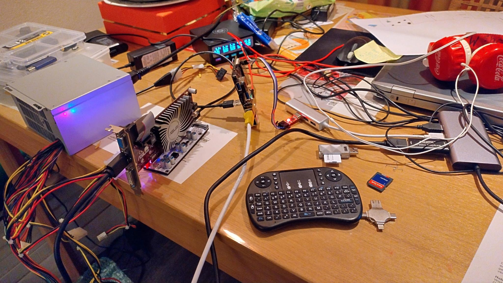
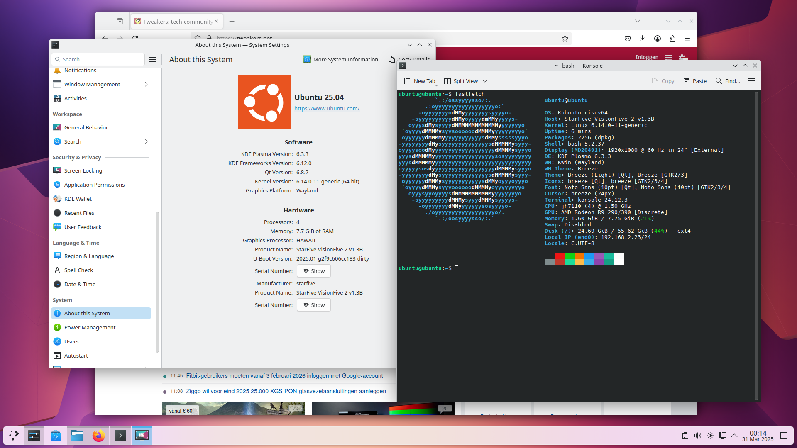

# Ubuntu 25.04 (beta) StarFive VisionFive 2 AMDGPU

Ubuntu 25.04 is using the 6.14 kernel. This has the PCI-e controller of JH7110 SoC + AMDGPU drivers that are working with RISC-V.
So if you have a M.2 to pci-e adapter you can now run Ubuntu with AMDGPU on RISC-V (without building your own kernel with patches etc.)

The only problem is now the U-boot that initialize the PCI-e controller to scan for M.2 drivers. Some of my AMDPGU do not like that (fan 100% and not detected anymore in the kernel).

So we need a U-boot (with the patches from Ubuntu) without the initialization of the PCI-e controller. I have build that and release the flash-files (u-boot + opensbi) on github.

So we can now just flash Ubuntu 25.04 to an eMMC and use the custom flash-files (u-boot + opensbi).

A lot of my AMDGPU's worked on this setup:

- ATI Radeon HD 5450 (Cedar PRO)
- ATI Radeon HD 5850 (Cypress PRO)
- AMD Radeon R9 290 (Hawaii PRO)
- AMD Radeon R9 290X (Hawaii XT)

not working:

- AMD Radeon RX 6600 (Navi 23 XL)

It is booting, it gives screenoutput (black) and then the system hangs completely

## Hardware Setup

I have configured my VisionFive 2 to boot from SD-card, see the last pages of [this document](https://doc-en.rvspace.org/VisionFive2/PDF/VisionFive2_QSG.pdf).

The reason is I very often change u-boot / kernel, so i want them on the sd-card. (You can flash the created/downloaded firmware files and override the partitions 13 and 2 on the eMMC or flash it to the board. But this example will use a SD-card to boot).

So my setup is a SD-card to boot (custom U-boot) and an eMMC for the Ubuntu operation system (default Ubuntu kernel and GNU software)

I have a M.2 to PCI-e board so I can add an AMDGPU on my VisionFive 2.

It can look something like this:


or

or

see [youtube video](https://www.youtube.com/watch?v=Jp0ZPA4IQGw)

## Flash Ubuntu 25.04 (beta) to eMMC

download from the [site](https://cdimage.ubuntu.com/releases/25.04/beta/) the [image 25.04](https://cdimage.ubuntu.com/releases/25.04/beta/ubuntu-25.04-beta-preinstalled-server-riscv64+jh7110.img.xz).

I used "balenaEtcher" to flash this to my eMMC (with an USB to eMMC adapter).

## Create/download u-boot without PCI-e initialization and flash to SD

We need a custom u-boot that will not try to initialize the PCI-e controller (scan for m.2 device). Some of the AMDGPU's don't like that (fan 100% and not detected anymore in the kernel)

So on build we need to set `CONFIG_PCI_INIT_R` and `CONFIG_CMD_PCI` to n (no).

I all ready create this builds and they can be found [here](https://github.com/Opvolger/ansible-riscv-sd-card-creater/releases):

Insert you SD-card (with GPT-partition-tables) in you computer (this example expect /dev/sdb to be your SD-card)

```bash
wget https://github.com/Opvolger/ansible-riscv-sd-card-creater/releases/download/0.2.0/release.tgz
tar -xvzf release.tgz
# check where your SD-card is with lsblk, in this example it is /dev/sdb
# delete MBR of SD-Card
sudo dd if=/dev/zero of=/dev/sdb bs=512 count=1 conv=notrunc
# we will create the needed partitions to boot from SD-card (for more information see https://docs.u-boot.org/en/latest/board/starfive/visionfive2.html)
sudo sgdisk --clear \
    --set-alignment=2 \
    --new=1:4096:8191 --change-name=1:spl --typecode=1:2E54B353-1271-4842-806F-E436D6AF6985 \
    --new=2:8192:16383 --change-name=2:uboot --typecode=2:BC13C2FF-59E6-4262-A352-B275FD6F7172 \
    /dev/sdb
# now "flash" the firmware on the sd-card
sudo dd if=release/ubuntu-25-04/u-boot-spl.bin.normal.out of=/dev/sdb1
sudo dd if=release/ubuntu-25-04/u-boot.itb of=/dev/sdb2
```

If booting ubuntu is not working (you can see it with serial-connection for example `screen -L /dev/ttyUSB0 115200`), go back to default settings in u-boot with:

how to set the default is explained also in the ubuntu [site](https://canonical-ubuntu-boards.readthedocs-hosted.com/en/latest/how-to/starfive-visionfive-2/). The only different is that I am using the sd-card and not the onboard flash.

StarFive #

```bash
env default -f -a
env save
```

Reboot you board (power off/on)

## First boot Ubuntu

login with ubuntu/ubuntu (you have to change the password!)

```bash
# set timezone
sudo timedatectl set-timezone Europe/Amsterdam
# check if the date is correct (now)!
date
# if not disable ntp sync
timedatectl set-ntp false
# update datetime to current date/time
timedatectl set-time '2025-03-30 19:26:50'
# enable ntp sync again
timedatectl set-ntp true
# update all packages
sudo apt update
sudo apt upgrade
# add repo for firefox
sudo add-apt-repository ppa:mozillateam/ppa
# install what default stuff + install kde + firefox + some c dev tools (so you can compile some stuff)
sudo apt install nano software-properties-common cmake cabextract sddm sddm-theme-breeze kde-standard build-essential libxml2 libcurl4-gnutls-dev fastfetch ubuntu-dev-tools libopenal-dev libpng-dev libjpeg-dev libfreetype6-dev libfontconfig1-dev libcurl4-gnutls-dev libsdl2-dev zlib1g-dev libbz2-dev libedit-dev python-is-python3 m4 clang  firefox kde-spectacle
# now reboot
sudo reboot
```

Fix network manager in KDE (so you can control network in KDE)

```bash
sudo nano /etc/netplan/01-network-manager-all.yaml
```

```yaml
# Let NetworkManager manage all devices on this system
network:
  version: 2
  renderer: NetworkManager
```

## Done

You will now see a KDE desktop login! Good luck and have fun!

