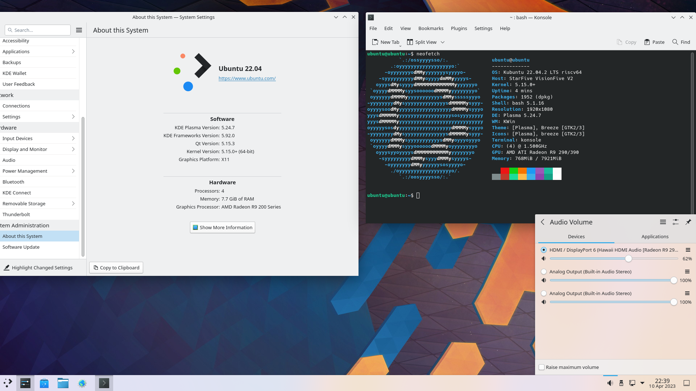

# Ubuntu on VisionFive 2

I wanted to compile and test a few programs on a RISC-V. I only ran into the problem of minimal support of the onboard GPU and custom build Debian from the StarFive Team.

So below you can see my "solution". (Part II)

Creating the image was more of the same I did on Part I [link](FedoraATIRadeon5450.md)

## Hardware

- StarFive VisionFive 2
- BEYIMEI PCIE Riser-Ver010X GPU Riser, 1X tot 16X (4PIN/6PIN/MOLEX) PCIE-verlengkabel, M.2 naar PCI-E Riser Card Bitcoin Litecoin Ethereum.
This is about 11 EURO on amazon, so no big deal... [amazon-link](https://www.amazon.nl/dp/B0BF4PH83Y?ref_=pe_28126711_487767311_302_E_DDE_dt_1)
- AMD/ATI Hawaii PRO [Radeon R9 290/390], Bought on a Dutch second-hand website, for 45 EURO.
- An ATX power supply (was still lying around in the house)
- For debugging a USB to TTL (was still lying around in the house), is about 5 EURO.


## Create SD-card

Download `ubuntu-22.04.2-preinstalled-server-riscv64+visionfive.img.xz` from [ubuntu](https://ubuntu.com/download/risc-v)
Unzip it to `ubuntu-22.04.2-preinstalled-server-riscv64+visionfive.img`.

Download the Debian-Image-69 from StarFive VisionFive 2 Support page (I used the torrent in the google drive).

```bash
# create a loop device of image
$ sudo losetup -f -P ~/Downloads/Image-69/starfive-jh7110-VF2_515_v2.5.0-69.img
$ sudo losetup -f -P ~/iso/ubuntu-22.04.2-preinstalled-server-riscv64+visionfive.img
# find your loop device
$ losetup -l
NAME       SIZELIMIT OFFSET AUTOCLEAR RO BACK-FILE                                                                    DIO LOG-SEC
/dev/loop1         0      0         0  0 /home/opvolger/iso/ubuntu-22.04.2-preinstalled-server-riscv64+visionfive.img   0     512
/dev/loop0         0      0         0  0 /home/opvolger/Downloads/Image-69/starfive-jh7110-VF2_515_v2.5.0-69.img        0     512
# in my case it is loop0 and loop1

# insert your SD-card and delete all partitions (I had 3)
$ sudo fdisk /dev/sdb
[sudo] password for opvolger: 

Welcome to fdisk (util-linux 2.38.1).
Changes will remain in memory only, until you decide to write them.
Be careful before using the write command.


Command (m for help): d
Partition number (1-4, default 4): 1

Partition 1 has been deleted.

Command (m for help): d
Partition number (2-4, default 4): 

Partition 4 has been deleted.

Command (m for help): d
Partition number (2,3, default 3): 

Partition 3 has been deleted.

Command (m for help): d
Selected partition 2
Partition 2 has been deleted.

Command (m for help): d
No partition is defined yet!

Command (m for help): w

The partition table has been altered.
Calling ioctl() to re-read partition table.
Syncing disks.

# add all 3 partitions (not all data) of the Debain-Image-69 to the SD-card
$ sudo dd if=/dev/loop0 of=/dev/sdb status=progress
[sudo] password for opvolger: 
1242001920 bytes (1,2 GB, 1,2 GiB) copied, 307 s, 4,0 MB/s^C
2430785+0 records in
2430785+0 records out
1244561920 bytes (1,2 GB, 1,2 GiB) copied, 312,402 s, 4,0 MB/s
# You can hit Ctrl+C after about 1GB (I did!)
$ sudo fdisk -l /dev/loop1
[sudo] password for opvolger: 
Disk /dev/loop1: 4,5 GiB, 4831838208 bytes, 9437184 sectors
Units: sectors of 1 * 512 = 512 bytes
Sector size (logical/physical): 512 bytes / 512 bytes
I/O size (minimum/optimal): 512 bytes / 512 bytes
Disklabel type: gpt
Disk identifier: 27D729D1-39F3-4647-9B99-E2EF8937310A

Device         Start     End Sectors  Size Type
/dev/loop1p1  227362 9437150 9209789  4,4G Linux filesystem
/dev/loop1p3  225314  227361    2048    1M Linux filesystem
/dev/loop1p12 217122  225313    8192    4M Linux filesystem
/dev/loop1p15     34  217121  217088  106M EFI System

Partition table entries are not in disk order.
# So the 1st partition is the rootfs
# 1ste is the root partition. We need to (re)place the root partition of the Debain-Image-69 (3th partition now on the SD-card)
$ sudo dd if=/dev/loop1p1 of=/dev/sdb3 status=progress
9975758848 bytes (10 GB, 9.3 GiB) copied, 319 s, 31.3 MB/s 
19537853+0 records in
19537853+0 records out
10003380736 bytes (10 GB, 9.3 GiB) copied, 384.316 s, 26.0 MB/s
```

Remove the SD-card and put it back in again.

I started gparted and fixxed the GPT-partition table of the SD card.

## Building the Linux Kernel

I build this on my own machine, otherwise it will take a very long time. so cross compile!
Everything is neatly explained if you click through to the "linux" repo of all (yet) custom code for the SBC. [link](https://github.com/starfive-tech/VisionFive2)

```bash
$ mkdir ~/visionfive2
$ cd visionfive2
$ git clone https://github.com/starfive-tech/linux.git
Cloning into 'linux'...
remote: Enumerating objects: 9469722, done.
remote: Counting objects: 100% (39691/39691), done.
remote: Compressing objects: 100% (17697/17697), done.
remote: Total 9469722 (delta 28345), reused 28687 (delta 21896), pack-reused 9430031
Receiving objects: 100% (9469722/9469722), 2.11 GiB | 14.23 MiB/s, done.
Resolving deltas: 100% (8042369/8042369), done.
Updating files: 100% (79598/79598), done.
$ cd linux
$ git checkout VF2_v2.8.0 # not working with tag 'VF2_v2.10.4', may in the feature it will (again)
Updating files: 100% (46210/46210), done.
Note: switching to 'VF2_v2.8.0'.

You are in 'detached HEAD' state. You can look around, make experimental
changes and commit them, and you can discard any commits you make in this
state without impacting any branches by switching back to a branch.

If you want to create a new branch to retain commits you create, you may
do so (now or later) by using -c with the switch command. Example:

  git switch -c <new-branch-name>

Or undo this operation with:

  git switch -

Turn off this advice by setting config variable advice.detachedHead to false

HEAD is now at 59cf9af678db Merge tag 'JH7110_515_SDK_v4.0.0-rc2' into vf2-515-devel
```

Now we have the configure a new kernel 5.15 that workes with VisionFive 2 and an AMD/ATI Hawaii PRO [Radeon R9 290/390].
We can use the instructions of the other branch [link](https://github.com/starfive-tech/linux/tree/JH7110_VisionFive2_upstream). Here and there I deviated a little from it.

I am running Manjaro on got an error. I fixxed it in `arch/riscv/Makefile` on line +/- 56 (find this online).

```Makefile
...
...
...
# ISA string setting
riscv-march-$(CONFIG_ARCH_RV32I)	:= rv32ima
riscv-march-$(CONFIG_ARCH_RV64I)	:= rv64ima
riscv-march-$(CONFIG_FPU)		:= $(riscv-march-y)fd
riscv-march-$(CONFIG_RISCV_ISA_C)	:= $(riscv-march-y)c

# Newer binutils versions default to ISA spec version 20191213 which moves some
# instructions from the I extension to the Zicsr and Zifencei extensions.
toolchain-need-zicsr-zifencei := $(call cc-option-yn, -march=$(riscv-march-y)_zicsr_zifencei)
riscv-march-$(toolchain-need-zicsr-zifencei) := $(riscv-march-y)_zicsr_zifencei

KBUILD_CFLAGS += -march=$(subst fd,,$(riscv-march-y))
KBUILD_AFLAGS += -march=$(riscv-march-y)
...
...
...
```

First I tried to use the ATI (old) kernel drivers, because that was working with the ATI Radion HD 5450. But I did get text, but not a (good) graphical output (and a reset of XOrg). So I got the new amdgpu drivers working (not what I expected)

```bash
# create the .config with all you need for only the StarFive VisionFive 2
make ARCH=riscv CROSS_COMPILE=riscv64-linux-gnu- starfive_jh7110_defconfig # starfive_jh7110_defconfig -> we need PCI-e what is not enabled in starfive_visionfive2_defconfig

# open the menu
make CROSS_COMPILE=riscv64-linux-gnu- ARCH=riscv menuconfig
```

Now we have to add the ATI video-card and HDMI-audio.

```
Device Drivers ---> [HIT ENTER]
  Generic Driver Options ---> [HIT ENTER]
    Firmware loader ---> [HIT ENTER]
      () Build named firmware blobs into the kernel binary [HIT ENTER]
```

enter this in the line:

(only the amdgpu bin files, radeon drivers was not working on my GPU)

```ini
amdgpu/hawaii_k_smc.bin amdgpu/hawaii_smc.bin amdgpu/hawaii_uvd.bin amdgpu/hawaii_vce.bin amdgpu/hawaii_sdma.bin amdgpu/hawaii_sdma1.bin amdgpu/hawaii_pfp.bin amdgpu/hawaii_me.bin amdgpu/hawaii_ce.bin amdgpu/hawaii_rlc.bin amdgpu/hawaii_mec.bin amdgpu/hawaii_mc.bin
```

Select Exit,Exit

```
Device Drivers --->
  Graphics support ---> [HIT ENTER]
    <*> AMD GPU [HIT SPACE 2x]
    [*] Enable amdgpu support for SI parts [HIT SPACE]
    [*] Enable amdgpu support for CIK parts [HIT SPACE]
    ACP (Audio CoProcessor) Configuration --->
      [*] Enable AMD Audio CoProcessor IP support [HIT SPACE] (Select Exit)
```

Select Exit

```
Device Drivers --->
  Sound card support ---> [HIT ENTER]
    Advanced Linux Sound Architecture ---> [HIT ENTER]
      HD-Audio --->
        HD Audio PCI [HIT SPACE 2x]
        Build HDMI/DisplayPort HD-audio codec support [HIT SPACE 2x]
```
Select Exit,Exit,Exit

We need some stuff for snapd:

```
Device Drivers -> 
    Block devices -> [HIT ENTER]
      <*> RAM block device support [HIT SPACE 2x]
```

Select Exit,Exit

```
Device Drivers -> 
  File systems  -> [HIT ENTER]
    Miscellaneous filesystems -> [HIT ENTER]
      <*> SquashFS 4.0 - Squased file system support [HIT SPACE 2x]
      <*> Squashfs XATTR support [HIT SPACE 2x]
      <*> Include support for ZLIB compressed file systems
      <*> Include support for LZ4 compressed file systems [HIT SPACE]
      <*> Include support for LZO compressed file systems [HIT SPACE]
      <*> Include support for XZ compressed file systems [HIT SPACE]
      <*> Include support for ZSTD compressed file systems [HIT SPACE]
```

Select Exit,Exit,Exit

Yes You wish to save your new configuration!

```bash
# We can compile the kernel, I have 16 cores in my machine... so I added -j 16
$ make ARCH=riscv CROSS_COMPILE=riscv64-linux-gnu- -j 16
scripts/extract-cert.c: In function ‘display_openssl_errors’:
scripts/extract-cert.c:46:9: warning: ‘ERR_get_error_line’ is deprecated: Since OpenSSL 3.0 [-Wdeprecated-declarations]
   46 |         while ((e = ERR_get_error_line(&file, &line))) {
      |         ^~~~~
...
...
...
drivers/gpu/drm/verisilicon/inno_hdmi.c: In function 'inno_hdmi_config_pll':
drivers/gpu/drm/verisilicon/inno_hdmi.c:208:9: warning: ISO C90 forbids mixed declarations and code [-Wdeclaration-after-statement]
  208 |         const reg_value_t cfg_pll_data[] = {
      |         ^~~~~
$ mkdir -p ~/visionfive2/kernel
$ make CROSS_COMPILE=riscv64-linux-gnu- ARCH=riscv INSTALL_PATH=~/visionfive2/kernel zinstall -j 16
sh ./arch/riscv/boot/install.sh 5.15.0-dirty \
arch/riscv/boot/Image.gz System.map "/home/opvolger/visionfive2/kernel"
Installing compressed kernel
```

The kernel is Done! Now copy it to the boot partition!

## BOOT/ROOT Copy kernel

We have the SD-card inserted (again).

```bash
$ mkdir -p ~/visionfive2/boot
$ mkdir -p ~/visionfive2/root
# mount boot and root partition
$ sudo mount /dev/sdb2 ~/visionfive2/boot
$ sudo mount /dev/sdb3 ~/visionfive2/root
# copy the kernel
$ sudo cp ~/visionfive2/kernel/*dirty ~/visionfive2/boot/boot
```

### BOOT/ROOT Add the boot option

```bash
$ sudo nano ~/visionfive2/boot/boot/extlinux/extlinux.conf
```

We have to change the kernel from /boot/vmlinuz-5.15.0-starfive to /boot/vmlinuz-5.15.0-dirty

```ini
## /boot/extlinux/extlinux.conf
##
## IMPORTANT WARNING
##
## The configuration of this file is generated automatically.
## Do not edit this file manually, use: u-boot-update

default l0
menu title U-Boot menu
prompt 0
timeout 50


label l0
        menu label Debian GNU/Linux bookworm/sid 5.15.0-starfive
        linux /boot/vmlinuz-5.15.0-starfive
        initrd /boot/initrd.img-5.15.0-starfive
        fdtdir /boot/dtbs/
        append  root=/dev/mmcblk1p3 rw console=tty0 console=ttyS0,115200 earlycon rootwait stmmaceth=chain_mode:1 selinux=0

label l0r
        menu label Debian GNU/Linux bookworm/sid 5.15.0-starfive (rescue target)
        linux /boot/vmlinuz-5.15.0-starfive
        initrd /boot/initrd.img-5.15.0-starfive
        fdtdir /boot/dtbs/
        append  root=/dev/mmcblk1p3 rw console=tty0 console=ttyS0,115200 earlycon rootwait stmmaceth=chain_mode:1 selinux=0 single
```

to

```ini
## /boot/extlinux/extlinux.conf
##
## IMPORTANT WARNING
##
## The configuration of this file is generated automatically.
## Do not edit this file manually, use: u-boot-update

default l0
menu title U-Boot menu
prompt 0
timeout 50

# add ' radeon.cik_support=0 amdgpu.cik_support=1 radeon.si_support=0 amdgpu.si_support=1 amdgpu.dc=1' to append if you have build ATI and AMD drivers in the kernel (amdgpu is not the default, the default is the old ati driver.)
# we changed the kernel from vmlinuz-5.15.0-starfive to vmlinuz-5.15.0-dirty

label l0
        menu label Ubuntu GNU/Linux bookworm/sid 5.15.0-dirty
        linux /boot/vmlinuz-5.15.0-dirty
        initrd /boot/initrd.img-5.15.0-starfive
        fdtdir /boot/dtbs/
        append  root=/dev/mmcblk1p3 rw console=tty0 console=ttyS0,115200 earlycon rootwait stmmaceth=chain_mode:1 selinux=0

label l0r
        menu label Ubuntu GNU/Linux bookworm/sid 5.15.0-dirty (rescue target)
        linux /boot/vmlinuz-5.15.0-dirty
        initrd /boot/initrd.img-5.15.0-starfive
        fdtdir /boot/dtbs/
        append  root=/dev/mmcblk1p3 rw console=tty0 console=ttyS0,115200 earlycon rootwait stmmaceth=chain_mode:1 selinux=0 single
```

### BOOT/ROOT Fix the fstab of the root partition

We have to change the /boot mount point. The UUID/LABEL are different. We have to findout the new UUID

```bash
$ blkid /dev/sdb2
/dev/sdb2: SEC_TYPE="msdos" UUID="9936-8B5F" BLOCK_SIZE="512" TYPE="vfat" PARTUUID="9ba5bebd-7dd9-4a43-b352-3b197302ead9"

$ sudo nano ~/visionfive2/root/etc/fstab
```

change

```ini
LABEL=cloudimg-rootfs   /        ext4   discard,errors=remount-ro       0 1
LABEL=UEFI      /boot/efi       vfat    umask=0077      0 1
```

to

```ini
LABEL=cloudimg-rootfs   /        ext4   discard,errors=remount-ro       0 1
UUID=9936-8B5F      /boot       vfat    umask=0077      0 1
```

## BOOT/ROOT fix ubuntu-advantage-tools hang

ubuntu-advantage-tools (not working for risc-v yet), so we disable it

```bash
sudo rm ~/visionfive2/root/var/lib/dpkg/info/ubuntu-advantage-tools.postinst
```

## BOOT/ROOT Fix VirtualKeyboard (disable)

create file so after we install kde, you will not have a big VirtualKeyboard in your login screen

```bash
sudo nano ~/visionfive2/root/etc/sddm.conf
```

with:

```ini
# InputMethod=qtvirtualkeyboard is default
InputMethod=
```

## BOOT/ROOT umount

```bash
# umount the SD-card
$ sudo umount ~/visionfive2/root/
$ sudo umount ~/visionfive2/boot/
```

## We are ready to Boot it up

But the SD-card in the VisionFive 2 and power on!
If you see a login, turn if off again!

We need to change the ssh-key of the ubuntu (will be set on first boot)

added ssh key (yours public)
If you have no ssh-key run `ssh-keygen -t ed25519` local (google it)

accepted ssh key in ubuntu are the `autorized_keys` in the ssh dir of the user.

```bash
$ sudo mount /dev/sdb3 ~/visionfive2/root
$ sudo cp  ~/.ssh/id_ed25519.pub ~/visionfive2/root/home/ubuntu/.ssh/authorized_keys
$ sudo chown 1000:1000 ~/visionfive2/root/home/ubuntu/.ssh/authorized_keys
$ sudo umount ~/visionfive2/root/
```

Put the SD-card back in the VisionFive 2.

Find out the ip-address of you VisionFive 2 and login with ssh

```bash
$ ssh ubuntu@192.168.2.24
Welcome to Ubuntu 22.04.2 LTS (GNU/Linux 5.15.0-dirty riscv64)

 * Documentation:  https://help.ubuntu.com
 * Management:     https://landscape.canonical.com
 * Support:        https://ubuntu.com/advantage

  System information as of Tue Apr  4 20:32:59 UTC 2023

  System load:  1.7021484375      Processes:             126
  Usage of /:   4.7% of 57.44GB   Users logged in:       0
  Memory usage: 2%                IPv4 address for eth0: 192.168.2.24
  Swap usage:   0%


Expanded Security Maintenance for Applications is not enabled.

0 updates can be applied immediately.

Enable ESM Apps to receive additional future security updates.
See https://ubuntu.com/esm or run: sudo pro status


The list of available updates is more than a week old.
To check for new updates run: sudo apt update

Last login: Tue Apr  4 20:33:03 2023 from 192.168.2.25
To run a command as administrator (user "root"), use "sudo <command>".
See "man sudo_root" for details.

ubuntu@ubuntu:~$ sudo -i
root@ubuntu:~# passwd ubuntu
New password: 
Retype new password: 
passwd: password updated successfully
root@ubuntu:~# exit
logout
ubuntu@ubuntu:~$
```

## debuggen if display is not working

```bash
$ ssh ubuntu@192.168.2.24
ubuntu@ubuntu:~$ journalctl -b | grep radeon
ubuntu@ubuntu:~$ journalctl -b | grep amdgpu
ubuntu@ubuntu:~$ journalctl -b | grep firmware
```

## kde install and other stuff 22.04

Now we can install a user interface, I like kde, so I installed KDE (and some other stuff)

```bash
$ sudo apt update
$ sudo apt upgrade
# maybe your update hangs (was on my machine)
Setting up libsasl2-2:riscv64 (2.1.27+dfsg2-3ubuntu1.2) ...
Setting up systemd-hwe-hwdb (249.11.3) ...
Setting up libmm-glib0:riscv64 (1.20.0-1~ubuntu22.04.1) ...
Setting up isc-dhcp-common (4.4.1-2.3ubuntu2.4) ...
Setting up ubuntu-advantage-tools (27.13.6~22.04.1) ...

Progress: [ 75%] [###########################################################################################################....................................]
# CTRL + Z
# if 'ubuntu-advantage-tools' updates, rm postinst (again)
$ sudo rm /var/lib/dpkg/info/ubuntu-advantage-tools.postinst
$ sudo apt upgrade
Waiting for cache lock: Could not get lock /var/lib/dpkg/lock-frontend. It is held by process 3029 (apt)      
Waiting for cache lock: Could not get lock /var/lib/dpkg/lock-frontend. It is held by process 3029 (apt)
# CTRL + C
$ sudo kill -9 3029 # repeat
$ sudo apt upgrade
E: dpkg was interrupted, you must manually run 'sudo dpkg --configure -a' to correct the problem.
$ sudo dpkg --configure -a
# It will work again.
Errors were encountered while processing:
 cloud-init
 flash-kernel
 libpam-systemd:riscv64
 linux-image-5.19.0-1014-starfive
 linux-image-starfive
 linux-starfive
$ sudo reboot # ignore errors

# disable sleep, less reboots
sudo systemctl mask sleep.target suspend.target hibernate.target hybrid-sleep.target

# install KDE and some build tools
$ sudo apt install kde-standard build-essential libxml2 libcurl4-gnutls-dev neofetch ubuntu-dev-tools libopenal-dev libpng-dev libjpeg-dev libfreetype6-dev libfontconfig1-dev libcurl4-gnutls-dev libsdl2-dev zlib1g-dev libbz2-dev libedit-dev python-is-python3 m4 clang 
```

## Network

Fix network manager in KDE (so you can control network in KDE)

```bash
$ sudo nano /etc/netplan/01-network-manager-all.yaml
```

```yaml
# Let NetworkManager manage all devices on this system
network:
  version: 2
  renderer: NetworkManager
```



## install gcc 13 on 23.04

If you use the (now beta) release 23.04 and wish to use gcc 13:

```bash
apt install G++-13 gcc-13
sudo update-alternatives --install /usr/bin/gcc gcc /usr/bin/gcc-12 12
sudo update-alternatives --install /usr/bin/g++ g++ /usr/bin/g++-12 12
sudo update-alternatives --install /usr/bin/gcc gcc /usr/bin/gcc-13 13
sudo update-alternatives --install /usr/bin/g++ g++ /usr/bin/g++-13 13
sudo update-alternatives --config gcc
sudo update-alternatives --config g++
```

## fix snapd

If snap is broken, you can fix it: (happens ones)

```bash
sudo apt purge snapd
sudo apt install snapd plasma-discover-backend-snap # plasma-discover-backend-snap is you had installed kde
```
