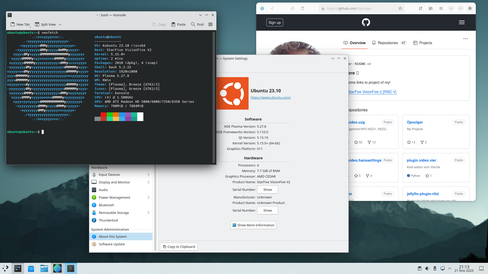

# Ubuntu 23.10 on VisionFive 2 with external GPU

I read on the Ubuntu website that there is now external GPU support for Ubuntu 23.10. There is no lie in that, but with the current kernel (6.5.0-9 and 6.5.0-10) it completely crashes.

[link](https://bugs.launchpad.net/ubuntu/+source/linux-riscv/+bug/2039782)

Keep in mind that:

- the kernel of Ubuntu only works with the firmware of Ubuntu.
- the kernel of StarFive only works with the firmware of Starfive.

So I put together my own kernel again and got it running again.

## Hardware

- StarFive VisionFive 2
- BEYIMEI PCIE Riser-Ver010X GPU Riser, 1X tot 16X (4PIN/6PIN/MOLEX) PCIE-verlengkabel, M.2 naar PCI-E Riser Card Bitcoin Litecoin Ethereum.
This is about 11 EURO on amazon, so no big deal... [amazon-link](https://www.amazon.nl/dp/B0BF4PH83Y?ref_=pe_28126711_487767311_302_E_DDE_dt_1)
- AMD/ATI Hawaii PRO [Radeon R9 290/390], Bought on a Dutch second-hand website, for 45 EURO. or ATI Radeon 5450, Bought on a Dutch second-hand website, for 10 EURO.
- An ATX power supply (was still lying around in the house)
- For debugging a USB to TTL (was still lying around in the house), is about 5 EURO.


or


## Downloades

download (to `~/Downloads/SF2_2023_11_20`):

- [visionfive2_fw_payload.img](https://github.com/starfive-tech/VisionFive2/releases/download/VF2_v3.8.2/visionfive2_fw_payload.img)
- [u-boot-spl.bin.normal.out](https://github.com/starfive-tech/VisionFive2/releases/download/VF2_v3.8.2/u-boot-spl.bin.normal.out)
- [u-boot-starfive-ubuntu-deb](https://launchpad.net/~ubuntu-risc-v-team/+archive/ubuntu/release/+files/u-boot-starfive_2023.09.22-next-5d2fae79c7d6-0ubuntu1~ppa5_riscv64.deb)

Download the `starfive-jh7110-VF2_515_v3.8.2-66-SD-minimal-desktop-wayland.img.bz2` (202310/sd) from StarFive VisionFive 2 Support [page](https://debian.starfivetech.com/) (I used One Drive).

Download `[ubuntu-22.04.2-preinstalled-server-riscv64+visionfive.img.xz](https://cdimage.ubuntu.com/releases/23.10/release/ubuntu-23.10-preinstalled-server-riscv64+visionfive2.img.xz)` from [ubuntu](https://ubuntu.com/download/risc-v)
Unzip it to `ubuntu-23.10-preinstalled-server-riscv64+visionfive2.img`.

```bash
$ mkdir -p ~/Downloads/SF2_2023_11_20
$ mkdir -p ~/Downloads/SF2_2023_11_20/ubuntu
$ cd ~/Downloads/SF2_2023_11_20
$ wget https://github.com/starfive-tech/VisionFive2/releases/download/VF2_v3.8.2/visionfive2_fw_payload.img
$ wget https://github.com/starfive-tech/VisionFive2/releases/download/VF2_v3.8.2/u-boot-spl.bin.normal.out
$ bzip2 -d ~/Downloads/SF2_2023_11_20/starfive-jh7110-VF2_515_v3.8.2-66-SD-minimal-desktop-wayland.img.bz2
```

## Update firmware from the VisionFive 2 to Ubuntu firmware

My first staps are flowing the Ubuntu [wiki](https://wiki.ubuntu.com/RISC-V/StarFive%20VisionFive%202)

We already downloaded `u-boot-starfive_2023.09.22-next-5d2fae79c7d6-0ubuntu1~ppa5_riscv64.deb` and now extract the firmware to `~/Downloads/SF2_2023_11_20/ubuntu`

I used Ark for this


```bash
# my download tree is now
$ cd ~/Downloads/SF2_2023_11_20
$ tree
.
├── sdcard.img
├── starfive-jh7110-VF2_515_v3.8.2-66-SD-minimal-desktop-wayland.img
├── u-boot-spl.bin.normal.out
├── u-boot-starfive_2023.09.22-next-5d2fae79c7d6-0ubuntu1~ppa5_riscv64.deb
├── ubuntu
│   ├── u-boot.itb
│   └── u-boot-spl.bin.normal.out
└── visionfive2_fw_payload.img
```

If you read the documentation of Ubuntu and uses the firmware of Ubuntu. This wil work for their kernels but if you compile the source code of StarFive the USB devices will not work (mouse/keyboard).

I didn't get it working with the sdcard.img (like last times) to flash my VisionFive 2, so I used tftp. I used the docker [image](https://hub.docker.com/r/pghalliday/tftp)

```bash
$ cd ~/Downloads/SF2_2023_11_20
# startup the docker tftp server and expose the current directory to /var/tftpboot
# The first time you will see this message, but the second time you will see nothing
$ docker run -p 0.0.0.0:69:69/udp -v $(pwd):/var/tftpboot -i -t pghalliday/tftp
Unable to find image 'pghalliday/tftp:latest' locally
latest: Pulling from pghalliday/tftp
fae91920dcd4: Pull complete 
0bb6771b2292: Pull complete 
Digest: sha256:59f843a93d62ac6e2fa475ee3d1a3786464fe5ea0334e6f1ea79bdec837f09fa
Status: Downloaded newer image for pghalliday/tftp:latest
```

Do NOT hit Ctrl+C! We need this server until we are done flashing!

Boot up your VisionFive 2 without a SD-card and the USB to TTL connected (see [link](https://doc-en.rvspace.org/VisionFive2/PDF/VisionFive2_QSG.pdf) for more information)

My machine (with docker) has ip-address 192.168.2.29 and I give my VisionFive 2 the ip 192.168.2.222

This will be the commands (for the Ubuntu firmware):

```bash
# set the ip of the VisionFive 2, and of the server (where docker is running)
$ setenv ipaddr 192.168.2.222; setenv serverip 192.168.2.29
# check connection
$ ping 192.168.2.29
# Initialize SPI Flash
$ sf probe
# Download and Update SPL binary
$ tftpboot 0xa0000000 ${serverip}:ubuntu/u-boot-spl.bin.normal.out
$ sf update 0xa0000000 0x0 $filesize
# Download and Update U-Boot binary
$ tftpboot 0xa0000000 ${serverip}:ubuntu/u-boot.itb
$ sf update 0xa0000000 0x100000 $filesize
# Reset the default (default load options)
$ env default -f -a
# Save your changes
$ env save
```

It will look somethink like this:

```bash
Hit any key to stop autoboot:  0 
StarFive # setenv ipaddr 192.168.2.222; setenv serverip 192.168.2.29
StarFive # ping 192.168.2.29
ethernet@16030000 Waiting for PHY auto negotiation to complete....... done
Using ethernet@16030000 device
host 192.168.2.29 is alive
StarFive # sf probe
SF: Detected gd25lq128 with page size 256 Bytes, erase size 4 KiB, total 16 MiB
StarFive # tftpboot 0xa0000000 ${serverip}:ubuntu/u-boot-spl.bin.normal.out
Using ethernet@16030000 device
TFTP from server 192.168.2.29; our IP address is 192.168.2.222
Filename 'ubuntu/u-boot-spl.bin.normal.out'.
Load address: 0xa0000000
Loading: ##########
         900.4 KiB/s
done
Bytes transferred = 139367 (22067 hex)
StarFive # sf update 0xa0000000 0x0 $filesize
device 0 offset 0x0, size 0x22067
139367 bytes written, 0 bytes skipped in 0.802s, speed 177281 B/s
StarFive # tftpboot 0xa0000000 ${serverip}:ubuntu/u-boot.itb
Using ethernet@16030000 device
TFTP from server 192.168.2.29; our IP address is 192.168.2.222
Filename 'ubuntu/u-boot.itb'.
Load address: 0xa0000000
Loading: #################################################################
         ####
         1010.7 KiB/s
done
Bytes transferred = 1005851 (f591b hex)
StarFive # sf update 0xa0000000 0x100000 $filesize
device 0 offset 0x100000, size 0xf591b
932123 bytes written, 73728 bytes skipped in 7.618s, speed 135134 B/s
StarFive # env default -f -a
## Resetting to default environment
StarFive # env save
Saving Environment to SPIFlash... Erasing SPI flash...Writing to SPI flash...done
OK

```

Done!

You can turn off the VisionFive 2 again and hit Ctrl+C to stop docker.

## Create the SD-card

I used `balenaEtcher` to flash a SD-card with `ubuntu-23.10-preinstalled-server-riscv64+visionfive2.img`.

## Fedora install packages

I have installed Fedora linux and had to install some stuff to be able to cross compile

```bash
sudo dnf group install "Development Tools"
sudo dnf install git gcc-plugin-devel libmpc-devel gcc-c++ gcc-c++-riscv64-linux-gnu ncurses-devel libmpc-devel
```

## Building the Linux Kernel

Building a kernel of the source code from StarFive

I build this on my own machine, otherwise it will take a very long time. so cross compile!
Everything is neatly explained if you click through to the "linux" repo of all (yet) custom code for the SBC. [link](https://github.com/starfive-tech/VisionFive2)

```bash
$ mkdir ~/Downloads/SF2_2023_11_20/visionfive2
$ cd ~/Downloads/SF2_2023_11_20/visionfive2
# we need the firmware for AMD / ATI cards, we do not need history so depth 1
$ git clone --depth 1 git://git.kernel.org/pub/scm/linux/kernel/git/firmware/linux-firmware.git linux-firmware
Cloning into 'linux-firmware'...
remote: Enumerating objects: 3126, done.
remote: Counting objects: 100% (3126/3126), done.
remote: Compressing objects: 100% (2281/2281), done.
remote: Total 3126 (delta 1061), reused 2423 (delta 751), pack-reused 0
Receiving objects: 100% (3126/3126), 428.00 MiB | 13.40 MiB/s, done.
Resolving deltas: 100% (1061/1061), done.
Updating files: 100% (3248/3248), done.

#Check out the last kernel, we do not need history so depth 1
$ git clone --branch VF2_v3.8.2 --depth 1 https://github.com/starfive-tech/linux.git
Cloning into 'linux'...
remote: Enumerating objects: 79432, done.
remote: Counting objects: 100% (79432/79432), done.
remote: Compressing objects: 100% (74286/74286), done.
remote: Total 79432 (delta 7390), reused 21741 (delta 4319), pack-reused 0
Receiving objects: 100% (79432/79432), 213.11 MiB | 6.87 MiB/s, done.
Resolving deltas: 100% (7390/7390), done.
Note: switching to 'b133739ab239ec9e5cd9bc4a15817145989021e4'.

You are in 'detached HEAD' state. You can look around, make experimental
changes and commit them, and you can discard any commits you make in this
state without impacting any branches by switching back to a branch.

If you want to create a new branch to retain commits you create, you may
do so (now or later) by using -c with the switch command. Example:

  git switch -c <new-branch-name>

Or undo this operation with:

  git switch -

Turn off this advice by setting config variable advice.detachedHead to false

Updating files: 100% (74883/74883), done.
```

I had to patch the kernel because I am using gcc-13: [link](https://lore.kernel.org/lkml/DB6P189MB05681E9F4785DF2758B9875B9CA49@DB6P189MB0568.EURP189.PROD.OUTLOOK.COM/t/)

```patch
*** ../linux-5.18/scripts/gcc-plugins/gcc-common.h  2022-03-20 20:14:17.0000
00000 +0000
--- scripts/gcc-plugins/gcc-common.h  2022-06-08 09:21:21.693178983 +0100
***************
*** 71,76 ****
--- 71,78 ----
  #include "varasm.h"
  #include "stor-layout.h"
  #include "internal-fn.h"
+ #include "gimple.h"
+ #include "gimple-iterator.h"
  #include "gimple-expr.h"
  #include "gimple-fold.h"
  #include "context.h"
```

I used VS-Code to edit the file.


Now we have the configure a new kernel 5.15 that workes with VisionFive 2 and an AMD/ATI Hawaii PRO [Radeon R9 290/390].
We can use the instructions of the other branch [link](https://github.com/starfive-tech/linux/tree/JH7110_VisionFive2_upstream). Here and there I deviated a little from it.

```bash
# go to checkout code
$ cd ~/Downloads/SF2_2023_11_20/visionfive2/linux

# create the .config with all you need for only the StarFive VisionFive 2
make ARCH=riscv CROSS_COMPILE=riscv64-linux-gnu- starfive_jh7110_defconfig # starfive_jh7110_defconfig -> we need PCI-e what is not enabled in starfive_visionfive2_defconfig

# open the menu
make CROSS_COMPILE=riscv64-linux-gnu- ARCH=riscv menuconfig
```

Now we have to add the ATI video-card and HDMI-audio.

```
Device Drivers ---> [HIT ENTER]
  Generic Driver Options ---> [HIT ENTER]
    Firmware loader ---> [HIT ENTER]
      () Build named firmware blobs into the kernel binary [HIT ENTER]
      (/lib/firmware) Firmware blobs root directory [change it to ../linux-firmware]
```

enter this in the line:

(radeon bins for ATI Radeon 5450, amdgpu/radeon bin files of AMD/ATI Hawaii PRO [Radeon R9 290/390] (has 2 drivers amd and ATI) and bin driver for my wifi dongel)

```ini
radeon/CYPRESS_uvd.bin radeon/CEDAR_smc.bin radeon/CEDAR_me.bin radeon/CEDAR_pfp.bin radeon/CEDAR_rlc.bin amdgpu/hawaii_k_smc.bin amdgpu/hawaii_smc.bin amdgpu/hawaii_uvd.bin amdgpu/hawaii_vce.bin amdgpu/hawaii_sdma.bin amdgpu/hawaii_sdma1.bin amdgpu/hawaii_pfp.bin amdgpu/hawaii_me.bin amdgpu/hawaii_ce.bin amdgpu/hawaii_rlc.bin amdgpu/hawaii_mec.bin amdgpu/hawaii_mc.bin radeon/hawaii_pfp.bin radeon/hawaii_me.bin radeon/hawaii_ce.bin radeon/hawaii_mec.bin radeon/hawaii_mc.bin radeon/hawaii_rlc.bin radeon/hawaii_sdma.bin radeon/hawaii_smc.bin radeon/hawaii_k_smc.bin radeon/HAWAII_pfp.bin radeon/HAWAII_me.bin radeon/HAWAII_ce.bin radeon/HAWAII_mec.bin radeon/HAWAII_mc.bin radeon/HAWAII_mc2.bin radeon/HAWAII_rlc.bin radeon/HAWAII_sdma.bin radeon/HAWAII_smc.bin rt2870.bin
```

Select Exit,Exit

We need some stuff for snapd:

```
Device Drivers -> 
    Block devices -> [HIT ENTER]
      <*> RAM block device support [HIT SPACE 2x]
```

Select Exit

```
Device Drivers -> 
    Network device support ---> [HIT ENTER]
      Wireless LAN ---> [HIT ENTER]
        <*> Ralink driver support ---- [HIT SPACE 2x][HIT ENTER]
          <*> Ralink rt27xx/rt28xx/rt30xx (USB) [HIT SPACE 2x]
          [*] rt2800usb - Incl..... 6x [HIT SPACE 1x on 4 rows]
```

Select Exit,Exit,Exit

```
Device Drivers --->
  Graphics support ---> [HIT ENTER]
    <*> ATI GPU [HIT SPACE]
    <*> AMD GPU [HIT SPACE 2x]
    [*] Enable amdgpu support for SI parts [HIT SPACE]
    [*] Enable amdgpu support for CIK parts [HIT SPACE]
    ACP (Audio CoProcessor) Configuration ---> [HIT ENTER]
      [*] Enable AMD Audio CoProcessor IP support [HIT SPACE]
```

Select Exit,Exit

```
Device Drivers --->
  Sound card support ---> [HIT ENTER]
    Advanced Linux Sound Architecture ---> [HIT ENTER]
      HD-Audio ---> [HIT ENTER]
        <*> HD Audio PCI [HIT SPACE 2x]
        <*> Build HDMI/DisplayPort HD-audio codec support [HIT SPACE 2x]
```

Select Exit,Exit,Exit,Exit

We need more some stuff for snapd:

```
File systems  -> [HIT ENTER]
  Miscellaneous filesystems -> [HIT ENTER]
    <*> SquashFS 4.0 - Squased file system support [HIT SPACE 2x]
    [*] Squashfs XATTR support [HIT SPACE]
    [*] Include support for ZLIB compressed file systems
    [*] Include support for LZ4 compressed file systems [HIT SPACE]
    [*] Include support for LZO compressed file systems [HIT SPACE]
    [*] Include support for XZ compressed file systems [HIT SPACE]
    [*] Include support for ZSTD compressed file systems [HIT SPACE]
```

Select Exit,Exit

We need CONFIG_SECCOMP and CONFIG_SECCOMP_FILTER for the `epiphany` browser

```
General architecture-dependent options  ---> [HIT ENTER]
  [*] Enable seccomp to safely execute untrusted bytecode -> [HIT SPACE]
```

Select Exit,Exit

Yes You wish to save your new configuration!

```bash
# We can compile the kernel, I have 16 cores in my machine... so I added -j 16
$ make ARCH=riscv CROSS_COMPILE=riscv64-linux-gnu- -j 16
scripts/extract-cert.c: In function ‘display_openssl_errors’:
scripts/extract-cert.c:46:9: warning: ‘ERR_get_error_line’ is deprecated: Since OpenSSL 3.0 [-Wdeprecated-declarations]
   46 |         while ((e = ERR_get_error_line(&file, &line))) {
      |         ^~~~~
In file included from scripts/extract-cert.c:23:
/usr/include/openssl/err.h:423:15: note: declared here
  423 | unsigned long ERR_get_error_line(const char **file, int *line);
      |               ^~~~~~~~~~~~~~~~~~
scripts/extract-cert.c: In function ‘drain_openssl_errors’:
scripts/extract-cert.c:59:9: warning: ‘ERR_get_error_line’ is deprecated: Since OpenSSL 3.0 [-Wdeprecated-declarations]
   59 |         while (ERR_get_error_line(&file, &line)) {}
      |         ^~~~~
/usr/include/openssl/err.h:423:15: note: declared here
  423 | unsigned long ERR_get_error_line(const char **file, int *line);
.......
.......
.......
.......
drivers/gpu/drm/amd/amdgpu/../display/dc/dce/dce_aux.c: In function ‘dce_aux_transfer_with_retries’:
drivers/gpu/drm/amd/amdgpu/../display/dc/dce/dce_aux.c:704:32: warning: storing the address of local variable ‘reply’ in ‘*payload.reply’ [-Wdangling-pointer=]
  704 |                 payload->reply = &reply;
      |                 ~~~~~~~~~~~~~~~^~~~~~~~
drivers/gpu/drm/amd/amdgpu/../display/dc/dce/dce_aux.c:687:17: note: ‘reply’ declared here
  687 |         uint8_t reply;
      |                 ^~~~~
drivers/gpu/drm/amd/amdgpu/../display/dc/dce/dce_aux.c:684:37: note: ‘payload’ declared here
  684 |                 struct aux_payload *payload)
      |                 ~~~~~~~~~~~~~~~~~~~~^~~~~~~
$
```

The kernel is Done! Now copy it to the boot partition on the SD-card!

## BOOT/ROOT Copy kernel

We need the initrd-img of 5.15.0 from VisionFive 2, so we don't have to make it ourselves.

```bash
# create a loop device of image
sudo losetup -f -P ~/Downloads/SF2_2023_11_20/starfive-jh7110-VF2_515_v3.8.2-66-SD-minimal-desktop-wayland.img
# find your loop device
$ losetup -a # or -l
/dev/loop0: []: (/home/opvolger/Downloads/SF2_2023_11_20/starfive-jh7110-VF2_515_v3.8.2-66-SD-minimal-desktop-wayland.img)
$ lsblk
NAME        MAJ:MIN RM   SIZE RO TYPE MOUNTPOINTS
loop0         7:0    0   3,9G  0 loop 
├─loop0p1   259:7    0     2M  0 part 
├─loop0p2   259:8    0     4M  0 part 
├─loop0p3   259:9    0   100M  0 part 
└─loop0p4   259:10   0   3,8G  0 part 
....
....
....
....
# create dir
$ mkdir -p ~/Downloads/SF2_2023_11_20/visionfive2/mount
# mount to dir
$ sudo mount /dev/loop0p3 ~/Downloads/SF2_2023_11_20/visionfive2/mount
# copy initrd img
$ cp ~/Downloads/SF2_2023_11_20/visionfive2/mount/initrd.img-5.15.0-starfive ~/Downloads/SF2_2023_11_20/visionfive2
# umount
$ sudo umount /dev/loop0p3
# detache loop device
$ sudo losetup -d /dev/loop0
```

We have the SD-card inserted (again). Mount the sd-card (cloudimg-rootfs)
Now we need to mount the first partition of the SD-card. my is mounted on `/run/media/opvolger/cloudimg-rootfs/` after a click in KDE :)

```bash
# go to checkout code
$ cd ~/Downloads/SF2_2023_11_20/visionfive2/linux
# copy the kernel to the sd-card
$ sudo cp arch/riscv/boot/Image.gz /run/media/opvolger/cloudimg-rootfs/boot/vmlinuz-5.15.0-dirty
# copy the System map
$ sudo cp System.map /run/media/opvolger/cloudimg-rootfs/boot/System.map-5.15.0-dirty
# copy the dtb (Device Tree) to the sd-card
$ sudo cp arch/riscv/boot/dts/starfive/jh7110-visionfive-v2.dtb /run/media/opvolger/cloudimg-rootfs/boot/dtb-5.15.0-dirty
# copy initrd to the sd-card
$ sudo cp ~/Downloads/SF2_2023_11_20/visionfive2/initrd.img-5.15.0-starfive /run/media/opvolger/cloudimg-rootfs/boot/initrd.img-5.15.0-dirty
# we have now all the 4 files we need
```

Now we need a custom boot option (the kernel we have made)

edit `40_custom` in `/run/media/opvolger/cloudimg-rootfs/etc/grub.d/`

```ini
#!/bin/sh
exec tail -n +3 $0
# This file provides an easy way to add custom menu entries.  Simply type the
# menu entries you want to add after this comment.  Be careful not to change
# the 'exec tail' line above.
menuentry 'Ubuntu StarFive VisionFive 2 5.15.0-dirty' --class ubuntu --class gnu-linux --class gnu --class os $menuentry_id_option 'gnulinux-simple-5-15-0-dirty' {
        load_video
        insmod gzio
        if [ x$grub_platform = xxen ]; then insmod xzio; insmod lzopio; fi
        insmod part_gpt
        insmod ext2
        search --no-floppy --fs-uuid --set=root 40249bdb-adbf-44bf-a50e-74b81c1200d7
        echo    'Loading Linux 5.15.0-dirty ...'
        linux   /boot/vmlinuz-5.15.0-dirty root=LABEL=cloudimg-rootfs ro  efi=debug earlycon sysctl.kernel.watchdog_thresh=60
        echo    'Loading initial ramdisk ...'
        initrd  /boot/initrd.img-5.15.0-dirty
        echo    'Loading device tree blob...'
        devicetree      /boot/dtb-5.15.0-dirty
}
```

```bash
$ sudo nano /run/media/opvolger/cloudimg-rootfs/etc/grub.d/40_custom
# Copy the text above
```

## Setup Ubuntu with ubuntu kernel and firmware

Put the SD-Card in the VisionFive 2 without an external GPU and use the USB to TTL.

Turn on the VisionFive 2

If booting is not working, reflash the firmware but skip the command `env default -f -a`. I had this problem (sometimes?).

Ubuntu will boot with the kernel and firmware from Ubuntu!

You will get to setup your ubuntu password (default is ubuntu/ubuntu).

```bash
-----BEGIN SSH HOST KEY KEYS-----
ecdsa-sha2-nistp256 AAAAB2VjZHNhLXNoYTItbmlzdHByNTYAAAAIbmlzdHAyNTYAAABBBNPq5SLKgBXEcCWZwAequ9Qr9af/PSurVzwNX3XIF/CAutf/aMGsOtBIyH5mk44HdLmtNLoM+voHsiZZ2/I8uCU= root@
ubuntu
ssh-ed25519 AAAAC3NzaC1lZBI1NTE5AAAAIGFLC6yXTpRmdkQstt6l2vzoJHRkQfvFllD3sVNg0L3o root@ubuntu
ssh-rsa AAAAB3NzaC1yc2EAAABDAQABAAABgQC1nU/WOAedfYMyRYSLXWHgsDd8brhSlYYLMCpS00Lv2CJr037RUe+v5TfzPqbBw9xech8lFruZxzJ0AHJx4kbu34va9de6xSVLjD+5cHE343pn0eXi4VI9KT9bnN42h2
1+7q/yGv2+ALQJ48Gi/AvuDnWKFXa8i4LOqlVjbnfutpko6bdw1ogttRXF8Lh7PacU6XihfQ7R5yPk0r2Kw0eFPT8vLRWp5OmT2KJaMg0K/UE0+Avv5zLq5axvSchA4pbeQ0NhgCw7NQUmuFha3ZUf/saksiohAtXUo2AF
HB3crZFM39ffyHaZyycP0rSMCU3ErCsV3YYRWJZ34A0t7+4fxdWUfhB1+hxm9D8EovTtB6/K1qiEU5/b7fP4n2wuBlpMhn/Nt/UG3vJ/jxtfLCoNHTL4iFdhP33mpnpB7uVZxR9TGI22+EQO5HyXSMF5HI4CGUr2bo2/ud
A/QNZScPICD9Hfq1MFS553M2dINFpFmVuvSqK3u0w4sW7ErB2Xr/U= root@ubuntu
-----END SSH HOST KEY KEYS-----
[  127.899234] cloud-init[1714]: Cloud-init v. 23.3.1-0ubuntu2 finished at Mon, 20 Nov 2023 23:21:04 +0000. Datasource DataSourceNoCloud [seed=/var/lib/cloud/seed/noc
loud-net][dsmode=net].  Up 127.87 seconds
[  OK  ] Finished cloud-final.servi… Execute cloud user/final scripts.
[  OK  ] Reached target cloud-init.target - Cloud-init target.

Ubuntu 23.10 ubuntu ttyS0

ubuntu login: ubuntu
Password: 
You are required to change your password immediately (administrator enforced).
Changing password for ubuntu.
Current password: 
New password: 
Retype new password: 
Welcome to Ubuntu 23.10 (GNU/Linux 6.5.0-9-generic riscv64)
....
....
....
To run a command as administrator (user "root"), use "sudo <command>".
See "man sudo_root" for details.
```

Now we will change the default boot option of Grub
We will edit `etc/default/grub`

The default boot option is now `GRUB_DEFAULT=0` we will change that to `GRUB_DEFAULT=2`. The boot options start counting with 0, so we need option number 3 (That is 2).

```bash
ubuntu@ubuntu:~$ sudo nano /etc/default/grub
# now change `GRUB_DEFAULT=0` to `GRUB_DEFAULT=2`
# We will now update grub with the custom kernel and menuentry
ubuntu@ubuntu:~$ sudo update-grub
Sourcing file '/etc/default/grub'
Sourcing file '/etc/default/grub.d/10_cmdline.cfg'
Sourcing file '/etc/default/grub.d/90_watchdog-thresh.cfg'
Generating grub configuration file ...
Found linux image: /boot/vmlinuz-6.5.0-9-generic
Found initrd image: /boot/initrd.img-6.5.0-9-generic
Found linux image: /boot/vmlinuz-5.15.0-dirty
Found initrd image: /boot/initrd.img-5.15.0-dirty
Warning: os-prober will not be executed to detect other bootable partitions.
Systems on them will not be added to the GRUB boot configuration.
Check GRUB_DISABLE_OS_PROBER documentation entry.
Adding boot menu entry for UEFI Firmware Settings ...
done
# turn it off
ubuntu@ubuntu:~$ sudo halt

Broadcast message from root@ubuntu on pts/0 (Tue 2023-11-21 19:51:40 UTC):

The system will halt now!

ubuntu@ubuntu:~$ [  366.522166] reboot: System halted
```

Turn off the VisionFive2 and remove the CD-card.

## Update firmware VisionFive 2 to 3.8.2

Now we need to update firmware of the board to the version of VisionFive2.

I updated my board to `VisionFive2 Software v3.8.2`

We will use the firmware from StarFive (with there kernel-source-build 5.15.0-dirty) if you want to use an extenal GPU without a crash within 1a10 minutes. We can not start a Ubuntu kernel with the firmware of StarFive!

I didn't get it working with the sdcard.img (like last times) to flash my VisionFive 2, so I used tftp. I used the docker [image](https://hub.docker.com/r/pghalliday/tftp)

```bash
$ cd ~/Downloads/SF2_2023_11_20
$ docker run -p 0.0.0.0:69:69/udp -v $(pwd):/var/tftpboot -i -t pghalliday/tftp
Unable to find image 'pghalliday/tftp:latest' locally
latest: Pulling from pghalliday/tftp
fae91920dcd4: Pull complete 
0bb6771b2292: Pull complete 
Digest: sha256:59f843a93d62ac6e2fa475ee3d1a3786464fe5ea0334e6f1ea79bdec837f09fa
Status: Downloaded newer image for pghalliday/tftp:latest
```

Boot up your VisionFive 2 without a SD-card and the USB to TTL connected (see [link](https://doc-en.rvspace.org/VisionFive2/PDF/VisionFive2_QSG.pdf) for more information)

My machine (with docker) has ip-address 192.168.2.29 and I give my VisionFive 2 the ip 192.168.2.222

This will be the commands (for the StarFive firmware):

```bash
# set the ip of the VisionFive 2, and of the server (where docker is running)
$ setenv ipaddr 192.168.2.222; setenv serverip 192.168.2.29
# test network
$ ping 192.168.2.29
# Initialize SPI Flash
$ sf probe
# Download and Update SPL binary
$ tftpboot 0xa0000000 ${serverip}:u-boot-spl.bin.normal.out
$ sf update 0xa0000000 0x0 $filesize
# Download and Update U-Boot binary
$ tftpboot 0xa0000000 ${serverip}:visionfive2_fw_payload.img
$ sf update 0xa0000000 0x100000 $filesize
# We will not need to reset to default now!
# Save your changes
$ env save
```

It will look something like this:
(I hit a key to stop autoboot)

```bash
# open a (new console with) screen to the VisionFive 2
$ screen -L /dev/ttyUSB0 115200
# now turn on the VisionFive 2 and you will see that if boot.
U-Boot SPL 2023.10-2023.09.22-next-5d2fae79c7d6-0ubuntu1~ppa5 (Oct 13 2023 - 13:25:02 +0000)
DDR version: dc2e84f0.
Trying to boot from SPI


U-Boot 2023.10-2023.09.22-next-5d2fae79c7d6-0ubuntu1~ppa5 (Oct 13 2023 - 13:25:02 +0000)

CPU:   rv64imafdc_zba_zbb
Model: StarFive VisionFive 2 v1.3B
DRAM:  8 GiB
Core:  129 devices, 24 uclasses, devicetree: board
MMC:   mmc@16010000: 0, mmc@16020000: 1
Loading Environment from SPIFlash... SF: Detected gd25lq128 with page size 256 Bytes, erase size 4 KiB, total 16 MiB
OK
StarFive EEPROM format v2

--------EEPROM INFO--------
Vendor : StarFive Technology Co., Ltd.
Product full SN: VF7110B1-2253-D008E000-00001648
data version: 0x2
PCB revision: 0xb2
BOM revision: A
Ethernet MAC0 address: 6c:cf:39:00:2a:e5
Ethernet MAC1 address: 6c:cf:39:00:2a:e6
--------EEPROM INFO--------

In:    serial@10000000
Out:   serial@10000000
Err:   serial@10000000
Net:   eth0: ethernet@16030000, eth1: ethernet@16040000
Working FDT set to ff7309d0
Hit any key to stop autoboot:  0
StarFive # setenv ipaddr 192.168.2.222; setenv serverip 192.168.2.29
StarFive # ping 192.168.2.29
ethernet@16030000 Waiting for PHY auto negotiation to complete....... done
Using ethernet@16030000 device
host 192.168.2.29 is alive
StarFive # sf probe
SF: Detected gd25lq128 with page size 256 Bytes, erase size 4 KiB, total 16 MiB
StarFive # tftpboot 0xa0000000 ${serverip}:u-boot-spl.bin.normal.out
Using ethernet@16030000 device
TFTP from server 192.168.2.29; our IP address is 192.168.2.222
Filename 'u-boot-spl.bin.normal.out'.
Load address: 0xa0000000
Loading: ###########
         1012.7 KiB/s
done
Bytes transferred = 147336 (23f88 hex)
StarFive # sf update 0xa0000000 0x0 $filesize
device 0 offset 0x0, size 0x23f88
143360 bytes written, 3976 bytes skipped in 0.840s, speed 178970 B/s
StarFive # tftpboot 0xa0000000 ${serverip}:visionfive2_fw_payload.img
Using ethernet@16030000 device
TFTP from server 192.168.2.29; our IP address is 192.168.2.222
Filename 'visionfive2_fw_payload.img'.
Load address: 0xa0000000
Loading: #################################################################
         #################################################################
         #################################################################
         ###########
         1 MiB/s
done
Bytes transferred = 3013797 (2dfca5 hex)
StarFive # sf update 0xa0000000 0x100000 $filesize
device 0 offset 0x100000, size 0x2dfca5
933888 bytes written, 2079909 bytes skipped in 8.149s, speed 378573 B/s
StarFive # env save
Saving Environment to SPIFlash... Erasing SPI flash...Writing to SPI flash...done
OK
StarFive #
```

Done!

You can turn off the VisionFive 2 again

## Boot Visionfive 2 with external GPU

Put the SD-card in the Visionfive 2.

We will start the Visionfive 2 with the external GPU.

We will use the USB to TTL to see that every thing is working!

```bash
$ screen -L /dev/ttyUSB0 115200

# After boot up, login with ubuntu and your password

# First update all the packages!
ubuntu@ubuntu:~$ sudo apt update
# This takes some time
ubuntu@ubuntu:~$ sudo apt upgrade
# after install updates ignore kernel warning! Restart some services


# install KDE and some build tools
ubuntu@ubuntu:~$ sudo apt install sddm sddm-theme-breeze kde-standard build-essential libxml2 libcurl4-gnutls-dev neofetch ubuntu-dev-tools libopenal-dev libpng-dev libjpeg-dev libfreetype6-dev libfontconfig1-dev libcurl4-gnutls-dev libsdl2-dev zlib1g-dev libbz2-dev libedit-dev python-is-python3 m4 clang sddm-theme-breeze epiphany-browser minetest
Service restarts being deferred:                                               
 /etc/needrestart/restart.d/dbus.service
 systemctl restart systemd-logind.service
 systemctl restart unattended-upgrades.service
 systemctl restart wpa_supplicant.service

No containers need to be restarted.

User sessions running outdated binaries:
 ubuntu @ user manager service: systemd[882]

No VM guests are running outdated hypervisor (qemu) binaries on this host.

ubuntu@ubuntu:~$ sudo reboot
```

Now KDE will startup after booting! Have fun!

## Network

Fix network manager in KDE (so you can control network in KDE)

```bash
$ sudo nano /etc/netplan/01-network-manager-all.yaml
```

```yaml
# Let NetworkManager manage all devices on this system
network:
  version: 2
  renderer: NetworkManager
```

Need reboot to get it working!

## Screenshot!

picture or it didn't happen

ATI Radeon 5450:



ATI Radeon R9 290:


